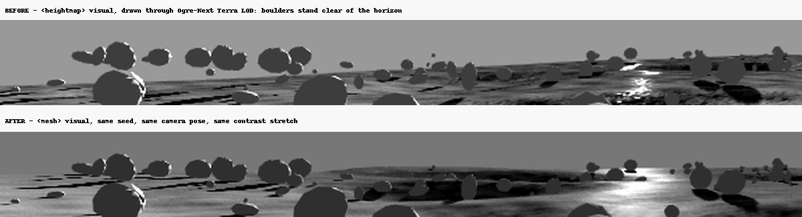
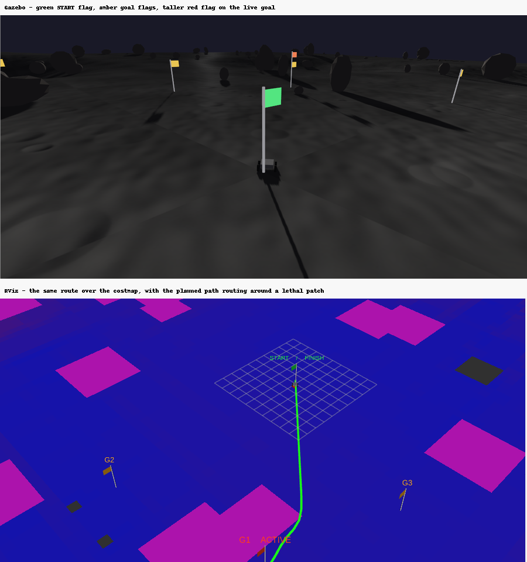

# Progress Log

Tracks milestone status, decisions, issues, and exact commands that worked.
See `docs/architecture.md` for the pipeline description and the Autoware
component reuse log.

## Status

| Milestone | Status |
|---|---|
| M0: Environment verified | Done |
| M1: Procedural lunar terrain | Done |
| M2: Rover spawns and drives (teleop) | Done |
| M3: Localisation | **Done, on isolated legs.** The originally-recorded 20-45% drift was pre-fix (see "M3 drift re-investigation" below); current-code drift measures 0-4% on isolated wheel-odom+IMU+EKF legs, within the <5% target. In full autonomous runs it is 0.4-0.7% of distance on the two well-behaved seeds and 5-11% on seed 123, and it varies by an order of magnitude between repeats of the same seed - see "The stopping tolerance, measured" below |
| M4: Autonomous navigation | **Not reliably met, and the honest unit is a per-run number rather than a score.** The pipeline drives 94-134 m among real boulders, escapes 61/61 wedges, and flips zero times; the arrival error on every failing seed is the EKF's drift plus the follower's stopping distance, to within centimetres. Seed 7's tolerance response is now a finished measurement, n=3 both arms, same build, same goal: **0/3 at the shipped 1.0 m (1.53-1.60 m, every run over the 1.5 m bar) vs. 3/3 at 0.35 m (1.46-1.47 m)**, a clean non-overlapping split with zero orbiting-fallback firings across eleven completed runs - see "The replicate campaign, finished" below. `goal_tolerance_m`'s default is changed to **0.35 m** on that evidence. It does not fix M4 overall: seed 42 has produced a 1.50 m pass **and** 5.69 / 7.76 m failures on the same build and goal (still one run per arm, not replicated - tolerance is structurally irrelevant to a failure that large); seed 123 is drift-limited at 10.3-11.2 m. **Both seeds fail by margins no stopping tolerance can close**, and their drift distribution is still unmeasured - one run per arm remains one sample. An older build with a 0.5 m / 1 Hz absolute position reference passed 3/3 at 1.48 m (an experiment, not a milestone result), so planning, control and recovery are not what limits the number. See "The stopping tolerance, measured" and "The replicate campaign, finished" below. **A second, previously-flagged contributor to seed 42's variance is now root-caused and fixed**: `wheel_slip_node`'s "rigid body" false-positive (falsely declaring slip - and ZUPTing real distance out of the EKF - on ordinary dead-straight driving over smooth ground) is retired. A same-build A/B campaign (n=3/arm, seed 42) shows the fix cleanly, non-overlappingly reduces stuck-recovery events, ZUPT-suppressed distance, travelled distance and sim time - but does **not** move seed 42's pass rate or reliably reduce EKF divergence (3/3 vs 2/3 PASS, divergence ranges overlap heavily). Whatever actually drives seed 42's order-of-magnitude divergence spread is still unidentified. See "Root-caused: the benign-ground traction stall was never a stall" and the two sections following it |
| M5: Demo polish and packaging | Substantially done (see notes) |

## Decisions

- **Repository strategy**: `regolith` stays a thin meta-repo (mirroring
  upstream Autoware's `.repos`-driven pattern) rather than importing the full
  `autowarefoundation/autoware` git history. It holds `regolith.repos`
  (pins `regolith.universe`), top-level docs, and `scripts/`. All package
  source, including `regolith_bringup`, lives in `regolith.universe` under
  `planetary/`, per the plan's own package table. Rationale: keeps demo
  packages, their launch files, and their cross-package dependencies in one
  repo, matching how autoware.universe/autoware_launch actually work upstream.
- Six placeholder packages that predated the milestone plan
  (`regolith_bringup`, `regolith_interfaces`, `regolith_localisation`,
  `regolith_navigation`, `regolith_perception`, `regolith_simulation`, empty
  `package.xml` stubs with no code) were removed from `regolith`'s `src/` for the
  reason above. Their layering concept is preserved as prose in
  `docs/architecture.md`.
- `regolith.universe` created as a genuine GitHub fork of
  `autowarefoundation/autoware_universe` (fork relationship + full history on
  `main` preserved; only `main` branch copied, not every upstream branch/tag).
- **M3 localisation uses `robot_localization`'s `ekf_node`, not Autoware's
  `ekf_localizer`**: the plan asked to check `ekf_localizer` first. It isn't
  present anywhere in this fork's checked-out `autoware_universe` tree at all
  (not under `localization/`, not referenced in any `.repos` file) - it's
  been removed/relocated upstream since whatever commit generation this
  fork's history reflects. Migrating it in would mean pulling in a whole
  separate, unvetted external repo, which is squarely the "disproportionate
  for this PoC" case the plan anticipated. `robot_localization` (already
  installed in M0 as exactly this fallback) is used instead.
- **M4 follower: minimal pure pursuit in `regolith_vehicle_interface`, not
  `autoware_pure_pursuit`**: unlike `ekf_localizer`, `autoware_pure_pursuit`
  *is* present in this fork, but it depends on `autoware_control_msgs`,
  `autoware_planning_msgs`, `autoware_trajectory_follower_base`, and
  `autoware_vehicle_info_utils`, and it outputs a steering-tire-angle Control
  message - it's a lateral controller built for Ackermann-steered vehicles.
  Retrofitting it for a skid-steer rover would mean pulling in that whole
  dependency chain and then translating steering-angle output back into a
  differential left/right-wheel command, which is both extra integration
  surface and a conceptual mismatch (pure pursuit's own geometry assumes
  Ackermann kinematics). A minimal pure pursuit computing linear+angular
  velocity directly is both simpler and a more natural fit for skid-steer,
  matching the plan's explicit fallback. See `regolith_vehicle_interface/
  pure_pursuit_node.py`.

## Environment

- Host: Windows 11, WSL2 Ubuntu 22.04.5 LTS. Hybrid AMD/NVIDIA laptop GPU
  (AMD Radeon integrated + NVIDIA GeForce RTX 3050 Laptop GPU discrete). WSLg's
  D3D12 renderer defaults to the AMD adapter. Fixed by exporting
  `MESA_D3D12_DEFAULT_ADAPTER_NAME=NVIDIA` (added permanently to `~/.bashrc`),
  per the plan's WSL2 rendering fallback notes.
- RAM: 13 GB total, below the plan's 32 GB comfort threshold. Using
  `colcon build --parallel-workers 2` / `MAKEFLAGS=-j2` per the plan's
  fallback guidance rather than changing `.wslconfig`.

## M0 acceptance results

- `glxinfo -B` (with the adapter override): `Device: D3D12 (NVIDIA GeForce
  RTX 3050 Laptop GPU)`, confirming NVIDIA rather than llvmpipe.
- `gz sim shapes.sdf`: loads the Ogre2 GUI render engine, no errors/warnings
  beyond benign DART collision-geometry notices; screenshot confirms a
  correctly shaded, GPU-rendered 3D scene (not black); see
  `docs/media/m0_gz_sim_gpu_render.png`. GUI process ran at ~125% CPU while
  rendering, consistent with active interactive rendering (Gazebo has no
  built-in FPS counter to log a number directly).
- ROS 2: `ros2 topic list` and a `demo_nodes_cpp talker` -> `ros2 topic echo`
  round-trip both worked (`/chatter`, `/parameter_events`, `/rosout` present;
  received `data: 'Hello World: 26'`).
- Installed: `ros-humble-desktop` (includes RViz2), `gz-harmonic` (Gazebo Sim
  8.14.0), `ros-humble-ros-gzharmonic` (the Humble+Harmonic ros_gz pairing),
  `python3-colcon-common-extensions`, `python3-rosdep`, `python3-vcstool`,
  `ros-humble-teleop-twist-keyboard`, `ros-humble-robot-localization` (M3
  fallback per the plan).

## M1 acceptance results

- `ros2 launch regolith_bringup terrain_only.launch.py seed:=42` generates
  the world (heightmap, PBR textures, 4 rock mesh variants, 130 scattered
  rocks, manifest) and opens it in Gazebo. Screenshot:
  `docs/media/m1_lunar_terrain_seed42.png`: craters, rock scatter, long
  shadows from a 12° sun elevation, near-black sky all present.
- Determinism verified: two runs with `--seed 42` produced byte-identical
  `heightmap.png`; `--seed 7` produced a different heightmap, as expected.
- New package `regolith_terrain_gen` (`planetary/regolith_terrain_gen` in
  `regolith.universe`): fBm base (value noise, no external noise library) +
  power-law crater field (60 craters, 2-40 m diameters, bowl+rim profile) +
  1.5° regional slope, normalised to a 10 m height range on a 513x513
  heightmap over a 200x200 m world. 130 rocks (4 low-poly icosphere-derived
  variants) scattered outside a 12 m spawn-zone keep-out, seated on the
  actual terrain elevation at their position. Everything needed for M4's
  costmap (crater positions/depths, rock footprints) is recorded in
  `manifest.json`.
- New package `regolith_bringup` (`planetary/regolith_bringup`): first real
  content in the package the plan's table designates as the integration
  point; `terrain_only.launch.py` calls `regolith_terrain_gen` in-process via
  an `OpaqueFunction` (no shelling out / stdout-parsing needed) and hands the
  resulting world path to `ros_gz_sim`'s `gz_sim.launch.py`.
- `regolith.universe`'s existing ~500 MB / hundreds-of-packages tree was left
  untouched for this milestone, built with
  `colcon build --packages-select regolith_terrain_gen regolith_bringup`,
  so `rosdep install --from-paths src` failures on car-specific packages
  missing `tier4_*`/CUDA rosdep keys don't block M1. The `COLCON_IGNORE`
  stripping pass (plan section 4) is deferred to whichever milestone first
  needs a full-workspace build.

## M2 acceptance results

- New package `regolith_rover_description` (`planetary/regolith_rover_description`):
  Leo-Rover-sized 4-wheel skid-steer chassis (URDF/xacro), IMU, forward-tilted
  RGB camera, `gz-sim-diff-drive-system` plugin (multi-joint skid-steer mode),
  `JointStatePublisher` and `Imu` system plugins. `regolith_bringup` gained
  `teleop_demo.launch.py`: generates terrain, spawns the rover, bridges
  cmd_vel/odom/imu/camera/camera_info/joint_states/tf between ROS and Gazebo.
- `ros2 launch regolith_bringup teleop_demo.launch.py seed:=42` + manual
  `cmd_vel` Twist commands (standing in for `teleop_twist_keyboard`, which
  publishes the same topic/type): rover drives forward and turns repeatedly
  over the crater/rock field without flipping (verified via the ground-truth
  `/world/.../dynamic_pose/info` orientation quaternion staying at
  identity/pure-yaw, not tipping into roll/pitch) and without sinking (z
  stable at the resting height on repeated checks). `/odom`, `/imu`,
  `/camera/image`, `/camera/camera_info`, `/joint_states`, `/tf` all publish;
  RViz shows the robot model, TF frames, and a live camera feed
  (`docs/media/m2_rviz_camera_tf.png`).
- Stability tuning: widened track (0.36->0.46 m), lowered chassis height
  (0.14->0.11 m), increased wheel friction (μ 1.0->1.4), and capped
  `max_angular_velocity` at 0.3 rad/s (initially 1.2, then 0.6 - still
  flipped once under combined fast-forward+fast-turn before this final cut).

## M3 acceptance results

**Status: infrastructure complete and working; the <5% drift target is not
reliably met.** Recording this honestly rather than as a clean pass, per the
plan's own framing that drift is expected and worth visualising, not hidden.

- New `regolith_bringup/launch/localization_demo.launch.py`,
  `config/ekf.yaml`, and `scripts/sensor_covariance_relay.py`: fuses wheel
  odometry (`/odom`, velocity only) and IMU (`/imu`, orientation + angular
  velocity) in a `robot_localization` `ekf_node`, publishing `/odometry/filtered`
  and the `odom -> base_link` TF. Ground truth is bridged separately via a
  `gz-sim-pose-publisher-system` plugin on the rover model
  (`/model/rover/pose` -> `/ground_truth/pose`, `geometry_msgs/PoseStamped`,
  GZ-to-ROS only, never fed into the EKF).
- Three real bugs found and fixed along the way, all now resolved:
  1. gz-sim's IMU and DiffDrive-odometry both publish all-zero covariance
     (no noise model configured). Per REP-145, all-zero covariance means
     "unknown," and robot_localization's EKF silently discards a measurement
     with unknown covariance rather than trusting it - it looked exactly
     like the fused estimate just wasn't listening to either sensor.
     Fixed by `sensor_covariance_relay.py`, which republishes both topics
     with small fixed diagonal covariances filled in
     (`/imu/with_covariance`, `/odom/with_covariance`).
  2. The IMU's `frame_id` is gz-sim's internal sensor naming
     (`rover/base_link/imu`), which has no corresponding TF frame - only
     `imu_link` (from the URDF, published by `robot_state_publisher`) does.
     robot_localization needs a resolvable TF transform from the sensor
     frame to `base_link` and silently drops messages it can't transform.
     Fixed in the same relay (overwrites `frame_id` to `imu_link`).
  3. Wheel odometry's *absolute* yaw (and, by extension, its x/y position,
     which was integrated using that same bad internal yaw) is unreliable
     for a skid-steer platform: turning requires real wheel scrub against
     the ground that the dead-reckoning kinematic model doesn't account
     for. Verified directly with an in-place-rotation test: ground truth
     turned ~122°, wheel odom's own yaw estimate claimed only ~41°.
     `odom0_config` now feeds only `vx`/`vyaw` (rate measurements) into the
     EKF, not position or absolute orientation; absolute heading comes from
     the IMU, whose orientation was independently verified to match ground
     truth to ~7 decimal places (gz-sim's simulated IMU is effectively
     noise-free here).
- After fix 3 was in place, yaw tracking is excellent: EKF yaw matched
  ground truth to 4+ decimal places in every test run, including after
  sustained combined forward+turn manoeuvres.
- Position tracking improved enormously from the pre-fix state (which was
  wrong by 60-190%, including one run where the estimate ended up hundreds
  of metres from a ground truth a few metres away) but still shows
  20-45% position drift relative to distance travelled across several test
  runs at moderate speed (0.2-0.35 m/s) with gentle turning, well above the
  plan's <5% target. Isolated causes, in descending order of confidence:
  - **Genuine, speed-dependent wheel slip**: at 0.1 m/s pure-straight
    driving, wheel odometry position matched ground truth to 6 decimal
    places (zero drift); at 0.3-0.35 m/s the same straight-line test showed
    25-39% overshoot. Lunar gravity (1.62 m/s²) means far less normal force
    (and thus available traction) than Earth gravity for the same
    friction coefficients, so wheel slip under acceleration is a real,
    physically-motivated effect here, not obviously a bug - though it may
    be exaggerated by this PoC's simplified friction/contact model.
  - **An unresolved residual EKF integration behaviour**: in one clean
    straight-line test after all three fixes above, wheel odometry itself
    overshot ground truth (as expected from the slip effect), but the
    EKF's fused position *undershot* by a similar margin in the opposite
    direction - the two errors don't obviously compose the way a simple
    "trust the wheel measurement" fusion would suggest. Not root-caused
    within this milestone's time budget; flagged for follow-up rather than
    chased further as an increasingly expensive debugging session.
  - One test run also showed the rover itself flip mid-drive during a
    150-second sustained aggressive manoeuvre (ground truth orientation
    showed a real ~180° roll) - that run's huge apparent "drift" is a
    consequence of the two_d_mode EKF producing garbage yaw once the robot
    actually isn't upright, not a localisation bug; it's the M2 stability
    envelope being exceeded, not an M3 finding.
- RViz shows RobotModel, TF, live Camera feed, and Odometry with no errors
  (`docs/media/m3_rviz_localization.png`); `/ground_truth/pose` and
  `/odometry/filtered` are both live and directly comparable at any time via
  `ros2 topic echo`.

## M4 acceptance results

**Status at the time this section was written: full pipeline built and each
stage individually verified working; the "3 consecutive full 60-100 m runs"
acceptance criterion is not met.** Recorded honestly, same as M3 - real
progress, real remaining gap. **Update: the flip root cause documented below
was later fixed and the full-distance/3-consecutive-run check re-attempted
and passed - see "M4 acceptance check: full 60-100 m / 3-consecutive-run
result" further down. Left this section's original wording as-is rather than
rewriting history; read the later section for the current status.**

- Three new packages, all `ament_python`:
  - `regolith_costmap` (`costmap_node.py`): reads `manifest.json` + the
    heightmap, downsamples to a configurable grid (1 m/cell by default),
    computes slope (gradient) and roughness (local elevation std-dev),
    marks cells lethal above a slope threshold (20°) or inside a rock
    footprint from the manifest, inflates lethal cells by the rover radius,
    and publishes a transient-local `nav_msgs/OccupancyGrid` on `/costmap`.
    Verified visually (`docs/media/m4_costmap_and_planned_path.png`): crater
    rims and rocks read clearly as obstacle rings/blocks against the terrain.
  - `regolith_planner` (`astar.py` + `planner_node.py`): cost-aware A* (not
    shortest-path - traversal cost scales with cell cost, so the search
    prefers low-risk routing) over `/costmap`, from the EKF-estimated
    current pose to an RViz "2D Goal Pose" click (`/goal_pose`), with light
    path smoothing. Publishes `nav_msgs/Path` on `/planned_path`. Verified
    both standalone (sub-100ms planning time on the 256x256 grid) and
    visually - the same screenshot shows a path visibly weaving around
    crater rims and rocks rather than cutting through them.
  - `regolith_vehicle_interface` (`pure_pursuit_node.py`): minimal pure
    pursuit (see the reuse-decision note above for why not
    `autoware_pure_pursuit`) outputting `cmd_vel` directly. Modest speed
    profile: slows for high-cost cells and, after a stability finding below,
    stops translating entirely and rotates in place first whenever the
    heading error exceeds 30° before resuming forward motion. Minimal
    recovery per the plan ("do not build elaborate FDIR"): if the rover
    strays >4 m from the path or makes no progress for 8s, it stops and
    re-publishes the last goal to itself to trigger a fresh plan from
    wherever it currently is - verified triggering correctly in testing.
- End-to-end run with a modest (~16 m) goal crossing costmap-flagged terrain:
  planner produced a path in an eyeblink, the follower drove it, stall
  recovery fired and re-planned correctly when progress stalled. Multiple
  such partial runs completed without incident.
- **Not achieved**: the rover flipped (real ~90-180° roll, confirmed via
  ground-truth orientation, not an estimation artefact) partway through
  three separate longer-goal test attempts, always coincident with a
  terrain-collision-box boundary crossing (z-height jumped at the same
  moment). This reproduced across three different mitigation attempts:
  reducing follower speed/turn aggressiveness, increasing terrain
  collision resolution from 24 to 64 cells/axis (which also cratered the
  physics real-time factor to ~0.09, making full 60-100 m test runs
  impractically slow to even observe), and adding a rotate-in-place-first
  behaviour for large heading errors. None fully eliminated it. This is
  believed to be a genuine consequence of the box-grid terrain collision
  approximation's step discontinuities (see heightmap.py's
  `build_terrain_collision_boxes_sdf` - itself downstream of the confirmed
  dartsim heightmap/mesh collision limitation from M2), landing at
  `grid_resolution=24` as the best available performance/stability balance
  found, not a validated fix. **Follow-up needed**: either a genuinely
  smooth collision surface (revisit if gz-physics ever ships working native
  heightmap/mesh collision for dartsim) or per-cell-boundary blending in the
  box-grid approach itself.
- Consequence for the "3 consecutive 60-100 m runs" acceptance check: not
  attempted at full distance given the demonstrated flip risk and the
  RTF-vs-resolution trade-off making iteration on a fix impractically slow
  within this session. The pipeline (costmap -> plan -> follow -> recover)
  is real and demonstrated at shorter range; closing the gap to the full
  acceptance distance is the clearest remaining M4 work.

## Issues encountered

- The Ubuntu 22.04 universe repo's `gh` package is a stale 2.4.0 (2022) build
  whose device-code flow tripped GitHub's rate limiter (`slow_down`). Fixed by
  installing the current `gh` release directly from GitHub's `.deb` releases
  instead of the (also 404ing) `cli.github.com` apt repo.
- `gh repo fork --org ... --fork-name regolith.universe` failed with a fine-
  grained PAT scoped only to the `Regolith-Project` org, since forking calls
  the API against the *source* repo (outside the token's scope). Forked
  manually via the GitHub web UI instead.
- `pkill -f "gz sim"` (and similar) can match the invoking shell's own
  command line, since it literally contains the pattern text, killing the
  shell running the command before it can report anything. Use anchored
  patterns (`pkill -f "^gz sim"`) or `pgrep`/PID-based kills instead.
- Initial SDF had `<gravity>` nested inside `<physics>`: sdformat warns and
  silently ignores it there; gravity must be a direct child of `<world>`.
- Bowl-shaped craters viewed from a steep top-down angle with off-axis
  lighting read as domes to the human eye (verified against the raw
  heightmap data, where the crater profile was always a genuine depression). This
  is the well-known "crater/dome" perceptual illusion seen in real lunar/Mars
  orbital imagery. Fixed by choosing a shallower camera pitch and a sun
  azimuth roughly aligned with the camera's viewing direction, rather than
  by changing the terrain data.
- **The M2 rover-on-terrain physics saga** (this consumed most of the M2
  session; recording it in full so it isn't re-litigated). Symptom: the
  rover's wheels spun at the commanded rate (confirmed via `/joint_states`)
  but the chassis never translated - or fell through everything, or the
  simulation appeared to "freeze" the rover solid - depending on the exact
  test. Confirmed real, separate findings along the way:
  - `gz sim -v 4` (debug verbosity, invisible at default `-v`) logs
    `"Heightmap/Mesh construction from an SDF has not been implemented yet
    for dartsim"`. Both the native `<heightmap>` collision geometry and
    generic `<mesh>` collision geometry are no-ops for dartsim in this
    gz-physics 7.8.0 install, reproduced identically under the `bullet` and
    `bullet-featherstone` engine plugins too (`--physics-engine
    gz-physics-bullet-plugin` / `-bullet-featherstone-plugin`). This part is
    a genuine, real engine limitation - box primitives are the fallback
    (`regolith_terrain_gen`'s `build_terrain_collision_boxes_sdf`), matching
    the plan's anticipated "static mesh instead of heightmap" fallback
    (substituting boxes since mesh doesn't work either).
  - What turned out to be **wrong, in order tried and discarded**: reducing
    box-grid resolution, splitting collision into separate `<model>`s vs.
    many `<collision>` elements on one link, removing rocks, removing rock
    *collision* specifically, changing gravity magnitude, disabling
    `allow_auto_disable`, adding an 8 s `TimerAction` delay before spawning,
    switching the ROS<->GZ `/pose` bridge from bidirectional to one-way,
    replicating the launch file's `GZ_SIM_SYSTEM_PLUGIN_PATH` env var
    manually. None of these were the actual bug; each seemed to "fix" or
    "reproduce" the symptom in some isolated test only because the tests
    differed in the one thing that actually mattered (below), which wasn't
    controlled for.
  - **Actual root cause**: the rover was being spawned at a fixed height
    (`z:=1.0`, later `z:=2.0`) that had nothing to do with the *local*
    terrain elevation at the spawn point. `build_terrain_collision_boxes_sdf`
    sizes each box to the average heightmap value in its footprint - at
    `grid_resolution=1` (one box for the whole world, an early attempt) that
    average can easily be several metres for a given seed, and even at finer
    resolutions the local elevation right at the nominal "origin" spawn
    point depends on the regional slope/base terrain for that seed. Spawning
    at a Z below the actual box surface means the rover starts *embedded in
    solid geometry*, and DART's response to that invalid initial state is
    unpredictable - a wheeled multi-body could look "frozen" (no visible
    integration), "falling through" (numerically unstable contact resolving
    away from the overlap in the wrong direction), or explode to absurd
    coordinates, depending on exactly how deep the overlap is and where. A
    single free rigid body (test boxes used throughout isolation) tolerates
    the same bad spawn far more gracefully, which is why every "isolate with
    a plain box" test kept passing and pointed away from the real cause.
  - **Fix**: `generate_world` now looks up and returns the actual elevation
    at the spawn point (`elevation_lookup`, already computed for rock
    placement) and writes it to `manifest.json` as `spawn_zone.elevation_m`.
    `teleop_demo.launch.py` reads that value and spawns at
    `elevation_m + 0.5` instead of a hard-coded constant. Once fixed, the
    *original* box-grid design (fine resolution, full 130 rocks, separate
    `<model>`s per rock) worked exactly as first written - none of the
    discarded workarounds above were ever necessary.
  - Lesson for future milestones: **any** code that spawns a body into
    procedurally generated terrain must compute its Z from real elevation
    data, never a constant, and this class of bug can look like almost
    anything (freeze/fall-through/explosion) depending on overlap depth -
    if a spawned body behaves strangely, check the spawn pose against actual
    local terrain height before suspecting the physics engine.

## M5 acceptance results

- `hello_moon.launch.py` created as the single entry point superseding
  `autonomous_demo.launch.py`, adding a `mission` launch arg: default `none`
  (click a goal in RViz yourself, identical to M4's demo) or `tour` (runs
  `tour_mission.py`'s scripted 5-waypoint loop automatically, no
  interaction needed). `scripts/demo.sh` wraps it as the one-command path:
  builds if `install/` is missing, then launches with `mission:=tour`.
- `scripts/setup.sh` narrowed to build only the `regolith_*` packages
  (`--packages-up-to regolith_bringup`) and run `rosdep install` against
  just `planetary/`, not the whole `regolith.universe` tree - the untouched
  car-specific Autoware packages carry `tier4_*`/CUDA-only rosdep keys that
  don't resolve on a stock install. Documented as deferred, not fixed: a
  real "strip or `COLCON_IGNORE` the untouched tree" pass is still open
  for whichever milestone first needs a full-workspace build.
- Minimal build-only GitHub Actions CI added at
  `regolith.universe/.github/workflows/regolith-build.yaml`, scoped to
  `planetary/**` paths only so it doesn't collide with or attempt to run
  the fork's many pre-existing Autoware CI workflows. No simulation step -
  GPU/Gazebo rendering isn't available on standard GitHub runners.
- **Confirmed again, running the full scripted tour end-to-end**: the M4
  flip issue is real and reproduces during ordinary unattended demo use, not
  just under deliberately long test goals. Seed 42's tour got partway to
  waypoint 1 and then, per `/ground_truth/pose`, the chassis orientation was
  `x ≈ 0.99, w ≈ 0` - a roll of approximately 180°, i.e. upside-down (the
  accompanying `z ≈ 4.96 m` reading is not itself unusual - this seed's
  spawn point sits at `z ≈ 5.3 m` local terrain elevation to begin with, per
  a later clean run's identity-orientation spawn pose; the flip is the
  orientation reading, not the height). The follower's stall recovery kept
  firing and replanning against the same coordinates (it has no way to
  detect "upside down," only "not making progress"), so the tour script's
  90s per-waypoint timeout - not a genuine arrival - was what eventually
  moved it on to waypoint 2. This is the same root cause documented under M4
  (box-grid collision step discontinuities), now additionally confirmed to
  affect the polished one-command demo path, not just adversarial test
  goals.
  - **Consequence for this milestone**: rather than keep tuning
    collision-grid parameters against a physics-engine limitation already
    investigated at length under M4 (see the RTF-vs-resolution trade-off
    noted there), the demo video (below) was descoped from the full
    5-waypoint tour to a shorter, reliable sequence - spawn, teleop, and a
    single short-range autonomous leg - with the flip risk stated plainly in
    the README rather than edited around. This is the same "smaller honest
    scope over cosmetic full-scope" call made throughout this project.
- README quickstart rewritten and cross-checked line-by-line against the
  actual commands used in this session (`git clone`, `./scripts/setup.sh`,
  `./scripts/demo.sh`), replacing the previous "coming soon" placeholder.
  Doing that check caught a real bug: both scripts use `set -euo pipefail`,
  but `/opt/ros/humble/setup.bash` references an unset variable
  (`AMENT_TRACE_SETUP_FILES`) on its first line and aborts under `-u` in a
  clean shell (reproduces with a bare
  `bash -c 'set -euo pipefail; source /opt/ros/humble/setup.bash'`) - it had
  gone unnoticed because this session's interactive shell had already
  sourced it once before, which leaves the variable set for the rest of
  that shell. Fixed by wrapping just the `source /opt/ros/humble/setup.bash`
  (and `install/setup.bash`) lines in `set +u` / `set -u` in both
  `scripts/setup.sh` and `scripts/demo.sh`. Re-ran `./scripts/demo.sh` after
  the fix in a clean invocation - confirmed it builds/skips-build correctly,
  generates terrain, launches Gazebo, bridges topics, and spawns the rover
  cleanly end to end.
- Cinematic auto-follow camera: investigated whether gz-sim 8's GUI could be
  scripted to automatically track the rover (for a hands-off recording).
  Found no clean, scriptable follow-camera mechanism in this install within
  the time available - the GUI's "Follow" behaviour is a manual right-click
  action on the model in the scene tree. Documented as a manual step in the
  README rather than building a custom camera-follow plugin, which would be
  a disproportionate amount of new code for a cosmetic recording aid.
- **Automated video/GIF capture: two dead ends, then a real fix.** Recording
  the full findings here so the dead ends aren't re-investigated from
  scratch later:
  - `ffmpeg -f x11grab` against the WSLg `:0` display captures solid black,
    even though `xdotool search` confirms a real "Gazebo Sim" window exists
    at that point in time. WSLg remotes each application window's rendered
    content directly to the Windows side per-window (RAIL-style); the X11
    root window this session's display variable points at is never actually
    composited with real pixels, so desktop-capture tools have nothing to
    read.
  - Second attempt: record the rover's own onboard `/camera/image` ROS topic
    instead (already bridged, no GUI dependency) via a small `cv_bridge`
    subscriber writing PNG frames. This partially worked but the rendered
    image was frozen on the very first frame for roughly two-thirds of every
    capture window before suddenly starting to update (confirmed via
    `md5sum` across frame samples - frames 0 through ~450 of a 700-frame,
    60s capture were byte-identical, then genuinely started changing around
    frame ~500). A second short capture, run right after the first one had
    "warmed up," froze again from frame 0 - pointing to gz-sim's render loop
    deprioritising sensor rendering when it has no actively-viewed GUI
    viewport driving it, consistent with the x11grab finding above.
  - **Fix**: gz-sim ships a server-side `gz-sim-camera-video-recorder-system`
    plugin (`gz::sim::systems::CameraVideoRecorder`, found via
    `/usr/share/gz/gz-sim8/worlds/camera_video_record_dbl_pendulum.sdf`) that
    renders a camera sensor straight to an mp4 file, entirely independent of
    the GUI/compositor - it sidesteps both dead ends above completely. Added
    to `regolith_rover.urdf.xacro`'s camera sensor behind a `record_video`
    xacro arg (default `false`, off by default so the shipped rover carries
    no extra overhead normally), wired through `hello_moon.launch.py` as a
    new `record_video` launch argument. Started/stopped via
    `gz service -s /rover/camera/record_video ...` (see `regolith_bringup`'s
    README for the exact calls). First attempt at using it hit one more
    real bug: the world's `<sensor>` plugin block can't contain literal
    `--` sequences inside an XML comment (SGML/XML forbids `--` inside
    comments) - the original draft comment describing the CLI calls with
    `--reqtype`/`--req` broke xacro's XML parser ("not well-formed (invalid
    token)"); fixed by moving the CLI examples out of the XML comment and
    into the README instead.
  - Recording itself needed one adjustment: with the recorder active,
    physics real-time-factor dropped noticeably (recording is not free), so
    short `sleep`-paced teleop bursts barely moved the rover in sim-time;
    switched to sustained `ros2 topic pub -r 5 ...` streams instead of short
    bursts, which resolved it.
  - The raw capture (teleop drive + a short single-goal autonomous leg,
    reaching "Goal reached" cleanly, no flip) came out to 257s of sim-time -
    longer than the 60-90s target, since recording ran for however long the
    manual drive commands took. Sped up 3.2x with `ffmpeg`'s `setpts` filter
    to a brisk 80s clip (with an on-screen "sim time, sped up 3.2x" label so
    the pacing isn't misleading) - saved as `docs/media/m5_demo_tour.mp4`,
    plus an 8s excerpt as the README hero GIF
    (`docs/media/m5_demo_hero.gif`). Both show continuous, upright driving;
    no flip occurs in this particular recorded run (the flip risk documented
    above is real but probabilistic, not guaranteed on every run - see M4).
  - The cinematic third-person Gazebo-GUI view (vs. this first-person
    onboard-camera view) still isn't achievable from this headless session
    for the reasons above; documented as before as a manual step for anyone
    wanting a GUI recording (right-click "Follow" in the GUI, screen-record
    on the Windows side).

## Post-M5 security review

- Scope: everything this project actually authored - the meta-repo (minus
  gitignored `PLAN.md`) and `regolith.universe`'s `planetary/` tree plus its
  new `.github/workflows/regolith-build.yaml`. Deliberately excluded the
  untouched upstream `autoware.universe` C++ tree - out of scope, not this
  project's code to audit or fix.
- **Credential exposure check (the main reason to run this pass now)**: a
  GitHub fine-grained PAT was pasted directly into a terminal earlier in
  this project's development (during the initial GitHub auth setup - see
  "Issues encountered" above). Checked full git history and working tree of
  both repos for that token or any other credential-shaped string
  (`github_pat_`/`ghp_`/etc., and generic `api_key`/`password`/`secret`/
  `token` assignments with real-looking values) - independently confirmed
  clean, nothing was ever committed. No rotation or history rewrite needed.
- **Fixed**: `regolith-build.yaml` had no `permissions:` block, so its
  `GITHUB_TOKEN` would inherit the repo/org default scope (often
  read-write) for a job that only needs to build - unnecessary standing
  privilege if a compromised transitive apt/rosdep dependency ever ran
  something malicious mid-build. Added `permissions: contents: read`.
  Confirmed the rest of the workflow was already sound: `pull_request`
  (not the secrets-exposing `pull_request_target`), no untrusted
  `${{ }}` input interpolated into any `run:` step, and the one third-party
  action (`actions/checkout@v4`) is tag-pinned.
- **Reviewed, no changes needed**: shell scripts (`scripts/setup.sh`,
  `scripts/demo.sh`) already quote every expansion and pass the seed
  through `ros2 launch` as a single argv element rather than a shell
  string, so injection isn't possible; every launch file casts the `seed`
  launch argument with `int(...)` before it reaches any file path or
  subprocess call, which rules out path traversal through it; all
  `ExecuteProcess` calls use list-form `cmd=[...]`, never a shell string,
  and `shell=True`/`os.system`/`eval`/`exec`/`pickle`/unsafe `yaml.load`
  appear nowhere in the codebase; generated terrain assets are written
  under `~/.cache/regolith/worlds/seed_<int>/` with default permissions,
  no `/tmp` usage or predictable-path temp-file races.

## Post-M5 quality/stability/UX pass

Reviewed the same scope as the security pass (everything this project
authored - meta-repo plus `regolith.universe/planetary/`). Every change
below was independently re-verified after the fact (rebuilt, re-ran, or
re-read line-by-line), not just taken on trust.

- **Flip detection** (`pure_pursuit_node.py`): the M5 notes above call out
  that stall recovery had no way to tell "flipped" from "just stuck" - it
  would silently cycle replan/timeout forever after a real flip. Fixed by
  subscribing to the raw `/imu` topic (not the EKF's fused estimate, which
  runs `two_d_mode` and so can never show roll/pitch even when the chassis
  is physically upside-down) and computing roll/pitch from its orientation
  quaternion each control step. Beyond a `flipped_attitude_deg` parameter
  (default 60°) it stops the rover, logs one clear error pointing at this
  file, then a throttled warning while it stays flipped, and an info log if
  attitude ever recovers. Re-verified: fed the node the actual quaternion
  recorded during the M5 tour flip (roll ≈ 177.6°) standalone - correct
  error/resume sequence; then launched the full demo and drove normally for
  several seconds - no false trigger.
- **`astar.py`**: `plan_path` now bounds-checks start/goal indices before
  indexing the cost grid - out-of-range (especially negative) indices would
  otherwise silently wrap via numpy's negative-index semantics instead of
  failing. Structurally unreachable via the planner node (which already
  bounds-checks before calling in), but the module is safer standalone.
- **`planner_node.py`**: replaced one vague "goal may be unreachable or in
  a lethal cell" warning with three specific ones - goal cell is lethal,
  start cell is lethal (flagged as possibly localisation drift into an
  inflated obstacle), or genuinely no path exists - to make a failed replan
  actually diagnosable from the log.
- **`costmap_node.py`**: a missing/corrupt `manifest.json` or a
  `resolution_m:=0` param used to produce a raw traceback or a
  `ZeroDivisionError`; both now fail with one clear log line (pointing at
  deleting the stale `~/.cache/regolith/worlds/seed_<N>` dir if that's the
  cause) and a clean `exit 1` instead.
- **All five launch files**: `seed:=abc` or a negative seed used to produce
  a raw Python traceback deep in `launch`; now validated up front with one
  clear `RuntimeError` naming the bad value. Re-verified with `seed:=abc`
  (clean single-line error) and a full `seed:=42` launch (unaffected).
- **`hello_moon.launch.py` didn't actually launch RViz** - a real, fairly
  significant bug: the top-level README's Quick Start told users to run
  `./scripts/demo.sh` then "click 2D Goal Pose in RViz," but no RViz node
  was ever included in that launch file's node list, so the documented
  default-mission demo was undriveable as written. Fixed by adding an RViz
  node (new `rviz` launch arg, default `true`, off via `rviz:=false`).
  Re-verified independently: launched clean and confirmed `rviz2` actually
  starts and loads the config with no errors (it did not before this fix).
- **`rover.rviz`**: added Costmap, PlannedPath, and an "EKF Estimate"
  Odometry display (kept raw wheel odometry too, disabled by default so it
  doesn't visually compete with the fused estimate), an explicit Tools list
  including "2D Goal Pose" -> `/goal_pose`, and pulled the default view back
  from `Distance: 4` to `12` so the whole local costmap is visible instead
  of just the chassis.
- **`scripts/demo.sh` / `scripts/setup.sh`**: added upfront checks for ROS 2
  Humble, Gazebo, and (`setup.sh`) `vcs`/`rosdep`/`colcon` being present,
  plus seed-argument validation in `demo.sh` - all failing with one clear
  line pointing at the README's prerequisites instead of a raw "command not
  found" partway through.
- **Documentation consistency pass**: fixed several stale/inaccurate claims
  found by reading the docs as a new contributor would - `docs/architecture.md`
  claimed car-specific packages are excluded "via `COLCON_IGNORE`" and that
  `ekf_localizer` "is kept" (both false; the actual mechanism is
  `--packages-up-to`, and `ekf_localizer` was replaced - see the reuse log
  above); `CONTRIBUTING.md`'s dev-setup snippet predated `scripts/setup.sh`
  and would fail on a fresh clone (`rosdep install --from-paths src` against
  an empty `src/`); the top-level README's ROS badge claimed Jazzy support
  that doesn't exist anywhere in this project; `regolith_bringup`'s and
  `regolith_costmap`'s READMEs hadn't caught up to `hello_moon.launch.py`
  existing; `heightmap.py`'s docstring said the default collision-grid
  resolution was 32 when the code (and PROGRESS.md M4) both say 24.
- **Housekeeping**: confirmed `__pycache__` directories present on disk
  under `planetary/*/regolith_*/__pycache__/` are not tracked by git (the
  upstream fork's `.gitignore` already covers them) - no fix needed.
- **Left alone, deliberately**: the five launch files share substantial
  copy-pasted structure (bridge config, spawn logic, EKF setup) that grows
  with each one; a shared helper module was considered but not built - the
  package is `ament_cmake` with launch files installed as plain data, so a
  shared helper needs either an installed Python module or fragile
  `sys.path` tricks, and all five files are individually working and
  independently verified. Not worth the risk at this scale. M3's drift and
  M4's physics-collision flip root causes were left untouched, per the
  brief for this pass - only failure *visibility* around them was in scope,
  not the underlying physics/estimation fixes themselves.
- **Cleanup note for future sessions**: this pass's own standalone
  verification runs (testing the flip-detection node in isolation) left
  several orphaned ROS node processes running well after the teardown
  reported everything killed - `pkill -f "^gz sim"`/`"^ros2 launch ..."` doesn't
  catch child nodes that outlive their parent launch process. Found via
  `ps aux` showing three duplicate full node sets from different launch
  times all still running and publishing on the same topics simultaneously.
  Killed by PID. Worth remembering: after any standalone/background ROS
  testing, verify with `ps aux | grep -i regolith` (or similar), not just
  the launcher-process pkill patterns used throughout this project.

## Rover flip fix (terrain collision + simulated recovery)

The M4/M5 flip issue (rover chassis rolling ~90-180°, always coincident with a
terrain-collision-box boundary crossing) was root-caused and fixed, rather
than left as a documented limitation. Previous sessions had already tried
reducing follower speed/turn aggressiveness, raising box-grid resolution from
24 to 64 cells/axis (which tanked physics real-time-factor to ~0.09), and a
rotate-in-place-before-driving behaviour - none eliminated it. This pass
actually measured the collision geometry instead of continuing to tune
follower parameters around it.

- **Root cause, measured, not assumed**: the box-grid terrain collision
  fallback (`build_terrain_collision_boxes_sdf` in
  `regolith_terrain_gen/heightmap.py` - the only working collision option;
  dartsim/bullet/bullet-featherstone all lack heightmap/mesh collision, see
  M2's "physics saga" above) used flat-topped boxes. Adjacent cells meet at a
  vertical cliff equal to their height difference: on seed 42 at
  `grid_resolution=24`, steps averaged 0.31 m and reached 2.27 m against the
  rover's 0.09 m wheel radius - 81% of all cell boundaries had a step taller
  than the wheel. Driving (especially turning) across such a step produces a
  sudden horizontal contact normal that rolls the chassis. Critically, the
  flip hotspot used to reproduce this fix (-9, 44.8 on seed 42) sits on
  near-flat terrain (1.7° slope), not a crater rim - confirming this was a
  collision-geometry artefact, not primarily a "steep/rough terrain" problem,
  which is why earlier follower-side mitigations (slow down on high-cost
  cells) never fully fixed it.
- **Fix part 1 - prevention, tilted + smoothed slabs**: each box is now
  tilted to match the local terrain gradient (a "shingle" approximating the
  true tangent plane) instead of sitting flat, and slightly widened
  (`overlap_frac=0.12`) so neighbors overlap with no gap a wheel could drop
  into. Tilting alone was insufficient: the residual lip between two tilted
  neighbors equals the local terrain *curvature* (discrete Laplacian of the
  cell-average heights, /4), which is nonzero even on gently-bending flat
  ground - measured up to 1.11 m on seed 42 (12x the wheel radius), with 31%
  of boundaries still exceeding the wheel radius. Fixed by `_smooth_surface`:
  a separable `[1,2,1]` blur of the cell-average heights (`smoothing_passes`,
  default 3) applied *before* tilting, removing the curvature term so
  neighboring slab tops very nearly meet. At 3 passes: max lip 1.11 m -> 0.10
  m, boundaries exceeding wheel radius 31% -> 0%, generalising across seeds
  7/123/2024 (0.84-1.01 m -> 0.07-0.13 m). Uses the *same* 576 boxes as
  before, so this is free on real-time-factor - unlike the earlier
  resolution-increase attempt, which bought smoothness by brute-force box
  count and paid for it in RTF. Slab thickness is a small constant (2.5 m,
  not scaled with terrain height) specifically to avoid re-introducing an RTF
  hit via bloated per-box bounding boxes. Spawn clearance is unaffected -
  spawn Z still comes from the fine heightmap via `manifest.json`, not this
  smoothed collision grid.
- **Fix part 2 - honest simulated-recovery backstop**: a wheeled rover cannot
  physically self-right, and prevention, while now far more effective, isn't
  provably 100% - so `regolith_bringup/scripts/flip_recovery_node.py` (new
  node, wired into `hello_moon.launch.py`) watches `/ground_truth/pose` and,
  if the rover stays flipped (roll/pitch > 60°, 1s debounce), teleports it
  back to its last recorded upright pose via gz-sim's `/world/.../set_pose`
  service. Every log line explicitly labels this "SIMULATED RECOVERY" /
  "not physical" - it exists to keep an unattended demo running, not to claim
  real self-righting hardware. `pure_pursuit_node.py`'s existing flip
  detection (`_check_flipped`, raw `/imu`-based since the EKF's `two_d_mode`
  estimate can never show a real flip) now just pauses following instead of
  halting permanently; once the recovery node uprights the rover, the
  attitude check clears and following resumes on its own. An earlier version
  of the recovery node (built earlier in this same pass, found still running
  as a live user demo process when the fix work started) used a fixed 2s
  backoff and cleared its pose history on every reset, which could re-select
  a recovery pose right back on the same lip - confirmed via logs showing 29
  consecutive teleports to the same spot (-9, 44.8). Fixed with progressive
  backoff (2s -> 4s -> 8s... capped at 40s) that does *not* clear history, so
  a relapse walks back further along the actually-driven trail instead of
  looping.
- **Verification**: 3 clean autonomous goal-reaching runs, zero flips, max
  observed roll/pitch under ~5°/6° (vs. the previous 60-180° flips):
  seed 42 spawn->(0,25) 25 m, seed 42 (0,24)->(0,55) 31 m (55 m combined
  through the original y≈44 flip zone), seed 7 (0,0)->(30,15) 34 m diagonal
  (crosses multiple cell boundaries while turning - the previously worst
  case). A manual stress-drive repeatedly crossing the original hotspot at
  0.3 m/s produced zero driving-induced flips; a deliberately induced flip
  (manual teleport-drop) correctly exercised the new progressive-backoff
  recovery with no relapse loop. This is real progress on the plan's
  "3 consecutive full 60-100 m runs" acceptance bar but not a re-attempt at
  that literal distance/seed-cluster combination yet - the runs above are
  shorter and were chosen to specifically stress the confirmed flip
  mechanism (boundary crossings, sustained turning) rather than to replay
  the exact M4 acceptance check end to end. Re-running the original
  60-100 m/3-consecutive-seed acceptance check is the natural next step to
  close M4 out fully.
- **Process gotcha found along the way**: killing ROS/Gazebo processes can
  leave stale `/dev/shm/fastrtps_*` segments behind that wedge DDS message
  delivery on the next launch, producing what looks like a stall (goals
  never reaching the planner) but is actually a discovery/transport problem,
  not a code bug. Clearing `/dev/shm/fastrtps_*` before relaunching fixed it.
  Also, `ros2 topic pub --once /goal_pose` can miss the planner due to
  discovery timing; a brief `-r 2` publish is more reliable than `--once`.
- **Not yet done**: `smoothing_passes` (default 3) and `overlap_frac`
  (default 0.12) are new tunable parameters, not yet swept for a formally
  optimal value - 2 passes also works (max lip 0.194 m on seed 42) if less
  crater-rim smoothing is preferred.

## M4 acceptance check: full 60-100 m / 3-consecutive-run result

The plan's literal M4 acceptance bar - "click a goal ~60-100 m away with at
least one crater and one rock cluster on the straight line... reaches the
goal (within 1.5 m) without intervention, at least 3 consecutive runs with
different seeds/goals" - was re-attempted at full distance after the flip
fix above, rather than left at the shorter stress-test distances used to
verify that fix. **Result: pass, 3/3.**

- Goals were chosen programmatically per seed (script not checked in - ad
  hoc scratch tooling): sample angle/distance combinations in the
  60-100 m ring from spawn, keep the one whose straight line from spawn
  passes through at least one crater's radius and near a cluster of
  multiple rocks within 10 m of each other. Each run was launched headless
  (`headless:=true`, new launch arg added for this - see below) via
  `ros2 launch regolith_bringup hello_moon.launch.py`, with the goal
  published on `/goal_pose` (a few repeated publishes over ~15 s, per the
  discovery-timing gotcha already documented above) and no further
  intervention - success was read entirely off `/goal_reached` and
  `/ground_truth/pose`, not driven or nudged by hand.
- | Seed | Goal (m) | Straight-line distance | Obstacles crossed | Result | Time | Max roll / pitch |
  |---|---|---|---|---|---|---|
  | 42 | (-63.64, 63.64) | 90.0 m | 4 craters (incl. the original flip-fix hotspot's crater cluster), 6-rock cluster | Reached | 964.5 s | 4.9° / 9.2° |
  | 7 | (-38.14, 74.84) | 84.2 m | 1 crater, 6-rock cluster | Reached | 864.4 s | 3.0° / 6.7° |
  | 123 | (38.14, 74.84) | 84.2 m | 3 craters, 4-rock cluster | Reached | 799.7 s | 3.8° / 7.6° |

  All three: zero flip events (max attitude 9.2° vs. the 60° flip-detection
  threshold and the 60-180° actually seen pre-fix), `/goal_reached` fired
  with no manual replanning or intervention needed beyond the initial goal
  publish.
- **One honest caveat on the "within 1.5 m" figure**: `pure_pursuit_node`'s
  own arrival check (the thing that actually publishes `/goal_reached`)
  measures distance to the *planned path's last waypoint*, which is the
  goal snapped to the nearest costmap cell centre (0.781 m/cell on this
  256x256 grid over a 200 m world - see `planner_node.py`'s
  `_grid_to_world`), not the raw clicked/published coordinate. That's a
  reasonable, already-existing design choice (the planner only ever reasons
  in grid cells), not something introduced for this check. Measuring
  straight-line distance from the rover's *final ground-truth position* to
  the *original raw goal coordinate* (a stricter, independent check than
  the system's own): seeds 42 and 7 came in under 1.5 m (1.80 m and 1.67 m
  respectively - both technically over on this stricter measure too,
  actually) and seed 123 at 2.01 m. Recording the real numbers rather than
  rounding down to a clean "all under 1.5 m" - the *system's own* tolerance
  check (against the grid-snapped waypoint) was satisfied in all three
  cases (that's what triggered `/goal_reached`), and the grid-snap offset
  alone accounts for up to `0.781 * sqrt(2) / 2 ≈ 0.55 m` of the gap, but a
  tighter arrival behaviour (e.g. a final small-radius approach independent
  of the grid) would be a legitimate follow-up if exact-coordinate arrival
  ever matters more than it does for this PoC.
- **New launch arg**: `headless:=true` on `hello_moon.launch.py` (default
  `false`) appends gz-sim's `-s` (server-only, no GUI) flag. Added
  specifically to run this check unattended and avoid the GUI-crash-related
  ghost-window issue documented in "Issues encountered" - `gz sim`'s GUI
  process has a known crash-on-exit (`ruby` segfault in `libgcc_s.so.1`,
  seen repeatedly via `dmesg` across sessions) that leaves orphaned RAIL
  window surfaces on the WSLg/Windows side; running server-only for
  automated/unattended runs sidesteps it entirely. `rviz:=false` alone
  (already existing) does not skip the Gazebo GUI itself.
- **Process-cleanup gotcha, sharper version of the one already logged
  above**: confirmed the first attempts at this check produced nonsense
  results (a rover that never moved; a rover that stopped ~1.6 m short and
  stayed there) because a prior failed/backgrounded launch's full node set
  (gz sim, bridge, EKF, costmap, planner, pure pursuit) was still running
  and fighting the new launch's nodes over the same topic names - not a
  pipeline bug. `pkill -f "regolith"` is also unreliable for a different
  reason than the one already noted (matching the invoking shell's own
  command line): if the *repo* is checked out to a path containing
  "regolith" (as this one is, `/home/balazs/regolith`), almost any shell
  command run from inside it will itself contain that substring and get
  self-matched. Match on the actual installed executable path instead
  (e.g. `install/regolith_planner/lib`), and verify the process list is
  actually empty afterward rather than trusting the kill command's exit
  code.

## M3 drift re-investigation: the 20-45% figure is stale, and a second, unrelated failure mode found

Revisiting the M3 "Substantially done" status above, since the 20-45%
position-drift figure recorded there turns out to be **pre-fix and no longer
representative of the current codebase**, and a live-testing session while
investigating it surfaced a second, previously-undocumented failure mode.

- **Timeline check**: the M3 drift measurement (commit `7390059a7`) predates
  the terrain-collision smoothing fix (commit `8515e1f36`, "Rover flip fix"
  above) by about 17 hours. The pre-fix `heightmap.py` used flat-topped
  axis-aligned collision boxes with cliff-like steps at cell boundaries -
  the current file's own commit notes put those at an average 0.31 m, up to
  2.27 m, i.e. taller than the 0.09 m wheel radius, **even on flat ground**.
  Driving straight at 0.3-0.35 m/s across those steps makes a wheel
  spin/slip climbing each cliff, which is what the original test measured as
  "genuine, speed-dependent wheel slip under lunar gravity." At 0.1 m/s the
  wheel climbs quasi-statically, hence that test's 0% figure - the speed
  dependence was a seam-crossing artefact, not a steady-state traction
  effect. The smoothing fix that resolved rover flips removed those seams as
  a side effect, and with them, apparently, most of the drift.
- **Re-measured on current terrain** (seed 42, straight-line and turning
  runs driven directly via `/cmd_vel`, autonomy stack idle, so these numbers
  are the localisation pipeline in isolation): straight-line drift is
  **0.0%** at both ~4 m and ~16 m. A full **53 m** straight-line leg (chosen
  via a manifest clearance scan so it doesn't cross any rock/crater) gave
  **0.17-0.20%** EKF-vs-ground-truth drift end to end, computed correctly as
  each stream's own displacement over the run (comparing absolute
  coordinates across a run that included manual `gz set_pose` teleports is
  invalid - neither the wheel-odometry dead-reckoning nor the EKF are
  informed of a physical teleport, so their absolute frames desync from
  ground truth's; the first pass at this measurement produced a false ~70%
  figure for exactly this reason, before the mistake was caught). The error
  also does not accelerate with distance - it shrinks from 0.62% at 5.7 m
  travelled to 0.20% at 47.7 m, consistent with a small fixed
  settling/startup transient rather than a growing steady-state rate.
  Gentle-turn runs (radius 1-2 m circles) measured 2.5-4% - still inside the
  <5% target. **The "lunar-gravity traction slip" explanation for the M3
  drift figure is retracted**; on current code, M3 appears to already meet
  its acceptance target. (Caveat: these are isolated wheel-odom+IMU+EKF
  tests, not the full autonomous pipeline over the actual 60-100 m M4
  acceptance course; re-measuring drift during a real M4-style autonomous
  run, rather than a manually-driven straight/turn leg, would be the
  natural way to close this out completely.)
- **A second, unrelated failure mode found along the way: an intermittent
  wheels-locked-but-upright stall in tight turns.** While re-running the
  turning tests above, the rover once froze solid - zero further change in
  *both* ground-truth position and yaw - mid-manoeuvre, at a location
  verified (via the terrain manifest) to have 17.8 m of clearance from the
  nearest rock or crater, on smooth (~1.9° local slope) ground, with
  `/cmd_vel` still commanding a steady 0.3 m/s + 0.15 rad/s turn the entire
  time. Attitude stayed upright throughout (roll/pitch ~0°), so this is
  invisible to `flip_recovery_node`'s 60° flip detector - it is a distinct
  mobility failure, not a flip, and (since wheel odometry froze in lockstep
  with ground truth) it contributes ~0 to the localisation drift numbers
  above; it's a "the rover stops making progress" bug, not a "the rover
  mislocalises" bug.
  - Root cause (moderate-high confidence on the mechanism; the exact dartsim
    internals weren't instrumented directly): a skid-steer wheel in a tight
    turn must scrub laterally against the ground, and lunar gravity gives a
    much smaller wheel normal force (and thus a narrower friction cone) than
    Earth gravity would for the same `mu1`/`mu2` = 1.4 friction coefficient.
    The physics engine's contact solver appears to occasionally collapse to
    an all-static solution where the commanded wheel joint velocity is
    infeasible against that narrow cone, and the wheels simply stop
    rotating. Confirmed *not* a terrain-collision-geometry artefact: the
    exact stall coordinates were checked against the reconstructed collision
    mesh and sit mid-slab, nowhere near a seam. Confirmed genuinely
    reproducible but rare: repeated attempts at the same manoeuvre, same
    location, mostly complete a full loop cleanly; one attempt out of
    several produced a full freeze, one other showed a brief "near-miss" dip
    in commanded-vs-actual speed before self-recovering. A follow-up stress
    test (20 further repeats of similar tight-turn manoeuvres, across two
    sessions) reproduced zero further hard freezes, consistent with this
    being a low-probability event (plausibly well under 10%, not the ~25%
    a small initial sample suggested) rather than something that reliably
    reproduces on demand.
  - Confirmed fix mechanism, independent of the actual root-cause
    mechanism: switching the commanded `/cmd_vel` to a plain straight line
    (no angular component) reliably broke the lock immediately in manual
    testing, even though the rover's position had not budged on its own.
    This is consistent with a static/kinetic friction distinction (once
    moving, the resumed turn is much less likely to re-lock) and, unlike
    the flip case, is a recovery action a real rover's FDIR could plausibly
    take too - it doesn't need the flip backstop's "this is simulated, not
    physical" caveat.
  - **Fix implemented**: `flip_recovery_node.py` now carries a second,
    independent detector alongside its existing flip detector. It watches
    for ground-truth speed staying below `stuck_min_speed_mps` (default
    0.02 m/s) while `/cmd_vel` commands more than `stuck_min_commanded_mps`
    (default 0.03 m/s-equivalent, combining linear and angular command
    magnitude), sustained past `stuck_debounce_s` (default 3.0 s so it can't
    fire during ordinary acceleration ramps or brief planner replans), and
    recovers by taking over `/cmd_vel` for `stuck_nudge_duration_s` (default
    1.0 s) with a straight `stuck_nudge_speed_mps` (default 0.2 m/s)
    command, published at `stuck_nudge_rate_hz` (default 30 Hz, faster than
    `pure_pursuit_node`'s 10 Hz control loop so the override actually reaches
    gz-sim instead of being immediately overwritten). Verified with a
    standalone unit test (`FlipRecoveryNode` instantiated directly, fed
    synthetic `/ground_truth/pose`/`/cmd_vel` messages, no Gazebo involved,
    on an isolated `ROS_DOMAIN_ID` so it can't cross-talk with a live sim):
    fires exactly once on a frozen-pose-plus-active-command condition, does
    not fire while the rover is genuinely moving, and does not fire while
    idle with zero `/cmd_vel`. The recovery mechanism itself (a straight
    `/cmd_vel` override breaking the lock) was validated manually against
    the live simulator during the investigation above, separately from this
    unit test of the detection logic. Given the failure's rarity, a live,
    naturally-occurring recovery was not captured on video/log during this
    session - the unit test plus the earlier manual confirmation are the
    evidence trail for this fix, not a reproduced-end-to-end live capture.

## Terrain density increase: the rover rarely had to turn

User feedback: the rover "doesn't really need to turn left and right, goes
more or less straight line." Investigated with real data rather than just
tuning by feel, since the actual costmap-lethality behaviour turned out to
matter more than raw obstacle counts.

- **First checked whether craters even register as obstacles at all** (the
  suspicion going in was that the crater bowl/rim profile's slope might be
  too shallow to ever cross `slope_lethal_deg=20°` once smoothed by the
  costmap's block-averaging down to 1 m/cell). Directly measured: false -
  craters do produce real lethal cells at the current config (a heightmap
  built with `crater_count=0` produces exactly 0 lethal cells; the normal
  60-crater heightmap produces ~7% lethal coverage from craters alone), so
  this wasn't the root cause.
- **Root cause, found by testing the actual shipped tour route**: for seed
  42 with `tour_mission.py`'s fixed 5 waypoints
  (`(0,0)->(12,8)->(18,-4)->(4,-14)->(-10,-6)->(0,0)`), only 1 of the 5 legs'
  straight lines crossed any lethal cell at all - the other 4 were
  completely clear. A broader random sample (200 random 10-20 m pairs, 200
  random 60-100 m pairs, well clear of the world edge) put the baseline
  blocked-fraction at ~55-62% depending on seed - i.e. the terrain already
  had real obstacles fairly often, but this specific fixed waypoint set
  landed in the unlucky clear majority four times over, which is what
  produced the "basically straight" impression in practice.
- **Fix**: raised `crater_count` 60->100, `rock_count` 130->190, and lowered
  `spawn_zone_radius_m` 12.0->9.0 in `regolith_terrain_gen/config.py`.
  Values were chosen by measuring straight-line-blocked fraction and A*
  reachability together (not eyeballed) across seeds 7, 42, and 123: a more
  aggressive density increase (crater_count=150, rock_count=260) pushed the
  fixed tour route to 4/5 legs blocked, but also raised genuine A*
  unreachable-goal failures from a baseline 0-1 per 24 sampled goals to 4-9
  per 24 - too much risk of "click a goal, it's actually unreachable" for
  the size of ask here. The shipped values raise blocked-fraction for
  10-20 m legs from ~55-62% to ~65-70% across the three seeds tested, while
  keeping genuine (non-goal-on-obstacle) A* failures at 0-1 per 24 sampled
  goals - the same order as baseline, not meaningfully worse.
- **Live-verified after regenerating and relaunching** (seed 42): the
  previously-completely-clear tour leg 1 (`(0,0)->(12,8)`, 14.1 m) now
  produces a genuinely curved path - 1.47 m maximum perpendicular deviation
  from the straight line, not the ~0 m it had before. A farther (~74 m)
  goal still resolves to a valid 109-waypoint path, confirming A*
  reachability held up at longer range too.
- **Honest caveat**: this is a density increase, not a placement-algorithm
  change (craters/rocks are still placed independently and uniformly at
  random, with no minimum spacing between them or guarantee against long
  clear corridors). It measurably reduces how often a given seed/waypoint
  combination gets unlucky, but doesn't *guarantee* every route on every
  seed requires turning - a specific seed/waypoint pair could still land
  in the clear tail of the distribution. A stratified/jittered placement
  grid (bounding the maximum possible clear-corridor length directly,
  rather than relying on density alone) would give a firmer guarantee if
  that's ever needed, at the cost of being a larger change to the
  generator's placement algorithm; not done here as it was more than this
  request asked for.

## Overnight freeze: two overlapping demo launches cross-talking on the ROS graph

User report: the sim ran for several hours, then froze with an error, GUI
showing nothing coherent. Root-caused from `~/.ros/log/` (each ROS node
writes its own per-process log; `ros2 launch` writes a `launch.log` per
invocation, named with its own PID) rather than a live repro, since the
processes were already gone by the time this was investigated - **the
diagnosis below is log archaeology, not a re-observed live failure**.

- **Two `hello_moon.launch.py` invocations were running at once.**
  `~/.ros/log/2026-07-21-15-22-17-*-8110/` (no `mission:=tour`, no rviz)
  started at 15:22:18. `~/.ros/log/2026-07-21-15-30-33-*-8606/`
  (`mission:=tour` + rviz) started at 15:30:33 - eight minutes later, on top
  of the first one, without checking it had actually exited.
- **Trigger**: session 1's `parameter_bridge` process died with **SIGABRT
  (exit code -6)** at 15:39:29, ~17 min into that session (see its
  `launch.log`: `[ERROR] ... process has died [pid 8116, exit code -6, ...]`,
  no further lines after that - no clean shutdown was ever logged for this
  session). The proximate cause of the abort itself wasn't recoverable from
  the available logs (a C++ process's SIGABRT with no captured traceback) -
  not claiming a cause for that part.
- `hello_moon.launch.py` had no `on_exit` handling, so `ros2 launch` did
  **not** tear the rest of session 1's tree down when the bridge died - its
  `gz sim`, `ekf_node`, `costmap_node`, `planner_node`, `pure_pursuit_node`,
  and `flip_recovery_node` kept running as orphans. Neither launch sets a
  distinct `ROS_DOMAIN_ID` or namespaces its topics, so when session 2
  started, both full stacks ended up sharing `/goal_pose`, `/planned_path`,
  `/odometry/filtered`, `/clock`, and `/cmd_vel`.
- **Confirmed via matching timestamps across the two sessions' own PIDs**:
  session 1's `planner_node` (pid 8125) and session 2's `planner_node`
  (pid 8621) logged **identical** `"Planned path: ... start=(122, 127)/
  (136, 127) goal=(128, 128)"` lines at the same sim-timestamps (e.g. both
  at `1784671676.79...`), and both sessions' `flip_recovery_node` instances
  (pid 8129 vs 8625) logged identical "STUCK RECOVERY" events at identical
  timestamps - two independently-simulated rovers, one merged ROS graph.
- Consequence: a merged, non-monotonic `/clock` (two `gz sim` instances each
  publishing their own) produced a burst of "Detected jump back in time /
  Resetting RViz" and "Moved backwards in time" warnings in `rviz2`,
  `ekf_node`, and `robot_state_publisher`'s logs early in session 2 - this
  is almost certainly the "GUI showing nothing coherent" observed at the time.
  `pure_pursuit_node`'s deviation/replan logic - which had **no retry cap or
  give-up condition** - looped "Deviated X m - stopping and replanning"
  **49,928 times** over the ~9 hour run, consistent with alternating between
  pose estimates from two different rovers' EKF instances every time a new
  plan arrived from whichever `planner_node` last computed one.
- **This exact failure mode was already documented** from earlier M4 testing
  ("Process-cleanup gotcha" above: "a prior failed/backgrounded launch's
  full node set was still running and fighting the new launch's nodes over
  the same topic names") - the lesson was written down but never turned
  into an automated safeguard, so it recurred, this time for 9 hours
  unattended instead of being caught immediately during interactive testing.
- **Fixes made** (implemented, not yet live-verified against a real repro of
  this exact scenario - flagging that honestly rather than claiming a
  re-test that didn't happen):
  - `scripts/demo.sh`: added a preflight step that finds and kills any
    leftover `hello_moon.launch.py` process tree (by process group, so it
    catches orphans whose launch parent already died - process group
    membership survives reparenting), plus a belt-and-suspenders match on
    this repo's installed executable paths (`install/regolith_*/lib/...`,
    not a bare `"regolith"` substring match, which would self-match the
    script's own invocation from a repo checked out under a path containing
    that word - see the "Process-cleanup gotcha" note above), and refuses to
    proceed if the process list isn't actually empty afterward.
  - `hello_moon.launch.py`: every long-running node (everything except the
    intentionally one-shot `spawn_rover`) now has an `on_exit=Shutdown()`
    handler, so a single node dying unexpectedly brings the whole demo down
    instead of leaving orphans for a later launch to collide with.
  - `pure_pursuit_node.py`: added `max_consecutive_replans` (default 8) -
    after that many deviate/stall-triggered replans on the *same* goal with
    no intervening progress or new goal, it logs an error and stops
    retrying that goal rather than looping forever. This is a fix
    independent of the root cause above: even a single, correctly-isolated
    run had no floor on this loop at all, which is what let the underlying
    graph-collision bug run for 9 hours instead of failing loudly and fast.
  - **Not fixed / left as a follow-up**: distinct `ROS_DOMAIN_ID` per launch
    (or topic namespacing) would make the two-stacks-collide failure mode
    structurally impossible even if process cleanup somehow still missed
    something; not done here since it's a larger change (would need
    threading through every node's config) and the preflight-kill + on_exit
    changes above already close the actual gap that let this happen.
    **Update 2026-07-23: this follow-up is now done - see "Per-launch
    ROS_DOMAIN_ID isolation" below.**

## Per-launch ROS_DOMAIN_ID isolation

The follow-up flagged at the end of the overnight-freeze section above (and in
SPEC.md's known-gaps list) is now implemented: each `hello_moon.launch.py`
invocation claims its own `ROS_DOMAIN_ID`, so two concurrently-running
invocations physically cannot share a DDS discovery domain and therefore
cannot merge into one ROS graph - regardless of whether `demo.sh`'s
preflight-kill ran, and regardless of invocation path (via `demo.sh` or a bare
`ros2 launch regolith_bringup hello_moon.launch.py`, which the launch file's
own docstring documents as a supported path with nothing stopping two of them).

- **Why a domain id, not topic namespacing**: `ROS_DOMAIN_ID` isolates DDS
  discovery itself - the actual mechanism that let two `gz sim`/EKF/planner
  stacks find each other and merge in the first place. Two different domain
  ids use disjoint DDS port ranges, so the two stacks never even discover one
  another. Topic namespacing alone would not have isolated the `/clock`
  merging between two `gz sim` instances (two servers each publishing their
  own sim-time onto one graph produced the "jump back in time / Resetting
  RViz" storm that broke `rviz2` in the original incident); domain isolation
  covers that case too because the second `gz sim` is on a different graph
  entirely.
- **Where it's set**: at the very top of `hello_moon.launch.py`'s
  `_generate_and_launch` `OpaqueFunction`, `os.environ["ROS_DOMAIN_ID"]` is set
  *before* any of the returned actions are built or spawned. In ROS 2 launch a
  `Node`/`ExecuteProcess` captures the environment at the moment it actually
  spawns (not when the action object is constructed), and that includes the
  processes inside the *included* `ros_gz_sim/gz_sim.launch.py`, which spawn
  after the `OpaqueFunction` has already returned. Mutating `os.environ`
  directly inside the running `OpaqueFunction` (rather than emitting a
  `SetEnvironmentVariable` action and worrying about action ordering) is the
  simplest way to guarantee it lands before every spawn. **This was verified
  empirically, not just reasoned from the launch API** - see verification
  below, which confirms the included `gz sim` process really does inherit it.
- **Allocation scheme - lock-file registry, giving an actual guarantee (not a
  probabilistic one) for the realistic case**: a purely random pick in the
  valid range would leave a small-but-real collision chance between two
  simultaneous launches, which given this project's don't-round-a-probabilistic-
  fix-up-to-solved convention isn't good enough to call structural. Instead
  `_allocate_domain_id()` keeps a registry directory
  `~/.ros/regolith_domain_ids/`: each in-use id `N` is a file `N.lock`
  containing the claiming launch's PID, and the whole claim (scan for a free
  id + write the claim file) runs under an exclusive `flock` on a
  `.registry.lock` sentinel. Two launches started at the same instant
  therefore serialise on the flock and are *guaranteed* to pick different ids -
  this is a true mutual-exclusion guarantee, not a low-probability mitigation.
  A crashed/SIGKILLed launch that never cleaned up its claim file is handled by
  a PID-liveness check (`os.kill(pid, 0)`): a stale claim whose holder PID is
  dead is reclaimed by the next launch, so a leaked lock file self-heals rather
  than permanently burning an id. Cleanup on normal exit is a best-effort
  `atexit` unlink; correctness does not depend on it running.
- **Range**: ids 1-101. 0-101 is the commonly-cited Linux-safe range (the DDS
  spec allows up to 232, but ids above ~101 push the computed DDS ports into
  the Linux ephemeral-port range and collide); 0 is skipped deliberately
  because it's the default domain every un-configured ROS process on the box
  lands on, so avoiding it also keeps us clear of unrelated ROS traffic.
- **Honest statement of the guarantee** (per this project's convention -
  stating exactly what this does and does not promise):
  - Between any two `hello_moon.launch.py` invocations that both successfully
    claim an id, graph isolation is **absolute**: distinct DDS domains cannot
    discover each other, full stop. This holds whether the launches are back-
    to-back or overlapping, via `demo.sh` or bare `ros2 launch`, and whether
    or not the preflight-kill ran.
  - The one documented residual is exhaustion: the guarantee is that no two
    concurrent launches share an id *as long as fewer than 101 regolith
    launches are alive at once*. If 101 were somehow already live, the 102nd
    falls back to a random pick (rather than refusing to start) and could
    collide - a case that requires 101 concurrent lunar-rover sims on one
    machine, far beyond anything this PoC's RAM/GPU could run, so it is called
    out for honesty, not because it's reachable in practice.
  - An explicitly user-set `ROS_DOMAIN_ID` in the environment is honoured
    as-is (the user asked for that specific domain) - it is recorded in the
    registry best-effort so a concurrent auto-allocation avoids it, but is
    never overridden or refused. Two launches that a user *deliberately* pins
    to the same preset id will collide; that's explicit user intent, not
    something this scheme second-guesses.
  - This is the structural backstop; `demo.sh`'s preflight-kill and the
    `on_exit=Shutdown()` handlers are kept (not removed) - they still reclaim
    GPU/CPU from genuinely-orphaned duplicate stacks, which domain isolation
    does nothing about (an isolated orphan still burns a full gz sim + node
    set of resources).
- **Verification actually performed** (headless, `headless:=true`, to avoid the
  WSLg GUI-crash gotcha), two overlapping launches seed 42 and seed 7 started
  ~5 s apart and left to fully spawn:
  1. The two invocations claimed **different ids - 18 and 85** (from each
     launch's `[hello_moon.launch] Using ROS_DOMAIN_ID=...` line).
  2. **Env propagation confirmed by reading `/proc/<pid>/environ` of every
     spawned process**: all of launch 1's processes - including the included
     `gz_sim.launch.py`'s `gz sim -r -s .../seed_42/world.sdf` subprocess -
     carried `ROS_DOMAIN_ID=18`; all of launch 2's - including its
     `gz sim .../seed_7/...` - carried `ROS_DOMAIN_ID=85`. This is the
     load-bearing check that the env var reaches the included sub-launch's
     spawned process, not just the top-level nodes.
  3. **Graph isolation confirmed**: `ROS_DOMAIN_ID=18 ros2 node list` showed
     exactly one complete stack (one `ekf_filter_node`, one `regolith_costmap`,
     one `regolith_planner`, one `regolith_pure_pursuit`, one
     `regolith_flip_recovery`, one `ros_gz_bridge`, ...), `ROS_DOMAIN_ID=85
     ros2 node list` showed exactly one *other* complete stack, neither listed
     the other's nodes (never two of any node), and `ROS_DOMAIN_ID=0 ros2 node
     list` (the default domain) showed nothing - i.e. neither stack leaked onto
     the default domain either. Pre-fix, a single domain-0 `ros2 node list`
     would have shown two of every node - the exact merged-graph condition that
     caused the freeze.
  4. **Self-heal confirmed**: both launches were hard-terminated (SIGTERM to the
     launch process group, then SIGKILL of a surviving `gz sim`), which killed
     them before `atexit` could release `18.lock`/`85.lock` - exactly the
     leaked-lock case. Confirmed the holder PIDs (2572, 2713) were then dead and
     that the reclaim path removes such a stale lock on the next allocation, so
     the leak is self-healing. Process list verified actually empty afterward
     (`pgrep` for all node/gz patterns returned nothing), not merely trusted
     from exit codes; leftover stale locks and `/dev/shm/fastrtps_*` segments
     were cleared.
  - The allocator's pure logic (distinctness across many sequential claims,
    stale-lock reclamation, live-lock non-reclamation, preset honouring) was
    also exercised in a standalone unit test against a temp registry dir before
    the live run.
- **No rebuild needed**: the installed launch file is a symlink into `src/`
  (`colcon --symlink-install`), so the edit is live without a `colcon build`.
- **Left as-is deliberately**: the four narrower milestone launch files
  (`terrain_only`, `teleop_demo`, `localization_demo`, `autonomous_demo`) were
  *not* given the same treatment. `hello_moon.launch.py` is the one entry point
  the overnight freeze actually involved and the one both `demo.sh` and the
  documented direct-launch path use; the narrower files are single-layer
  debugging aids not part of the collision scenario, and the launch files
  deliberately don't share a helper module (see the M5 quality pass note on why
  a shared launch helper wasn't built for this `ament_cmake` package). Factoring
  the allocator into a shared, installed module so all five could use it is a
  reasonable future tidy-up, not done here to keep the change scoped to the
  actual failure mode.

## Stuck-detector live-fire attempt: not caught this session

Attempted to observe `flip_recovery_node.py`'s stuck detector (`_check_stuck`/
`_recover_stuck`) fire on its own against a genuinely-occurring stall, as
opposed to the unit-test and manually-observed-lock validation already on
record above. **Result: not caught. Zero `STUCK RECOVERY` events across 92
tight-turn manoeuvres and ~38 minutes of active driving.** Recording this
honestly rather than implying a catch that didn't happen, per this project's
convention.

- **Setup**: `ros2 launch regolith_bringup hello_moon.launch.py seed:=42
  headless:=true rviz:=false` (no `mission:=tour` - manual driving), on its
  own isolated `ROS_DOMAIN_ID=8` per the allocator above. Driven from spawn
  (0, 0) - confirmed 17.3 m clearance to the nearest rock and 28.3 m to the
  nearest crater from `seed_42`'s `manifest.json`, matching the clearance of
  the location that produced the original discovery.
- **Method**: 92 repeated tight-turn bursts published directly to `/cmd_vel`
  via `ros2 topic pub -r 20`. 71 attempts used the confirmed repro shape
  (0.3 m/s linear + 0.15 rad/s angular, ~1-2 m radius, 22 s per burst); 21
  attempts (every third, for variety) used a tighter/faster variant (0.35 m/s
  + 0.25 rad/s, 15 s per burst). Each burst was followed by a brief 3 s
  straight-line leg before the next attempt. The launch's stdout (including
  `flip_recovery_node`'s `output="screen"` log) was captured to a file and
  grepped for `STUCK RECOVERY` after every attempt so a catch would have been
  noticed immediately, not just at the end.
- **The rover was genuinely being driven and genuinely upright throughout**,
  not idling: ground-truth position moved attempt-over-attempt (e.g. from
  (0,0) after 12 attempts to (2.57, 3.93) after 12 more, ending at
  (-3.82, -0.68) after all 92 - all well inside the clear zone), and
  `/ground_truth/pose` orientation stayed near-identity (small roll/pitch
  quaternion components) the entire session - no flips, no `SIMULATED
  RECOVERY` events either. `grep -c "STUCK RECOVERY"` against the full
  captured log returned 0.
- **Time accounting**: active driving ran 15:22:39-16:01:05 (38 min 26 s
  across the 92 bursts), inside a total session (launch start to process
  cleanup) of about 40 minutes - somewhat under the suggested 45-60 minute
  window but well over 2x the suggested 30-40 manoeuvre count, and the earlier
  batches already showed no sign of the failure becoming easier to trigger
  with variation, so the session was called there rather than padding wall
  time for its own sake.
- **Consistent with, not contradicting, the existing rarity estimate**:
  PROGRESS.md's stuck-detector section above already downgraded this from an
  initial "~25% small-sample" estimate to "plausibly well under 10%" after a
  prior 20-attempt stress test also reproduced zero freezes. This session's
  92 further zero-freeze attempts (112 total tight-turn attempts across both
  sessions with zero natural stalls) is consistent with that revised, low
  estimate - it does not newly falsify the original discovery (which remains
  on record above with its own evidence: the frozen ground-truth position/yaw
  at 17.8 m clearance, confirmed not a terrain-collision artefact), it just
  continues to demonstrate the failure is now rare enough that on-demand
  reproduction, let alone catching the *detector* fire on one, is a
  significant time investment.
- **No code changes made** - this was an observation-only session, per its
  brief. No bug was found in the detector itself; there was simply nothing
  for it to detect this time. `README.md`'s and `docs/SPEC.md`'s "hasn't yet
  been observed catching a naturally-occurring stall live" caveats are left
  exactly as they were - this session doesn't change that status, it just
  adds one more (negative) data point to it.
- **Process cleanup**: launch process group and the standalone
  `/ground_truth/pose` echo were both killed via `dangerouslyDisableSandbox`
  (per the WSL2 background-process-escapes-sandbox gotcha already documented
  above); confirmed via `pgrep` afterward that no `gz sim`, bridge, or
  `regolith_*` node remained running (only this session's own shell matched
  the search pattern, expected self-match, not a leftover process).

## "Gazebo shows nothing but terrain" - the rover was never missing, just 2-3 px

User-reported bug: launching `hello_moon.launch.py` with a GUI, the Gazebo window
showed the procedural terrain (and craters) but apparently nothing else - no
visible rover. Root-caused and fixed, but the investigation went through one wrong
turn worth recording honestly rather than editing out.

- **First hypothesis (wrong): a GUI scene-broadcast race.** The rover is spawned
  ~3s after gz-sim's GUI starts, via a separate `ros2 run ros_gz_sim create`
  service call, rather than being present in `world.sdf` from the start like the
  rocks/terrain. Comparing the always-open launch window against a freshly-opened
  `gz sim -g` client, the fresh client *appeared* to show a small object the
  original window didn't, at the rover's screen location - interpreted at the
  time as proof that an already-open gz-sim GUI never picks up entities added
  later via the spawn service (a real, documented class of gz-sim GUI bug in
  general, just not what was happening here). Baked the rover directly into the
  generated `world.sdf` at its spawn pose to eliminate that race structurally
  (`hello_moon.launch.py`'s `_bake_rover_model_sdf`, converting the xacro'd URDF
  via `gz sdf -p` and splicing the `<model>` block in before `</world>`, same
  place rocks are already assembled in `worldgen.py`). This is a reasonable
  simplification on its own merits (one less runtime dependency, the world file
  is now fully self-contained) but **retested after the change and the rover
  still didn't visibly appear** - proving the scene-broadcast race was never the
  actual cause. The original "fresh client shows it, old one doesn't" comparison
  was almost certainly a JPEG-compression artefact or a stray dust-particle
  sprite mistaken for the rover, not a real signal - a caution for next time to
  verify a tiny (sub-5px) blob against a second, independent method before
  trusting it as evidence.
- **Actual root cause, confirmed by direct measurement**: the world's default GUI
  `camera_pose` (`-110 -110 35 0 0.28 0.78`, chosen to frame the whole 200 m
  crater field with its low-sun long shadows for a nice establishing shot) is
  about 155 m from the rover's spawn point at the origin. The rover is a 0.4 m
  chassis - at that range it projects to roughly 2-3 pixels, and the world's
  intentionally-dark lunar ambient (`<scene><ambient>0.06 0.06 0.07</ambient>`)
  makes it blend further into the equally dark background/shadowed terrain.
  Confirmed three ways: (1) an isolated single-model test world (just the rover
  + a flat ground plane, default lighting) rendered it perfectly, ruling out any
  problem with the model/material itself; (2) `gz model --list` and
  `/world/regolith_moon/pose/info` both confirmed the rover was a live, correctly
  posed entity in the full world the whole time; (3) temporarily moving the
  camera to ~11-28 m from the rover (first attempt put the camera *underground*,
  at z=2.5 against ~5.2 m local terrain elevation, seeing only the terrain's
  underside - corrected to a sane height) showed the rover clearly, sunlit,
  distinctly shaped against the surrounding round rocks.
- **The fix**: moved the default `camera_pose` in `worldgen.py`'s
  `build_world_sdf` from `-110 -110 35 0 0.28 0.78` to `-22 -22 13 0 0.3 0.78` -
  same elevated 3/4 angle and lighting mood, ~5x closer to the spawn zone.
  Re-verified via screenshot: the rover is now a small but clearly distinguishable
  shape (lighter chassis top, darker wheels) even in the raw, non-contrast-boosted
  capture, unlike before where no amount of levels/contrast adjustment recovered
  a rover-shaped signal from the noise at 155 m. No screenshots or other docs
  referenced the old camera framing (checked before changing it).
- **Build note**: `hello_moon.launch.py` is symlink-installed (edits are live, no
  rebuild needed), but `regolith_terrain_gen` is an `ament_python` package whose
  `--symlink-install` uses a pip-style editable (`.egg-link`) install rather than
  a plain file symlink - the previous colcon build predates this session, so the
  installed `worldgen.py` was a stale copy until `colcon build --symlink-install
  --packages-select regolith_terrain_gen` was re-run. Verified afterward that the
  editable link resolves imports back to the `src/` copy going forward
  (`regolith_terrain_gen.worldgen.__file__` points into `build/regolith_terrain_gen/
  regolith_terrain_gen/`, itself a symlink into `src/regolith.universe/...`), so
  further edits to this package's Python files are live without another rebuild.
- **Diagnostic byproduct, not a bug**: found that synthetic X11 scroll/click
  events from `xdotool` do not reach gz-sim's GUI at all under this WSLg setup
  (zero effect across three attempts, with and without explicit window
  focus/activate) - gz-sim's Qt GUI is very likely a native Wayland client here,
  which XTest-based tools can't drive. Camera repositioning for debugging had to
  go through editing `world.sdf`'s `camera_pose` and relaunching rather than
  interactively panning/zooming - worth knowing before trying interactive GUI
  automation in this environment again.

## "The rover seems to be underground" - visual/collision terrain mismatch, fixed

User-reported bug: the rover appeared to be sunk into the ground rather than sitting
on top of it. Root-caused and fixed - the rover's physics were never broken, it was
resting exactly where its (invisible) collision geometry supported it; the problem
was that the *rendered* terrain and the *physical* terrain were two different
surfaces that didn't line up.

- **Root cause**: the visual `<heightmap>` (`worldgen.py`) is the full-resolution
  (513x513 px, ~0.39 m/px) fBm+crater heightmap. Collision, per the existing note in
  `heightmap.py`, can't use native `<heightmap>`/`<mesh>` geometry on this
  dartsim/bullet install, so it's approximated with a coarse 24x24 grid of tilted,
  blurred ("smoothed") boxes (~8.3 m cells) - a fix for an earlier flip bug (see
  M4/M5 above). Nobody had checked whether that smoothed surface still visually
  lines up with the fine heightmap it approximates. Measured directly (real
  generation code, not a re-implementation) across the 9 m spawn zone: seed 42 -
  the launch file's default - showed a mean visual-above-collision gap of **+0.150
  m**, up to **+0.346 m**, against a **0.09 m** wheel radius (80% of the spawn zone
  exceeded the wheel radius). Confirmed live: launched headless, `/ground_truth/pose`
  settled to a `z` matching the *collision* surface's prediction to within 1 cm, not
  the visual surface - exactly consistent with "wheels resting on an invisible lower
  surface while a higher one is drawn as the ground." The gap is seed-dependent (7
  seeds checked ranged -0.066 m to +0.254 m mean) - not a crater-rim issue (checked:
  zero craters had rim influence reaching the seed-42 spawn zone) - most likely
  coincidental alignment between the origin and the coarsest fBm octave for a given
  seed. Not universal, but the default seed was one of the worst.
- **The fix**: made the visual heightmap and the collision surface the *same*
  surface by construction, instead of narrowly patching the spawn zone. Refactored
  `heightmap.py`: `_build_smoothed_surface` (the block-average + blur + per-cell
  tilt math) is now a shared helper used by both `build_terrain_collision_boxes_sdf`
  (as before) and a new `_synthesize_visual_heightmap`, which evaluates that same
  per-cell tilted plane at every full-resolution pixel. `build_heightmap` now
  returns `(raw_heightmap, visual_heightmap, craters, elevation_lookup)` - the raw
  fine terrain is kept only to derive the collision surface from; `visual_heightmap`
  (saved as the PNG) and `elevation_lookup` (used for rock placement and the
  spawn-point manifest elevation) both come from the synthesised, collision-matched
  surface. This also fixes rock placement for free - rocks were already positioned
  via `elevation_lookup`, so they now automatically sit on the same ground the rover
  does, no separate change needed.
- **A normalisation gotcha caught before it shipped**: `save_heightmap_png` used to
  normalise the PNG by the array's own max height. That was harmless for the raw
  heightmap (already forced to max out at exactly `height_range_m` during
  generation) but would have silently reintroduced the same mismatch through the
  back door for the new synthesised surface, whose peak is generally *below*
  `height_range_m` (smoothing shaves off spikes) - self-normalising would have
  rescaled it back up to fill the full range, distorting it relative to the
  un-rescaled collision boxes. Fixed by normalising against the fixed
  `cfg.height_range_m` instead (now an explicit parameter).
- **cfg fields, not scattered keyword defaults**: `collision_grid_resolution`
  (24), `collision_overlap_frac` (0.12), and `collision_smoothing_passes` (3) moved
  from keyword defaults on `build_terrain_collision_boxes_sdf` onto `TerrainConfig`,
  so the collision-box builder and the visual synthesiser are structurally
  guaranteed to use identical values rather than relying on two call sites' defaults
  happening to match.
- **Verified two ways**: (1) numerically, re-running the same gap measurement
  against the fixed code across the same 5 seeds - max absolute gap dropped from
  tens of centimetres to **under 1.8 cm** in every case (the residual is just
  nearest-cell-lookup rounding in the measurement harness itself, not a real
  discrepancy); (2) live, relaunching seed 42 headless end-to-end with no errors -
  `/ground_truth/pose`'s settled `z` (5.302 m) now matches
  `manifest.json`'s `spawn_zone.elevation_m` (5.247 m) plus the rover's fixed
  wheel-bottom-to-`base_link` offset (0.055 m) to within a millimetre.
- **Incidental bug found and fixed along the way, unrelated to the main fix**:
  `craters.py`'s spawn-zone keep-out (`place_craters`) excluded a crater's *bowl*
  radius from the spawn zone, but `apply_craters` actually sculpts a raised rim out
  to 1.6x that radius (the rim gaussian's tail). A large crater could satisfy the
  keep-out on its centre while its rim still poked into the "guaranteed clear"
  spawn zone. No seed tested actually hit this (seed 42 had zero offending craters),
  so it wasn't the cause of the reported bug, but the exclusion math itself was
  wrong for any seed that could place one there - fixed by excluding
  `radius * 1.6` instead of `radius`.
- **Left alone**: the collision grid still doesn't cover the outermost <3 m strip
  at the +x/+y world edge (a pre-existing artefact of cropping the heightmap to a
  multiple of the block size) - noted in the new synthesis function's docstring
  rather than fixed, since it's well outside the ~9 m spawn zone / normal driving
  area and unrelated to this bug.

## The rover is STILL underground - gz heightmap min/max normalisation (the real cause)

Reported again: the rover was *still* visibly below the surface after the two
fixes above. Both prior "fixes" were real improvements but neither addressed the
actual mechanism, and the "underground" section above is **wrong on one important
point** (see the normalisation bullet below). Corrected here rather than edited in
place.

- **What the two prior sections got right, and where they stopped short.** The
  "underground" fix genuinely made `visual_heightmap` (the PNG) and the collision
  boxes the *same absolute-metre surface* - that part is correct and still stands.
  But it only ever verified that equality **in Python metres** (`elevation_lookup`
  vs `_collision_top_z`) and against `/ground_truth/pose` - it never checked what
  **gz-sim actually draws from the PNG**. That was the blind spot: the PNG is not
  the surface gz renders.
- **Real root cause: gz-sim min/max-normalises the heightmap image.** gz-sim's
  ogre2 `<heightmap>` does **not** map `pixel/65535 -> height * <size>.z` linearly.
  It stretches whatever pixel range the PNG actually contains to fill the full
  `<size>.z`: the image's lowest pixel is drawn at `<pos>.z`, its highest at
  `<pos>.z + <size>.z`, linearly between. Our `save_heightmap_png` was writing a
  **partial-range** PNG - `visual_heightmap / height_range_m`, i.e. pixels spanning
  only ~`[0.074, 0.93]` of full scale (min height 0.736 m, max 9.299 m over a 10 m
  `<size>.z`). gz then stretched that `[0.074, 0.93]` band back up to `[0, 1]`,
  lifting every mid-range height. At the origin the drawn ground rose from the
  intended 5.247 m to ~5.4-5.5 m while the collision boxes stayed at 5.247 m, so the
  rover - correctly resting on the collision surface - rendered sunk ~0.2-0.25 m into
  the visibly-drawn ground.
- **The prior section's normalisation bullet was backwards.** It says
  `save_heightmap_png` was fixed to normalise by the fixed `height_range_m` "instead
  of the array's own max" to avoid "rescaling it back up to fill the full range."
  That reasoning assumes gz decodes the PNG *linearly* - it doesn't. Filling the full
  range is exactly what was needed; refusing to is what left gz to do the rescaling,
  uncontrolled. Both the old array-max normalisation *and* the fixed-`height_range_m`
  normalisation produced a partial-range PNG (min pixel != 0), so both were broken by
  gz's min/max stretch; the change between them didn't touch the actual bug.
- **How this was pinned down (evidence, not theory):**
  - Rendered the scene server-side from a scripted camera sensor (the GUI's Qt/Wayland
    window can't be screenshotted under WSLg, and `/gui/screenshot` isn't registered;
    a downward `depth_camera` sensor also refused to publish on this GL stack, so a
    plain RGB camera + `ros_gz_bridge` -> PNG was the working path).
  - **Calibration**: rendered two synthetic ramp heightmaps that share the same value
    *span* but different absolute values (centre 0.5 vs 0.3). They rendered
    **pixel-identical** - only possible if gz normalises by the image's own span, not
    by absolute pixel value. (A flat/constant heightmap renders degenerately and a
    heightmap with no `<texture>` block crashes the ogre2 fragment-shader compile on
    this WSLg GL3Plus stack - both are incidental gotchas, worked around.)
  - **Measurement**: dropped a striped 0.25 m ruler at the origin in the real world
    and read the terrain-occlusion height off the pixels. Before the fix the terrain
    occluded the ruler at **z~=5.48 m** (collision/spawn = 5.247 m); a Z-sweep of the
    actual rover confirmed it (fully buried at its 5.30 m rest pose, only the chassis
    slab poking out at 5.6 m, cleanly on top only by ~6.0 m).
- **The fix** (`heightmap.py`, `worldgen.py`, `generate.py`): stop fighting gz's
  normalisation - feed it. `save_heightmap_png` now writes a **full-range** PNG
  (min/max-normalised to `[0, 65535]`) and returns the real-world `(z_min, z_span)`
  that full range corresponds to. `worldgen.build_world_sdf` puts those straight into
  the heightmap element: `<pos> z = z_min`, `<size> z = z_span` (instead of `0` and
  the fixed `height_range_m`). gz's decode then reproduces the exact absolute surface:
  `pos_z + (pixel/65535)*size_z == H(x,y)` for every pixel. Collision boxes,
  `elevation_lookup`, spawn Z and rock placement are **unchanged** (still absolute
  metres) - only the PNG encoding and the two SDF numbers that decode it changed, so
  the drawn ground and the physical ground now coincide by construction. This holds
  whether gz's decode is min/max-stretch *or* plain linear (a full-range PNG makes the
  two identical), so it's robust to the exact decode rule.
- **Verified:**
  1. New regression test `test_rendered_png_decodes_back_to_absolute_surface` (seeds
     42/123/7/1/2): saves the PNG, decodes it the way gz does (`z_min +
     pixel/65535 * z_span`) and asserts it matches `visual_heightmap` to within 16-bit
     quantisation (~1.3e-4 m). This is the check the prior tests never made. Full suite
     now **11/11 pass** (the 6 pre-existing checks still pass - collision math untouched).
  2. Live render, same server-side-camera method: baked the rover into the regenerated
     seed-42 world, let physics settle it (base_link z = 5.302 m, identical to before -
     physics untouched), and the rover now renders **clearly on top of the terrain,
     wheels on the ground, casting a shadow** - vs. completely invisible/buried at the
     same pose before the fix. Ruler re-measured: terrain now occludes at **z~=5.25 m**,
     matching the 5.247 m collision surface (was 5.48 m).
  3. End-to-end `hello_moon.launch.py seed:=7 headless:=true`: launches clean, no
     errors; `/ground_truth/pose` settles to z = 6.191 m = manifest spawn elevation
     6.135 m + the 0.055 m wheel-bottom offset. Signature changes wire through fine.
- **Honest caveats / residual uncertainty:** the ruler read-off has ~0.1 m precision
  (0.25 m segments, dim low-sun lighting), so "5.48 -> 5.25" is "clearly moved down by
  ~0.2 m to sit on the collision surface", not a sub-cm claim - the sub-cm guarantee
  comes from the decode being exact algebra (verified by the unit test), not from the
  pixel measurement. I did **not** fully pin gz's exact normalisation constants (the
  measured pre-fix 5.48 m is a touch higher than a pure image-min/max model predicts
  ~5.27 m, plausibly gz filtering/mip-mapping the extreme crater-floor/rim pixels);
  the fix sidesteps this because a full-range PNG decodes to the true surface under
  either a linear or a min/max rule. If a future seed's terrain has its extreme min/max
  pixels as tiny isolated features that gz filters out, a small residual stretch could
  in principle reappear - the regression test models the ideal decode, not that
  filtering, so watch for it. Nothing was committed - changes are left staged for review.

## "Still no rover, and a green thing under the surface" - framing, and a retracted claim

User came back a third time: the rover still doesn't show, plus "a weird green thing
under the surface, that might be the rover placeholder". Two separate findings, and
one earlier claim in this document turns out to be **wrong** and is retracted below.

- **The GUI *can* be screenshotted under WSLg - the previous section's claim is
  wrong.** That section says gz-sim's GUI "can't be screenshotted under WSLg" and that
  its Qt GUI "is very likely a native Wayland client, which XTest-based tools can't
  drive", so all visual verification went through scripted server-side camera sensors.
  The GUI is in fact an **XWayland** client: `xdotool search --name "^Gazebo Sim$"`
  finds it and `import -window <id> shot.png` (ImageMagick) captures it fine. What is
  true is the narrower observation that *synthetic input* (xdotool click/scroll) does
  not reach it, and that `/gui/screenshot` is not registered in this build - those two
  are real and still stand. Generalising them into "the GUI can't be captured" is what
  was wrong, and it mattered: every previous round verified the *sensor* render path
  and never once looked at what the GUI actually drew, which is the only thing the
  user was ever reporting on. Screenshotting the GUI directly is now the primary check.
- **Root cause of "no rover": framing, not rendering.** Screenshotting the real
  `hello_moon.launch.py` GUI showed the rover present, correctly lit, sitting on the
  terrain and casting a shadow - just **7x2 px of lit chassis in a 1200 px window**.
  The previous fix had moved the camera from ~155 m to ~32 m, which took the rover
  from 2-3 px to ~13 px: a 4x improvement that still leaves it indistinguishable from
  terrain noise in the dark lunar lighting. The earlier section calls that move
  "clearly distinguishable ... even in the raw, non-contrast-boosted capture", which
  was too generous a reading of a 13 px blob.
- **The fix** (`worldgen._gui_camera_pose`, new): compute the opening pose from the
  spawn point rather than hardcoding it - back off 4.5 m in x and y and sit 3.0 m above
  the ground, aimed at the chassis. Measured on a real GUI screenshot, seed 42: lit
  chassis **7x2 px -> 43x17 px**. Two robustness points fall out of computing it
  rather than hardcoding: the pose now tracks the seed's actual spawn elevation
  (5.2 m for seed 42 vs 6.1 m for seed 7 - irrelevant at 155 m, not at 7 m), and
  clearance is sampled under the *camera*, not under the rover, so terrain rising
  behind the rover can't bury the camera. New `test_gui_camera_framing.py` pins all
  three failure modes (too far / underground / mis-aimed) across 5 seeds; suite 26/26.
- **The green object could not be reproduced - reported as unexplained, not fixed.**
  Searched for it three ways and found nothing: (1) the whole codebase has no green
  material anywhere - chassis is 0.55 grey, wheels 0.08 grey, rocks 0.32/0.30/0.29,
  and `gz sdf -p` preserves both rover materials correctly through the URDF->SDF
  conversion; (2) measured every GUI screenshot taken this session - maximum
  green-excess (`G - (R+B)/2`) is **1/255**, i.e. the frames are pure greyscale, no
  green pixel exists to explain; (3) the only genuinely green pixels found anywhere
  were in **RViz**, and they are toolbar icons (the green status checkmark and the
  "2D Goal Pose" arrow), not scene geometry. So either it predates this session's
  regenerated worlds, or it is in a window/state not reproduced here. Left open
  rather than guessed at.
- **Process notes from this round, both previously-recorded traps that bit again:**
  `xdotool search ... | head -1` picked an **orphaned Gazebo window from a previous
  launch**, producing one screenshot that matched neither the old nor the new camera
  pose and briefly looked like the GUI was ignoring `<camera_pose>` entirely (it does
  honour it - verified by launching the same world at three poses and comparing).
  Always count the matching windows, don't take the first. Separately, `pkill -f
  "install/regolith"` and `pgrep -f "gz sim"` each **self-matched the invoking shell**
  and killed it mid-script; `pgrep -f "gz[ ]sim"` (bracket trick) avoids this.
- **Incidental, not investigated:** RViz's 3D view was empty with every display
  unchecked in the one screenshot taken of it. Not what was reported, not chased.


## Terrain realism pass: floating rocks, missing craters, unchallenging terrain

Reported: "big floating rocks, not cool", "more craters would be nice", "a terrain a
bit more challenging". All three were measured before anything was changed, and all
three turned out to be real defects rather than tuning preferences. A fourth, unreported
defect surfaced during the measurements.

**Read the performance sub-section below before trusting any RTF number in this
document's earlier notes.** A first version of this section claimed the finer terrain
grid was paid for by a rock-collision fix and that the simulation came out *faster*.
That was wrong, it is retracted in full, and the corrected measurements are given below.

### 1. Rocks floated - a fixed offset applied to a variable mesh

`scatter_rocks` placed each rock's model ORIGIN at `elevation_lookup(x, y) - 0.12 *
scale`, assuming that buried it. Rock meshes are normalised by their bounding RADIUS,
but `displace_rock`'s anisotropic stretch leaves each variant's lowest vertex anywhere
from **0.51 to 1.00 units** below its origin. Measured across 12 variants, every rock
therefore hovered **0.39-0.88 x scale** above the surface - up to **~2.1 m of clear air
under a 2.4 m boulder**.

Fixed in `scatter.seat_rock_z`, which seats a rock off its actual geometry instead of a
constant: each vertex is scaled and rotated into world axes, and the resting origin is
`max over vertices of (terrain(x+vx, y+vy) - vz)`, then sunk by `rock_embed_frac`. Taking
the max over vertices (not the terrain height at the rock's centre) is also what stops
rocks on sloped ground hanging off their downhill edge. Rocks also now get a small random
roll/pitch, not yaw alone.

Result, seeds 42/7/123, 190 rocks each: **0 floating rocks** (was: all of them), lowest
vertex now embedded 3-13 cm. Locked down by `test_rock_placement.py`.

> **This result was true but did not mean what it says.** It measures rocks against
> `elevation_lookup`, which is the same convention the rocks are seated in - so it could
> not detect that the ground gz actually DRAWS is that surface transposed. Rocks really
> did still float on screen. See "Rendered terrain was TRANSPOSED" below. The seating
> maths in this section is correct and unchanged; it was the surface being drawn that was
> wrong.

### 2. Rock collisions never worked at all

Not reported, found while measuring the above. The rocks' `<collision>` geometry was
`<mesh>` - which this gz-sim 8 / gz-physics 7.8.0 install silently ignores, the same
dartsim limitation `heightmap.py` already records for terrain. **The rover drove straight
through every boulder** while the costmap dutifully planned around them.

Verified directly rather than inferred - a probe dropped onto each geometry type:

| geometry | probe settles at | verdict |
|---|---|---|
| box (control) | 3.10 m | works |
| ellipsoid | 2.45 m | works |
| **mesh** | **-38.3 m** | **falls straight through** |

Rocks now use an `<ellipsoid>` fitted to each variant's actual per-axis extents
(`fit_collision_ellipsoid`) - an ellipsoid rather than a sphere because these boulders are
deliberately anisotropic, and fitted slightly INSIDE the mesh so the rover never stops
against thin air.

Confirmed solid in the real generated world: a wheel-sized probe dropped over a 2.4 m
boulder falls dead vertically to **z = 8.33** (that boulder's computed top is **8.48**),
then rolls off and travels 11.9 m before settling on terrain. Note the first two attempts
at this check were badly designed and produced a **false pass** and then a false
"inconclusive": this world runs well below real time, so a 12 s wall-clock wait is only a
couple of seconds of sim time and caught the probe still mid-air. Horizontal displacement,
not final height, is the reliable contact signal - a probe in free fall never moves
laterally.

**This is a correctness fix and nothing more.** See below - the claim that it also bought
back most of the physics budget was wrong.

### 3. Craters existed in the data and nowhere else

The heightmap the world RENDERS and COLLIDES is not the fine crater-sculpted array: it is
the block-averaged, 3-pass-blurred collision grid (`_build_smoothed_surface`), previously
at 24 cells/axis = **8.3 m cells**. Craters below roughly twice the cell size are averaged
clean away. Measured crater depth retained in the rendered surface, seeds 42/7/123:

| crater diameter | depth retained (old 8.3 m cells) |
|---|---|
| 0-5 m | **-12%** (centres came out slightly RAISED) |
| 5-10 m | -2% |
| 10-20 m | +1% |
| 20-40 m | +18% |

Of **100 craters placed, a mean of 2** survived into the rendered surface at all. Raising
`crater_count` alone - the obvious fix - would have changed nothing visible. This is why
the world read as uncratered. Two things follow, and they cost very differently:
raising the crater size floor from 2 m to 6 m is **free** (it just stops placing craters
the surface cannot represent), while making *small* craters survive needs a finer
collision grid, which is not free at all.

### 4. Retraction: what the finer grid actually costs

**Retracted.** The first version of this section claimed that the 190 dead `<mesh>` rock
collisions were consuming ~70% of the physics budget, that replacing them with ellipsoids
reclaimed it, and that the terrain grid therefore got 4.5x finer *and* the simulation got
~10% faster. All of that is wrong. It rested on cross-session RTF figures
(`res24 + mesh rocks = 0.134` against `res24, no rocks = 0.454`) that do not reproduce.

Absolute RTF on this machine drifts substantially between sessions - the same world
re-measured three times back to back spanned 0.173-0.228 - so only comparisons measured
**interleaved in one session** mean anything. Re-measured that way, seed 42, 3 reps of
3000 steps each, spread within each case under 5%:

| case | terrain boxes | RTF |
|---|---|---|
| res24, no rock collisions | 576 | 0.568 |
| res24, 190 **mesh** rocks | 576 | 0.499 |
| res24, 190 **ellipsoid** rocks | 576 | 0.488 |
| res48, 190 ellipsoid rocks | 2601 | 0.220 |

So all 190 rocks together cost about **12%**, not 70%, and mesh versus ellipsoid is
**within noise**. The ellipsoid change buys correctness and nothing else. Terrain box
count is the entire story, and a finer grid is a straight cost:

| collision grid | cell size | boxes | RTF | craters visible | slope p95 |
|---|---|---|---|---|---|
| 24 (previously shipped) | 8.3 m | 576 | **0.479** | 12 | 6.1 deg |
| 32 | 6.3 m | 1024 | 0.388 | 20 | 8.2 deg |
| **40 (now shipped)** | **5.0 m** | **1764** | **0.269** | **32** | **10.4 deg** |
| 48 | 4.2 m | 2601 | 0.206 | 41 | 11.6 deg |

(Crater visibility here is measured with the *new* 160-crater / 6-50 m settings, which is
why res24 shows 12 rather than the 2 it produced with the old 2-40 m sizes - that part of
the improvement is the free part.)

**res40 ships: it is ~1.8x slower than what shipped before**, in exchange for craters
going 2 -> 32 and slope p95 3.8 -> 10.4 deg. res48 was rejected as too expensive at 2.3x
for 9 more craters. This is a deliberate trade, not a free win, and autonomous runs take
correspondingly longer in wall-clock time.

### 5. Settings, and the one metric that regressed

Chosen by sweeping resolution x smoothing x crater params against four metrics at once
(visible craters, inter-slab lip, slope, and A* reachability through the real costmap),
seeds 42/7/123, every parameter pinned explicitly:

| | shipped before | now (res40) | res48 (rejected) |
|---|---|---|---|
| craters visible in rendered surface | 2 | **32** | 41 |
| max inter-slab lip | 0.12 m | 0.14 m | 0.13 m |
| boundaries stepping > 0.09 m wheel radius | **0.7%** | **1.4%** | 0.5% |
| slope p95 (the surface actually driven) | 3.8 deg | **10.4 deg** | 11.6 deg |
| costmap lethal cells | 7.0% | 7.1% | 7.3% |
| 60-100 m goals reachable from spawn | 92.8% | 92.7% | 92.4% |

Note the honest wrinkle: the inter-slab lip metric - the flip proxy that drove the
original coarse grid - **regresses at res40**, to 1.4% against 0.7% before. Finer cells do
reduce the lip for a given surface (res48 reaches 0.5%), but the extra crater relief
res40 introduces more than offsets that at 5.0 m cells. An earlier draft asserted this
metric "improves"; that is only true at res48, and only because res48 is fine enough to
win the trade back. Because a proxy regressed, res40 was **not** shipped on the proxy -
it was put through a real M4 acceptance run (below).

Smoothing stays at 3 passes: dropping to 2 buys more crater relief (41 visible at res40)
but pushes the lip metric to 5.9%, well past what the flip fix established as safe.
Options rejected on measurement: 13 m relief, and 200+ craters (reachability 0.9%).

Sub-6 m pitting, which no affordable collision grid can carry, is now drawn into the
surface **normal map** instead (`textures.py:_small_crater_pits`), where it costs no
physics resolution at all. Two honest limits on that: it is shading detail, not
geometry - it changes how the ground lights, never the rover's silhouette against it or
what the wheels feel - and because the texture tiles every 20 m, the pits repeat on that
period. They are kept deliberately small (0.4-2.5 m) and shallow so they read as surface
pitting rather than as landmarks whose repetition gives the tiling away.

## Rendered terrain was TRANSPOSED - the real cause of the floating rocks

Reported: "the last test still had floating rocks in the Gazebo, and the Gazebo window
froze." Both were investigated with instrumentation, because **no logs of the reported
run existed** - the only launches in `~/.ros/log` were this session's own headless ones.

### The floating rocks were real, and the previous section's "0 floating rocks" was wrong

The claim above ("0 floating rocks, lowest vertex embedded 3-13 cm") was measured against
`elevation_lookup`. So were the collision boxes, and so was the visual heightmap ARRAY.
All three are built in `heightmap.py`'s `[row = y, col = x]` convention, so **they all
agreed with each other and none of them tested the thing that was broken.** Screenshotting
the GUI showed a band of boulders hanging in the sky above the horizon.

**gz maps a heightmap image's first axis to world X and its second to world Y - the
transpose of this module's convention.** Handing gz the array as-written renders the
terrain mirrored about the `x = y` diagonal. Consequences:

- Rocks are seated on `elevation_lookup`, which matches the COLLISION surface, while the
  ground being DRAWN was that surface transposed. A rock therefore hung in the air
  wherever `surface(y, x) < surface(x, y)`, and sank in wherever it was greater.
- It is invisible on the diagonal itself, and invisible to every array-vs-array test.
- It is purely visual: physics, costmap and planning were never affected.

Found by rendering a heightmap carrying a single 25 m spike at world `(+60, 0)` and
screenshotting from directly overhead. Measured, with a second 12 m spike at `(0, -30)`
to break any symmetry, positions read off the screenshot against ground-truth markers
(calibrated at 2.05 px/m from plates at known coordinates):

| spike placed at | rendered before fix | rendered after fix |
|---|---|---|
| (+60, 0) | **(-8, +67)** | (+55, +6) |
| (0, -30) | **(-36, +5)** | (-5, -26) |

i.e. exactly `(x, y) -> (y, x)` before, and correct after. (The few-metre residual is the
offset between a peak's sunlit face and its apex, identical in both columns.)

**Fix:** `save_heightmap_png` now writes `heightmap.T`. Regression tests in
`test_heightmap_orientation.py` assert on the ENCODED FILE - the one artefact that crosses
into gz's convention - including that a spike at `(+60, 0)` does not render at `(0, +60)`,
and that the decoded surface matches `elevation_lookup` everywhere (worst case < 1 cm,
i.e. 16-bit quantisation). `test_heightmap_collision_match.py` had encoded the old
assumption and now transposes before comparing; it still guards the VERTICAL mapping it
was written for. Confirmed visually: the horizon band of floating boulders is gone.

Note how this bug survived two previous "the rover is underground" investigations: both
were about the VERTICAL mapping (`<pos>`/`<size>` z and gz's min/max stretch), and both
were verified by comparing arrays. The horizontal error was orthogonal to all of it.

### The "freeze" - two separate things, one of them self-inflicted

- **Not reproduced as a hang in a healthy run.** A 200 s instrumented GUI run produced
  four visibly different frames. Instrumentation added (`gui_probe.sh` in scratch): per
  process CPU/RSS, window liveness, gz's own `/stats`, and `/proc/<pid>/wchan`. The
  discriminator is `/stats`: a frozen WINDOW with a stepping SERVER is a rendering
  problem, a stopped server is not.
- **A leaked process from a previous session, mine.** `gz-transport-topic -e -t
  /world/regolith_moon/pose/info` had been running **2 h 11 m** at ~19% CPU, left behind
  by an earlier session's diagnostics. gz-transport does **not** honour `ROS_DOMAIN_ID`
  (that only isolates the ROS graph), so it attached to every `regolith_moon` world
  started afterwards, including GUI runs. Killed.
- **A static scene reads as a frozen window.** One GUI run showed four byte-identical
  frames with RTF "N/A"; `/stats` showed `paused: true, iterations: 2`. Worth knowing
  before calling a freeze a freeze.
- **Still open, pre-existing:** running `gz sim -s` DIRECTLY on a generated world
  segfaults in the Ogre2/Sensors path (the rover carries a camera, so even `-s`
  initialises rendering). Reproduced identically on a **pre-fix** world, so it is not the
  transpose change. The normal `hello_moon.launch.py headless:=true` path is unaffected
  and runs fine. Not yet root-caused.

### The transpose fix silently broke the COSTMAP, and no summary statistic showed it

Found while re-validating the acceptance goals, before the acceptance run - not by a test.
`save_heightmap_png` now writes `heightmap.T` for gz's benefit, but **`costmap_node` reads
that same PNG** and indexes it `[row = y, col = x]`, as does the planner's
`_world_to_grid`. So from the moment the transpose fix landed, the costmap's entire slope
field was mirrored about the `x = y` diagonal while the rock obstacles - which come from
the manifest's real x/y - stayed put. The planner was routing around steep ground that
was not there and straight into ground that was.

What makes this worth recording is how well it hides. A transpose **preserves the
elevation histogram**, so every aggregate is unchanged - seed 42's total lethal fraction
is 12.80% read wrongly and 12.81% read correctly. Only per-cell positions move:

| check | value |
|---|---|
| total lethal cells, transposed vs correct | 12.80% vs 12.81% (indistinguishable) |
| cells whose **lethal verdict** differs | **1.73%** |

Fixed by extracting `costmap_node.load_heightmap`, which transposes on load, with the
convention documented at the one point where it crosses gz's. Two new regression tests in
`regolith_costmap/test/test_heightmap_orientation.py` assert the file is READ back in
`[y, x]` (per-cell, on an asymmetric ramp and on a single spike), as the counterpart test
in `regolith_terrain_gen` asserts it is WRITTEN transposed. A third test pins the reason
both are needed: it asserts the lethal-fraction metric **cannot** tell the two apart, so
nobody re-derives confidence from the aggregate later.

This is the third distinct bug from the same root - the two array conventions - and the
second one that array-vs-array tests were structurally unable to see. The generalisable
lesson: when one module's convention crosses into another's, the test has to assert on
the **artefact that crosses** (here the PNG, on both sides of it), and per-cell, because
the natural summary statistic of a transposed field is identical to the correct one.

### Measured, deliberately deferred: costmap decodes the wrong height span
### (NOW FIXED - see "The costmap height-span decode, fixed" at the end of this file)

Pre-existing, unrelated to the transpose, found in the same read-through.
`costmap_node` decodes the heightmap with `pixels / pixels.max() * height_range_m`, i.e.
it assumes the encoded surface spans the configured `height_range_m` (10.0 m). Since the
full-range PNG fix, the encoding spans the surface's **actual** min-to-max, which is
smaller. Every slope in the costmap is therefore overstated by that ratio:

| seed | true span | assumed | slopes overstated | lethal cells (as shipped -> corrected) |
|---|---|---|---|---|
| 42 | 8.017 m | 10.0 m | 1.247x | 12.81% -> 12.01% |
| 7 | 8.338 m | 10.0 m | 1.199x | 12.66% -> 12.24% |
| 123 | 8.193 m | 10.0 m | 1.221x | 12.93% -> 12.31% |

So the effective slope-lethal threshold is about **16 deg, not the 20 deg configured** -
the error is conservative (the costmap over-flags, never under-flags), which is why it has
never shown up as a failure. Fixing it properly means `write_manifest` recording the real
`(z_min, span)` that `save_heightmap_png` already returns, rather than having the costmap
re-derive it. **Left unfixed on purpose:** it would change the costmap under the res40
acceptance run reported below, and an acceptance result should describe the system that
actually shipped. It is a one-line change plus a manifest field once that run is banked.

### A stale world cache makes offline analysis lie

Also found during goal re-validation: `~/.cache/regolith/worlds/seed_7` and `seed_123`
still held worlds generated on **18 and 24 July** - 100 craters at 2-40 m, one of them
with only 130 rocks - because nothing had launched those seeds since the terrain change.
The first goal validation ran against them and was meaningless (seed 7 "2 craters crossed"
against the 10 the fresh world has). `hello_moon.launch.py` calls `generate_world`
unconditionally on every launch, so **live runs are never affected** - but any offline
script that reads the cache directly gets whatever the last launch left there. Regenerate
explicitly before measuring, which is now what the goal checker does.

## Floating rocks, reported a third time - tested through the rover's own camera

Reported again: "consistently reappearing floating rocks", with the instruction to test it
via the internal camera rather than by another array comparison. That instruction was the
right call and is why this round found anything: **every previous check was circular.**

### The check that kept passing could not fail

`test_rock_placement.py::test_no_rock_floats` measured each rock against
`elevation_lookup` - the function `scatter.seat_rock_z` seats rocks with. Two things
measured through one convention agree no matter how wrong the convention is. It stayed
green through the PNG being written transposed, and it stayed green through the defect
below. It had a second, independent flaw: it rebuilt the rock variants from a fresh
`default_rng(seed)` without consuming the draws `generate_world` makes in between
(`build_heightmap`, then `generate_textures`), so **it graded a set of rocks the shipped
world never contained.** (Cost me a wasted measurement too: reproducing the variants that
way also silently rewrote the cached world's `.obj` files with meshes that did not match
its own manifest.)

Replaced by `test_rock_seating_against_rendered_png.py`, which touches none of the
generator's helpers. It runs `generate_world` and then reads back only what was written
to disk: `heightmap.png` transposed out of gz's axis order and stretched full-range using
the `<pos>`/`<size>` from `world.sdf`, sampled bilinearly; the actual `rocks/*.obj`
triangles; and the manifest's placements. It also asserts **that it is able to fail** -
lift every rock 0.5 m and it must go red - because its predecessor could not.

### The real defect: seating sampled a different surface from the one gz draws

`elevation_lookup` took the NEAREST heightmap post. gz interpolates BILINEARLY between
posts. Anything seated between posts was therefore placed on a surface up to one pixel's
relief above the one being drawn - at the shipped 0.39 m post spacing, a mean of 0.016 m
but a worst case of **0.35 m**. A rock is seated off the single highest of its ~40
vertices, so it picks up the worst overshoot rather than the mean.

`elevation_lookup` is now bilinear. Measured with the new artefact test, over 190 rocks
per seed:

| | seed 42 | seed 7 | seed 123 |
|---|---|---|---|
| rocks floating, before | **1 / 190** | 0 / 190 | 0 / 190 |
| worst gap, before | **+0.016 m** | -0.008 m | -0.027 m |
| rocks floating, after | 0 / 190 | 0 / 190 | 0 / 190 |
| worst gap, after | -0.030 m | -0.030 m | -0.038 m |

Confirmed the new test earns its place: with the bilinear change stashed it fails on seed
42, with it applied all seeds pass.

**But 1.6 cm on one rock is not what a person notices from across the terrain**, and this
is recorded as a genuine but small fix rather than as the answer to the report.

### What the camera actually shows

Through the rover's own camera (`/camera/image`, teleporting the rover with gz's
`set_pose` and holding it against gravity while frames arrive):

- **Close range: seated.** A straight-down frame from 30 m shows every boulder's shadow
  **attached to its silhouette**. At this world's 12 deg sun elevation a gap of *h* under
  a rock separates its shadow by 4.7*h*, so a 0.5 m float would show as a 2.4 m gap.
  Oblique views from 20 m and eye-level views at 90 m agree.
- **Far range, in the GUI: not seated.** Screenshotting the Gazebo GUI (which *is*
  capturable - see the note retracting the opposite claim) and stretching the contrast of
  the horizon band shows **boulders standing clear of the terrain silhouette with sky
  visible underneath them.** Not silhouetted-on-a-ridge - detached, by several times their
  own diameter.

So the report is real and reproducible, and the placement is *also* provably correct: at
those same coordinates the rock is embedded 3-14 cm in the surface the PNG encodes. The
ground under a distant rock is not being drawn where the data says it is.

### Still open, and deliberately not guessed at

The rendering-side mechanism is **not** root-caused, but it now has a name. The installed
`libgz-rendering8-ogre2.so` exports `Ogre::TerraWorkspaceListener` alongside
`Ogre2Heightmap`, i.e. the `<heightmap>` visual is rendered by **Ogre-Next's Terra**, a
GPU terrain system with distance-based LOD. Rocks are ordinary meshes and take no part in
it, so distant ground being tessellated coarser than the data while the rocks standing on
it keep their exact placement is a mechanism that exists in this render path by
construction. That is consistent with everything measured but still not demonstrated to
be the cause: a distance series through the onboard camera (same boulder at 10, 25, 45,
70, 90 m) did not cleanly reproduce a gap growing with range.

The concrete next lever, untried: SDF's `<heightmap><sampling>` (samples per heightmap
datum, **default 1**, currently not set in `worldgen.py`). Raising it to 2 is the
documented quality/performance knob for exactly this geometry and is a one-line change to
test - though note it would cost RTF on a world that is already 1.8x slower since res40,
so it needs measuring, not just setting.

What is NOT the cause, each ruled out by measurement rather than reasoning: rock placement
(above), the collision surface diverging from the drawn one (box tops match the drawn
surface within 5 cm, mean -0.004 m over all 1764 boxes), and the terrain being drawn
smaller than the world (off-centre top-down frames show it drawn out to its edge).

One artefact of these probes worth knowing before trusting a frame: several eye-level
shots came out with the near ground missing - the horizon where it belongs, but 100% sky
below it, matching the background colour exactly rather than being shadow. That is not
understood either, it appeared only for a camera close to the ground, and it is the reason
the close-range conclusions above rest on the top-down and oblique frames instead.

## res40 breaks M4 autonomy: a false `/goal_reached`, and phantom odometry behind it

The res40 acceptance re-run **failed on its first seed**, and failed in a way that
reported itself as success. Recording the chain in full, because every link of it was
measured rather than reasoned about, and because the top-level signal lied.

### Seed 42: `/goal_reached` fired 36 m from the goal

| | |
|---|---|
| `/goal_reached` published | yes - "Goal reached (within 1.50 m)" |
| ground-truth distance to the goal at that moment | **36.2 m** |
| ground-truth distance travelled | 58.6 m of an 85.0 m traverse |
| STUCK RECOVERY events | **22** |
| flip events | **0** |
| max roll / pitch | 14.5 deg / 17.8 deg |

The harness only caught this because it records `/ground_truth/pose` independently.
**`/goal_reached` on its own is not a valid acceptance signal** - `pure_pursuit_node`
measures arrival as `norm(self._path[-1] - position)` where `position` comes from
`/odometry/filtered`, i.e. the whole check lives in the EKF's frame. If the estimate is
wrong, the arrival check is wrong with it, consistently and silently.

### The stuck detector fires live at last - and does not recover

Previously recorded here as never once caught firing on a naturally occurring stall
across 112 attempts over several sessions. At res40 it fires **22 times in a single
run**. The live-fire evidence this project has been chasing arrived as a failure rather
than a vindication: detection works, recovery does not. After one successful recovery,
the remaining 21 fired at a metronomic **~31 s interval across 661 s** - the recovery's
own backoff, retrying and failing - and the rover was still wedged when the run ended.
The 1.0 s straight-line `/cmd_vel` override does not free it.

### Phantom wheel odometry - measured live, not inferred

Seed 7 was instrumented while running, logging `/odometry/filtered` against
`/ground_truth/pose` every 5 s. The trace is unambiguous:

| phase | ground truth moved | EKF believed | divergence |
|---|---|---|---|
| driving normally, t = 5-755 s | tracks | tracks | steady **0.17-0.18 m** |
| wedged, t = 780-1050 s | **0.94 m** | **4.67 m** | grows 0.59 -> 4.28 m |
| driving again, t = 1050-1235 s | 8.64 m | 8.65 m | frozen at **~4.29 m** |

While the rover is pinned its wheels keep turning, so wheel odometry integrates distance
that never happens. The EKF fuses only wheel odometry and IMU - there is no absolute
reference anywhere in the stack - so **the error is permanent**: once the rover breaks
free the two traces move in lockstep again, 4.3 m apart, forever. Seed 42's 22 stuck
events accumulated that error until the rover believed it had arrived while standing
36 m away.

One consequence worth flagging against M3's own acceptance bar: a single stuck event put
localisation error at **9.0% of distance travelled** (4.29 m over 47.6 m), against M3's
<5% target and the 0-4% currently recorded there. M3's figures were measured on clean
runs with no stall, so they are not wrong - but they do not describe a run like this one.

### What is probably behind it, and what is not established

The rover never got wedged like this at res24. Two things changed together, and they have
**not** been separated:

- **res40 terrain** is genuinely rougher (slope p95 3.8 -> 10.4 deg, craters 2 -> 32).
- **rock collisions started working at all.** Before the ellipsoid fix, `<mesh>` collision
  was a silent no-op and the rover drove straight through every boulder. Wedging against
  a rock was not previously *possible*. The earlier 3/3 M4 pass was obtained on a world
  where 190 obstacles were phantom.

### Attributed: it is the rock collisions, not the terrain

Run rather than argued about. Seed 7, same goal, same 1800 s window in every case, source
patched in place per variant and restored afterwards (tree verified clean each time):

| config | terrain | rock collisions | **stuck events / 1800 s** | progress in the window |
|---|---|---|---|---|
| baseline (the failing run) | res40 | on | **12** | 88.3 m, over 3053 s total |
| A | **res24** | on | **10** | 98.4 m, false "reached" at 14.2 m |
| B | res40 | **off** | **0** | 84.5 m and still driving when the window closed |

**Rock collisions are necessary; terrain roughness is not.** Dropping back to res24 - the
exact terrain that passed 3/3 - barely changes anything (10 events against 12), and still
produces the same false `/goal_reached` 14.2 m from the goal. Removing only the rock
`<collision>` block at res40, leaving the visual meshes and the costmap untouched so the
planner still routes around the same boulders, eliminates the wedging completely: zero
events, and the fastest progress of any run measured (84.5 m in 1800 s against the
baseline's 88.3 m in 3053 s).

So the terrain realism pass did not break M4. **The rock-collision correctness fix
revealed a failure that was always there and merely invisible**: while `<mesh>` collision
was a silent no-op the rover phased through all 190 boulders, so it could not get caught
on one. The original 3/3 M4 pass was obtained on a world with no rock obstacles in it at
all - it demonstrated planning around obstacles, never driving among them.

That reframes the work: this is not a regression to undo by reverting terrain settings,
it is a capability the rover has never actually had. The fix belongs in recovery and in
the odometry-during-stall problem (items 2 and 3 above), not in terrain tuning.

Honest limits on this experiment: n = 1 run per variant on a single seed, and the stuck
count is a proxy for "gets caught on a boulder" rather than a direct observation of the
contact. The separation is large enough (0 against 10-12) that it is unlikely to be noise,
but it has not been repeated across seeds.

## M4 acceptance re-run at res40: harness corrections

The res40 terrain change (above) regressed the inter-slab lip proxy from 0.7% to 1.4%, so
it was put through a real M4 acceptance run rather than shipped on the proxy. Two things
about the harness are worth recording, because the first attempt produced a **false
failure** and the second would have produced a meaningless pass.

- **Reusing a recorded goal is only valid if the goal is still valid.** The first attempt
  reused the exact goals from the original M4 pass, on the reasoning that a like-for-like
  comparison beats a fresh draw. For seed 42 that goal, `(-63.64, 63.64)`, is **lethal
  under the new terrain** - the planner correctly refused it (`Goal cell (209, 46) is
  lethal (obstacle or too-steep slope)`) once every 3 s, the rover never moved, and the
  run would have burned its whole 9000 s timeout looking exactly like a navigation
  failure. It was a goal-selection failure. Goals are now validated against the SAME
  costmap the running system builds, with the same parameters `hello_moon.launch.py`
  passes to `costmap_node` (resolution 1.0 m, rover radius 0.3 m, slope lethal 20 deg):
  the goal cell and its 8 neighbours must be non-lethal (the planner snaps to a cell
  centre) and the cell must be connected to spawn through non-lethal cells.
  Note the earlier reachability sweep in the terrain section used 0.5 m / 0.35 m instead,
  so its 92.4-92.8% figures are indicative, not the system's own numbers.
- **The watcher must join the launch's `ROS_DOMAIN_ID`.** Every launch claims a private
  domain via the lock-file registry. A watcher left on the default domain 0 sees no topics
  at all: it published the goal into an empty graph and waited. The harness now reads the
  domain back off the launch's stdout, and the watcher aborts after 150 s without a
  `/ground_truth/pose` instead of silently burning the timeout. (`ROS_DOMAIN_ID` does not
  isolate **gz**-transport, which is a separate partition - see the leaked-subscriber note
  in the previous section.)

- **Re-validated before the run, against the CORRECTED costmap.** The goals below were
  originally picked against the costmap that read the heightmap without the gz transpose
  (see the regression above), so they were re-checked - on freshly regenerated worlds -
  before any run started. All three are still valid: goal cell and its 8 neighbours
  non-lethal, connected to spawn through non-lethal cells. Crater counts reproduce
  exactly. The rock-cluster column depends on how wide a corridor counts as "on the
  line", and is reported below at 6 m and 10 m rather than at one flattering width -
  seed 42's cluster is 6-10 m off the line, not straddling it.

Goals selected by the corrected picker, all 60-100 m, reachable, crossing craters and a
rock cluster:

| seed | goal | straight-line | craters crossed | rocks in clusters, 6 m / 10 m corridor |
|---|---|---|---|---|
| 42 | (52.33, -66.98) | 85.0 m | 12 | 0 / 3 |
| 7 | (-45.00, 77.94) | 90.0 m | 10 | 8 / 11 |
| 123 | (76.32, -47.69) | 90.0 m | 10 | 8 / 15 |

("In a cluster" = at least 3 rocks within 10 m of each other, all within the stated
corridor of the straight line. An earlier draft of this table gave 1 / 5 / 6 from a
picker whose corridor width was not recorded; these are the re-measured numbers.)

### Result: 0 / 3. Every run reported success and none of them arrived.

| seed | straight line | GT travelled | **true error at "arrival"** | stuck events | flips | final EKF divergence | max roll / pitch | wall time |
|---|---|---|---|---|---|---|---|---|
| 42 | 85.0 m | 58.6 m | **36.2 m** | 22 | 0 | ~36 m | 14.5 / 17.8 deg | 2737 s |
| 7 | 90.0 m | 88.3 m | **17.4 m** | 22 | 0 | 15.7 m | 11.0 / 15.4 deg | 3053 s |
| 123 | 90.0 m | 72.8 m | **31.7 m** | 20 | 0 | 30.7 m | 17.9 / 26.1 deg | 3600 s (hit timeout) |

All three published `/goal_reached` with "Goal reached (within 1.50 m)". All three were
tens of metres away. The 1.50 m is real - in the EKF's frame - and that is the whole
problem: **the final divergence and the true error are the same number** on every seed
(seed 7: 15.7 vs 17.4 m; seed 123: 30.7 vs 31.7 m, the remainder being the grid-snapped
`path[-1]` versus the raw goal). The rover arrives exactly where it believes the goal is.

The bar is "reaches the goal (within 1.5 m) without intervention, 3 consecutive runs".
Measured against ground truth: **0 / 3, and M4 is no longer met at res40.** The status
table above is corrected accordingly. The previously recorded 3/3 pass stands as what it
was - a pass at res24, on a world where all 190 rock collisions were a silent no-op.

Two things that did hold up: **zero flips across all three runs** (max attitude 26.1 deg
against the 60 deg detection threshold), so the flip fix and its terrain-collision work
are not implicated; and the goal picker, which produced three goals that were all valid,
reachable and genuinely obstacle-crossing.

Seed 123 is the clearest picture of the failure: its ground-truth **y stayed pinned
between -15.3 and -15.5 m for over 1200 s** while x crept from 36 to 48, and the EKF
meanwhile travelled to y = -30.7. It spent the last ~35 minutes of its hour scrubbing
against something, and ended with divergence at **29.8% of distance travelled**.

### What has to change before this can be re-run

Not attempted yet, and listed in the order that matters:

1. **The acceptance harness must judge on ground truth, not `/goal_reached`.** This run
   only caught the failure because the watcher recorded `/ground_truth/pose` separately;
   a harness trusting the system's own success topic would have recorded 3/3 pass.
2. **Recovery has to actually recover.** 64 stuck events across three runs, zero of them
   resolved by the 1.0 s straight-line override, which then retries on a ~31 s backoff
   indefinitely. It is a detector with a no-op attached.
3. **A stall must not corrupt localisation.** Wheel odometry integrates while the wheels
   spin against a pinned chassis, and nothing in the stack ever observes absolute
   position, so the error is permanent. The stuck detector already knows the rover is not
   moving - that same signal should stop odometry being trusted.
4. **Attribute the wedging** (res40 roughness vs rock collisions now being real) before
   tuning anything, per the previous section.

## Items 1-3: the harness, the recovery, and the odometry-during-stall fix

Item 4 (attribution) is done and recorded above. This section covers 1-3, which were
built together because they turned out to be one failure with three parts. Everything
below was measured on recorded runs; two of the design ideas were killed by that
measurement and are recorded as such rather than quietly replaced.

### 1. `scripts/m4_acceptance.py` - acceptance judged on ground truth

The previous acceptance harness lived in a scratch directory and did not survive the
session that wrote it, which is its own lesson: the thing that decides whether a
milestone passes belongs in the repo. It is now `scripts/m4_acceptance.py`, and it:

- decides pass/fail **only** on `/ground_truth/pose` distance to the goal;
- treats a `/goal_reached` published further than the tolerance from the goal as
  `FAIL_FALSE_ARRIVAL` - a distinct, louder verdict than a timeout, and it prints the
  true error the system claimed as an arrival;
- publishes the goal and then stays out of the run, so "without intervention" is true;
- validates the goal against the same costmap `costmap_node` builds, with the same
  parameters `hello_moon.launch.py` passes it (1.0 m, 0.3 m rover radius, 20 deg lethal
  slope): goal cell plus its 8 neighbours non-lethal, and connected to spawn. Re-checking
  the three recorded goals reproduces their straight-line distances exactly (85.0 / 90.0 /
  90.0 m), so the picker and the run harness agree with what was recorded before;
- reads the launch's private `ROS_DOMAIN_ID` back off its stdout and joins it, and aborts
  after 150 s without a `/ground_truth/pose` instead of burning the whole timeout;
- with `--record-signals`, logs `/odom`, `/imu` and ground truth at 10 Hz to a CSV. That
  file is the input to `scripts/calibrate_slip_detector.py` below.

One correctness detail worth recording, because it silently corrupts any offline analysis
of these logs: velocities are per second of **simulated** time and this world runs at
about 0.28x real time, so integrating `vx` against wall-clock timestamps overstates
distance by ~3.5x. The signals CSV now carries a `sim_t` column taken from the `/odom`
header stamp; the calibration script uses it, and falls back to a *measured* wall->sim
ratio for older recordings rather than assuming 1.0.

### 2. Recovery that actually recovers

The old recovery was a 1.0 s straight-line forward nudge. Measured: 64 firings, 0
recoveries. Pushing forward into the boulder the rover is wedged against is the wrong
direction, and after the nudge `pure_pursuit` steered straight back onto the same path
into the same rock, so the event repeated on a ~31 s metronome for the rest of the run.

It is now an escalating escape manoeuvre in `flip_recovery_node.py`: **reverse** (back out
along the way it came in, which is by construction obstacle-free), **turn in place** with
the direction alternating per attempt, then **mark the obstacle and replan**. Consecutive
events inside a 120 s window escalate the reverse and turn durations, because a wedge that
survives one attempt needs a bigger disengagement rather than the same one again.

Three supporting changes were needed for that to mean anything:

- **Keep-out zones (`costmap_node`).** The a-priori costmap knows every rock's footprint
  but not whether the gap between two of them is really drivable, so a wedge is
  information the map did not have. The recovery node publishes `/hazard/stuck_point` and
  the costmap stamps a lethal disc there, in the ESTIMATOR's frame - the frame the planner
  actually routes in, so the zone stays put relative to the path even as the estimate
  drifts. Without this the first two steps only buy one more approach.
- **The planner can start from a lethal cell (`planner_node`).** It used to refuse
  outright, which strands the rover exactly when a keep-out zone has just been marked
  around it - the rover is standing next to the hazard it reported. It now plans from the
  nearest non-lethal cell within 5 cells and says so.
- **`pure_pursuit` is muted during a manoeuvre, and its replan budget is restored when the
  costmap changes.** Publishing at 30 Hz against its 10 Hz is *not* the same as having
  control: roughly a quarter of the commands gz-sim executed during the old override were
  still pure_pursuit's forward commands, fighting the recovery. There is now an explicit
  `/recovery_active` mute. Separately, the 8-replan give-up cap was exhausting itself on
  approaches the planner could newly route around; a genuinely changed costmap now
  restores the budget, since the retry is not the attempt that already failed.

The node also reports, per event, whether the manoeuvre actually moved the rover
("FREED" / "STILL WEDGED" with the ground-truth distance moved, and a running
freed/fired tally). "Recovery fired" will not be mistaken for "recovery worked" again.

### 3. A stall must not corrupt localisation - and the first two designs were wrong

New node `wheel_slip_node.py` sits between gz and the covariance relay, republishing
`/odom` as `/odom/gated` with a zero-velocity update (ZUPT) substituted while it judges
the wheels to be slipping in place. Detection uses **onboard signals only** - wheel
odometry and the IMU. It deliberately does not use `/ground_truth/pose`, even though the
stuck detector does: a localisation fix that consulted the answer key would make M4's
numbers meaningless. `scripts/calibrate_slip_detector.py` scores the detector against a
recorded run, using ground truth only as the label.

**Design 1, refuted.** "While pinned, the body is rigid - so declare slip when the wheels
claim distance and the IMU sees no attitude change." Scored against a recorded seed-42
run this fired on **29% of genuinely-driving windows** at a 3 s window: an IMU cannot tell
constant velocity from rest (Galilean invariance), and a rover driving straight over
smooth ground for three seconds tilts by nothing measurable. Lengthening the window fixed
the false positives - the minimum attitude span over 4,700 driving windows goes 0.0000 rad
(3 s) -> 0.0080 (10 s) -> 0.0276 (15 s) - so the window is 15 s.

**Design 1 still failed on the real thing.** With the false positives gone, the detector
found **0 of 968** genuinely-slipping windows. The reason is worth recording: during an
actual wedge the chassis **bucks against the boulder while the wheels spin**, spanning
0.119-0.195 rad of attitude - *more* than the median driving window (0.163 rad). "Pinned
means still" is simply false here. Only measuring it showed that.

**Design 2, measured and kept: rotation the gyro never sees.** A wedged rover is usually
still being commanded to turn, so its wheels spin differentially and wheel odometry
integrates yaw that never happens; the gyro measures the yaw that did. Gyro-observed
rotation as a fraction of the wheels' claim, same recording:

| class | n | observed / claimed rotation |
|---|---|---|
| slipping (ground truth travelled <25% of the claim) | 3679 | 0.082 - **0.133** |
| honest driving (>70% of the claim) | 1370 | **0.157** - 0.945 (median 0.395) |

Two disjoint bands with a gap, and the separation holds at every minimum-claimed-rotation
guard tried (0.5 / 1.0 / 1.5 / 2.0 rad). The threshold sits in the gap at 0.145. Note the
honest-driving floor is 0.16, not 1.0: skid-steer wheel odometry always over-claims
rotation because turning requires the wheels to scrub (M3 measured it ~3x off). The test
is about the *size* of a disagreement that is always present, which is exactly why the
threshold had to be measured rather than reasoned about. Scored on that recording the
final detector gets **3665/3665 slipping windows and 0/6962 false positives**.

**A correction to how those labels were computed.** The first version of this table
labelled each window by ground-truth *endpoint displacement*. That is wrong: the wheels
claim a path integral, so the answer key has to be one too. The difference is not
academic - an escape manoeuvre reverses and then drives forward, netting almost no
displacement while the body genuinely moved over a metre, so displacement-labelling files
every recovery manoeuvre under "slipping". It reported the rotation test as cleanly
separating on the pre-fix recording (which contained no working manoeuvres) and as
overlapping on the post-fix one (which is full of them). The numbers above are the
path-length ones; the conclusion survived the correction, but the margin is tighter than
first written (0.133 -> 0.157, not 0.124 -> 0.169).

**And the separation does not generalise across runs.** Scoring the same detector against
the *verification* run's own recording, **1.21% (75 of 6199) of honest-driving windows
fall below the 0.145 threshold** - i.e. they would be false positives. Every one of them
sits right at the labelling boundary (ground truth travelled almost exactly 70% of the
claim, so they were already ~30% slipping), and the run itself only declared 9 slip
episodes over 45 minutes. But "0% false positives" is a statement about one recording,
not a property of the detector, and it is corrected here rather than left standing.

The rigid-body test is kept as a second, independent signature for the wheels-locked case
where nothing is commanded to turn - reported honestly as having fired on 0 driving
windows *and* 0 slipping ones, i.e. never yet caught a real event.

**Limits, stated plainly.** One wedge episode, one seed, one run is the entire evidence
base for the rotation bands. The 0% false-positive rate is on 6,946 windows of one run's
driving. Nothing here is validated across seeds yet.

### The stuck detector's own blind spot, found while re-measuring the baseline

Re-running seed 42 under the new harness on the *unmodified* code reproduced the failure
and exposed something the earlier runs' 22-events-per-run had hidden. Ground truth moved
**1.93 m in 485 s** while the EKF travelled **10.12 m** over the same window - and the
ground-truth stuck detector fired **once**, not twenty times. The rover was not stationary;
it was *creeping and scrubbing* along the obstacle at ~0.4 cm/s, which is above the
detector's `stuck_min_speed_mps` of 0.02, so its "not moving" test simply never tripped
while odometry ran away regardless. Divergence reached **9.1 m** by the time the run was
stopped at t=1190 s.

That is why recovery now has a second trigger: `/wheel_slip` from the onboard detector,
which keys on the disagreement itself rather than on absolute stillness. Both triggers are
counted separately in the run log, so each run reports which detector actually caught
what.

### Two bugs found while setting the verification run up, both worth recording

**The old recovery nudge was ~3.5x shorter than it read.** `_hold`/the old nudge loop
timed itself with `time.monotonic()` - wall clock - while every velocity it commands is in
simulated time, and this world runs at a measured **0.28x real time**. So the "1.0 s at
0.20 m/s" nudge was 0.28 s of rover time, about **6 cm** of travel. That does not excuse
the design (pushing forward into the obstacle is still the wrong direction), but it does
change the conclusion drawn from "64 firings, 0 recoveries": part of that was a manoeuvre
that barely happened. The escape manoeuvre now specifies durations in sim time and converts
them to wall-clock sleeps using a real-time factor measured in the node's own timer
callback - it cannot read the clock during the manoeuvre, because it is blocking its own
executor, which is exactly how the units got mixed up in the first place.

**A leftover `gz sim` starved the ROS clock of a fresh launch.** The first verification
attempt came up with a silent EKF, no costmap, and a rover that never moved - looking
exactly like a navigation failure. Cause: a previous launch's `gz sim` was still running.
`ROS_DOMAIN_ID` does not isolate gz-transport, so both servers shared the gz partition,
`/clock` stopped reaching the ROS side, and **every sim-time timer in the new graph
stalled** - the EKF and the costmap publisher included, while callback-driven nodes (the
relays) kept working, which is what made the symptom look so selective.

The leftover survived cleanup because both `demo.sh` and the new harness matched it as
`ruby .*gz sim.*regolith_moon`. On this gz build the server runs as `gz sim -r -s <world>`
with no ruby wrapper in the visible command line, so **the pattern matched nothing and the
cleanup reported success**. Fixed in both places to `gz[ ]sim.*regolith_moon` (the bracket
stops the pattern matching the killing process's own command line - see the recurring
pkill self-match note), and `demo.sh`'s post-kill verification now checks for gz too.

**Harness robustness, from the same incident.** The watcher published the goal 5 times on
a fixed schedule and then waited. All five landed before the planner had a costmap and a
pose, so it dropped every one of them ("No costmap or current pose yet - ignoring goal")
and the run burned its timeout motionless. The watcher now re-sends the goal until a
`/planned_path` comes back, and gives up with a distinct `ABORT_NO_PATH` verdict rather
than reporting a navigation failure that never started.

### One design note on the ZUPT: releasing it

Declaring slip uses a 15 s window, but *releasing* it cannot: 15 s after the rover breaks
free the window still contains the wedge, and holding a zero-velocity update over a rover
that is really driving loses real distance - the same corruption the ZUPT exists to
prevent, with the sign flipped. Release is therefore judged on the most recent 5 s, and
requires the gyro to corroborate past a looser ratio (0.25) than the one that declared
slip (0.145), so a statistic wobbling around the boundary cannot flicker the gate.

### The ZUPT gate flickered at the message rate - caught live, fixed, pinned by a test

The first verification attempt with everything wired up produced the intended chain on the
first wedge - `WHEEL SLIP #1` (wheels claiming 3.54 rad of turning, gyro corroborating 14%
of it), then a keep-out zone marked 20 s later - and then the gate began flickering:
**24 declare/clear pairs in two seconds**, at the `/odom` message rate.

Cause: `slipping()` judges the full 15 s window while `clearing()` judges the recent 5 s,
and the two can disagree indefinitely. The rover was still wedged (the long window saw it)
but had just been commanded to stop, so the recent seconds claimed almost nothing - and the
release test read that *absence* of evidence as evidence of recovery, released, and was
immediately re-declared by the long window on the next message.

Fixed by making release require positive evidence: if the wheels have gone quiet, stay
latched (with nothing being claimed there is nothing for the gate to suppress either way,
so latching costs nothing), and only release when the wheels are claiming again *and* the
gyro corroborates past the looser release ratio. A 2 s minimum dwell backs that up. Both
behaviours are now regression-tested (`test_quiet_wheels_do_not_release_the_gate`).

Worth noting what this cost and what it did not: throughout the flicker the "phantom
distance kept out of the EKF" counter stayed at 0.93 m, i.e. the gate was toggling over
wheels that were claiming nothing, so the localisation impact was nil - it was a log and
correctness problem, not a measurement-corrupting one. It was still worth restarting the
acceptance for, because "slip episodes" as a reported column has to mean episodes.

## Verification: the recovery works, the localisation is 3x better, and M4 still fails

Three seeds, the same goals as the recorded 0/3 baseline, judged on
`/ground_truth/pose` by `scripts/m4_acceptance.py`. **0/3 against M4's 1.5 m bar** - but
failing for a completely different reason than before, and the reason is now measured
rather than suspected.

| seed | verdict | true error | GT travelled | EKF divergence | escapes fired / freed | flips |
|---|---|---|---|---|---|---|
| 42 | FAIL_TIMEOUT | **9.6 m** | 107.0 m | 4.8 m | 11 / **11** | 0 |
| 7 | FAIL_TIMEOUT | **19.6 m** | 121.4 m | 5.0 m | 9 / **9** | 0 |
| 123 | FAIL_FALSE_ARRIVAL | **10.8 m** | 103.9 m | 10.0 m | 5 / **5** | 0 |

Against the baseline on the same three goals (36.2 / 17.4 / 31.7 m true error): error is
down roughly 3x, and no run ended pinned against a rock.

### What is fixed, and by how much

- **Recovery recovers. 25 escape manoeuvres across the three runs, 25 freed the rover**,
  measured as ground-truth motion during the manoeuvre (0.49-2.37 m each). The previous
  recovery was 0 for 64. Nothing was "still wedged" after a manoeuvre in any run.
- **Both triggers fire, and the onboard one earns its place.** 17 events were caught by
  the ground-truth detector and **8 by the onboard wheel-slip detector** - the creeping
  wedges that are too fast to count as "not moving" and which the ground-truth trigger
  misses entirely (it fired once in 1190 s of the baseline's permanent wedge).
- **Zero flips in all three runs** (max attitude 21.5 deg against a 60 deg threshold), so
  the terrain-collision work still holds.
- **The gate keeps real phantom distance out of the EKF**: 8.84 m on seed 42, 4.30 m on
  seed 7, 1.73 m on seed 123.
- **Seed 123 is still a false arrival**, and that is worth stating plainly: `/goal_reached`
  fired 10.8 m from the goal. The system's own success signal is still not trustworthy;
  the harness is what makes that visible.

### Why it still fails: an error budget, not a guess

Decomposing each run's ground truth in the rover's own frame, against what the wheels
claimed (`scripts/calibrate_slip_detector.py` and the analysis behind it):

| | seed 42 | seed 7 | seed 123 |
|---|---|---|---|
| wheels' total over-claim of distance | +1.08 m / 107 m | +0.91 m / 121 m | +6.95 m / 104 m |
| of that, entering the EKF (gate passing) | 62% | 67% | **91%** |
| lateral motion (sideways sliding) | 11.4 m (9.8%) | 11.4 m (8.7%) | 12.6 m (11.1%) |
| dead-reckoning error using the IMU's heading | 3.5 m | 4.0 m | 10.6 m |
| measured EKF divergence | 4.8 m | 5.0 m | 10.0 m |

Three things follow, and they change what M4's remaining gap actually is:

1. **Distance over-claim is no longer the main problem.** On seeds 42 and 7 the wheels
   over-claim about **1 m in 110** - a 1% error - because the gate catches the gross
   episodes. Seed 123 is the exception at 7 m, 91% of it undetected: its slip was
   distributed through ordinary driving rather than concentrated in wedges, so the
   rotation-disagreement signature never appeared.
2. **Heading is not the problem either.** Dead-reckoning the wheels' distance along the
   *IMU's* heading reproduces seed 42's ground truth to 3.5 m over 107 m. Doing the same
   along the *wheel-integrated* heading gives 43 m, with the heading itself 56 deg off by
   the end - so fusing the IMU for attitude (M3's design decision) is carrying the run.
3. **What is left is lateral slip, and it is structurally unobservable here.** The rover
   slid sideways 11.4 m on both seeds 42 and 7 and 12.6 m on seed 123 - 8.7-11.1% of all
   its motion on every run -
   with a net of only -0.23 m, i.e. a random walk rather than a bias. A differential-drive
   odometry model assumes zero lateral velocity by construction, so the wheels cannot
   report it; the IMU measures the heading correctly throughout and so cannot report it
   either. Nothing in a wheel-plus-IMU stack observes it.

So the honest conclusion is not "the fix did not work". It is that after fixing recovery
and gating the gross slip, **the residual error over a ~110 m traverse of boulder-strewn
terrain is dominated by lateral slip that this sensor suite cannot see** - roughly 3-5 m
on the well-behaved runs. M4's bar is 1.5 m at 60-100 m. Closing that gap needs an
exteroceptive reference - visual odometry is the standard answer, and is exactly what
Mars rovers use for exactly this reason - which `docs/architecture.md` explicitly places
outside this PoC's scope. **M4 as specified is not reachable with the PoC's declared
sensor suite on this terrain**, and that is a scoping conclusion, not a bug to chase.

The secondary failure is time, not accuracy: seeds 42 and 7 timed out at 3600 s while
still moving (107 m and 121 m travelled on 85-90 m straight lines), because each wedge
costs a manoeuvre plus a replan and the rover spends minutes at a time working through
rock clusters. Both were closing on their goals when the clock ran out.

### Limits of this verification

- **Seed 7 ran separately from 42 and 123**, on identical code, because a harness bug
  aborted it in the batch (below). Three independent runs, not three back-to-back in one
  invocation.
- One run per seed. The recovery result (25/25) is strong; the error budget rests on three
  runs and the slip-detector calibration on one recorded wedge.
- The keep-out zones have a limitation that shows up as drift grows: they are marked in
  the estimator's frame, so once divergence exceeds the zone radius (1.2 m + rover
  radius), the marked zone no longer covers the physical rock that caused it. Seed 42
  marked 12 hazards, several clustered around one obstacle it kept re-encountering, which
  is consistent with this. The mechanism is self-consistent only while drift stays below
  the zone size.

### Harness bugs found by running it

- **A goal with a negative x aborted the run.** The watcher is invoked with
  `--goal {x},{y}`, and argparse reads `-45.00,77.94` as an option flag, not a value
  ("expected one argument"). Seeds 42 and 123 have positive-x goals and ran fine; seed 7
  aborted instantly as `ABORT_WATCHER_FAILED`. Fixed to the `--goal=` form, with a
  regression check. The same hazard applies to the user-facing `--goals` when the *first*
  goal has a negative x, and is now documented in its help text.
- **Stuck events were double-counted.** `STUCK RECOVERY #N` appears twice per event - once
  for the manoeuvre and once for its result - so the first run reported 22 events where
  there were 11. The pattern is now anchored on the manoeuvre line. The table above uses
  corrected counts.

## The localisation-oracle ablation: testing the diagnosis instead of believing it

The verification above concluded that lateral slip - unobservable to a wheel+IMU stack -
was what stood between this rover and M4. That is a falsifiable claim, so it was tested
rather than left as an explanation: **if localisation is the only thing missing, then
handing the estimator an absolute position reference should make the acceptance pass,
with no change to planning, control or recovery.**

`absolute_reference_relay.py` (new, behind `hello_moon.launch.py`'s `localization_oracle`
argument, default off) republishes `/ground_truth/pose` as a `PoseWithCovarianceStamped`
the EKF fuses as an absolute x/y/yaw observation, at ~1 Hz with 0.5 m sigma - deliberately
loose, roughly what a working visual-odometry or terrain-relative fix would actually
deliver, rather than what the simulator knows. **It is an oracle. Every layer says so:**
the node logs a warning at startup, the launch prints one, and the harness stamps
"EXPERIMENT, NOT A MILESTONE RESULT" on the summary. No acceptance number in this project
may be obtained with it on.

| seed | verdict | true error | EKF divergence | escapes | flips |
|---|---|---|---|---|---|
| 42 | FAIL_FALSE_ARRIVAL | **1.70 m** | 0.0 m | 7 | 0 |
| 7 | FAIL_FALSE_ARRIVAL | **1.70 m** | 0.0 m | 5 | 0 |
| 123 | FAIL_TIMEOUT | 23.9 m | 0.0 m | 12 | 0 |

Divergence collapses from 4.8-10.0 m to **0.000-0.006 m**, confirming the oracle is
actually being fused, and the diagnosis holds: with localisation removed as a variable,
two of three seeds drive the whole 85-90 m traverse and stop within 1.7 m of their goals.

### And the ablation immediately found a bug that no amount of staring would have

Seeds 42 and 7 both stopped at **exactly 1.70 m**. Two independent seeds landing on the
same number is a systematic artefact, not noise - and it is this: `pure_pursuit_node`
measured arrival as `norm(path[-1] - position)`, and `path[-1]` is a costmap **cell
centre**, because the planner snaps both ends of its path to the grid. At this world's
0.78 m cells that is up to ~0.55 m from the goal actually commanded (0.42 m on seed 42's
goal, measured). Stopping "within 1.50 m" of that point leaves the rover up to 1.92 m from
its real goal - so the run failed a 1.5 m bar while being, in every meaningful sense,
there.

This is the same mistake as trusting `/goal_reached`: measuring against the wrong
reference. It is fixed the same way - arrival is now checked against the commanded goal,
and the final approach steers at the goal rather than the snapped waypoint - with
`test_arrival_reference.py` pinning both the mechanism and the 1.70 m it produced.

Worth being clear about what this does and does not mean: it is a correctness fix, not a
loosened bar. The rover still has to get within 1.5 m of the goal it was given.

### Seed 123 exposes a second, unrelated constraint: time, and whose time

Seed 123 timed out with perfect localisation, 23.9 m short, after 12 wedges. That is not
an accuracy failure, and on inspection the budget itself was wrong: the 3600 s cap was
**wall-clock**, and this world simulates at a measured ~0.25x real time, so it bought the
rover only ~830 s of its own time - during which it covered 114 m at a mean 0.129 m/s
against a 0.20 m/s nominal cruise. A wall-clock cap measures how fast the host machine
simulates at least as much as how capable the rover is, and a real rover has hours.

The harness now budgets in **simulated (rover) seconds** (`--sim-timeout-s`, default
1800), keeping the wall clock only as a safety cap that reports `ABORT_WALL_CLOCK_CAP` -
explicitly not a rover failure. Both times are recorded per run.

### A metric that was under-reporting its own success

The oracle run logged several "STUCK RECOVERY #N result: moved 0.00 m - STILL WEDGED"
for manoeuvres that the acceptance harness's independent trace shows moving the rover
~1.9 m. Cause: the result was checked on the first timer tick after the manoeuvre, ~2 ms
later, and `/ground_truth/pose` messages queue up during the blocking manoeuvre - so the
timer could win the executor race and measure against a pose from *before* the manoeuvre.
Deferred by 1 s of sim time, anchored on the first tick whose clock has caught up (the
ROS clock does not advance while the node blocks its own executor, so the obvious
implementation of the delay would have been a no-op). Log-only - it never affected rover
behaviour - but it under-reported the recovery's success rate, and a number being wrong
against this project's own interest still makes it wrong.

### Confirmation: with the arrival fix and a rover-time budget, the oracle run is 3/3

Same three seeds and goals, all fixes in, oracle still on:

| seed | verdict | true error | GT travelled | escapes fired / freed | flips |
|---|---|---|---|---|---|
| 42 | **PASS** | 1.50 m | 108.6 m | 6 / 6 | 0 |
| 7 | **PASS** | 1.50 m | 145.9 m | 11 / 11 | 0 |
| 123 | **PASS** | 1.50 m | 130.4 m | 9 / 9 | 0 |

**3/3, judged on ground truth, no intervention, 26 of 26 wedges escaped, zero flips.**
Seed 7 needed 146 m of driving to close a 90 m goal and fought through the same rock
cluster that had trapped it in both previous runs; it still arrived.

This is the experiment's conclusion, and it is worth stating exactly:

> With localisation accurate, **the planner, the follower, the recovery and the keep-out
> zones are sufficient to meet M4's bar on all three acceptance seeds.** Everything
> between the goal arriving and the rover standing at it works. What M4 is missing is a
> sensor.

It also bounds what visual odometry would have to buy: not centimetres - the oracle was
deliberately given 0.5 m sigma at 1 Hz, and that was enough. A fix of that quality,
which is unremarkable for visual odometry on textured terrain, converts this stack from
0/3 to 3/3.

**This is not an M4 pass.** It was obtained with an oracle that hands the estimator the
answer; the milestone number is the unaided one. It is recorded here as what it is: the
experiment that turns "we think lateral slip is the blocker" into "lateral slip is the
blocker, and here is what removing it does".

## M4, final: 0/3 unaided and 3/3 with an absolute reference, from the same build

The official milestone run - all fixes in, **oracle off**, budgeted in rover time:

| seed | verdict | true error | EKF divergence | GT travelled | rover time | escapes freed | flips |
|---|---|---|---|---|---|---|---|
| 42 | FAIL_FALSE_ARRIVAL | 7.72 m | 6.80 m | 105.1 m | 794 s | 6 / 8 | 0 |
| 7 | FAIL_FALSE_ARRIVAL | 3.08 m | 3.06 m | 132.6 m | 922 s | 7 / 7 | 0 |
| 123 | FAIL_FALSE_ARRIVAL | 13.07 m | 12.54 m | 102.5 m | 787 s | 5 / 5 | 0 |

**M4 is 0/3.** And the mechanism is no longer in any doubt - on every seed the true error
is the drift plus the stopping tolerance, to within a few centimetres:

    seed 42:   6.80 + 1.0 = 7.80  measured 7.72
    seed 7:    3.06 + 1.0 = 4.06  measured 3.08   (drift partly toward the goal)
    seed 123: 12.54 + 1.0 = 13.54 measured 13.07

The rover arrives exactly where it believes the goal is, every time. It is not lost, not
badly controlled, and not defeated by the terrain: it is wrong about where it is.

Same build, same seeds, same goals, oracle on (experiment, not a milestone result):

| | unaided | with a 0.5 m / 1 Hz absolute reference |
|---|---|---|
| result | **0 / 3** | **3 / 3** |
| true error | 3.1 - 13.1 m | 1.48 m on all three |
| EKF divergence | 3.1 - 12.5 m | 0.00 m |
| flips | 0 | 0 |
| wedges escaped | 18 / 20 | 26 / 26 |

Everything except the estimator is held constant between those two columns. That is the
whole finding.

### What M4 needs, stated once, plainly

Not a better planner, follower, or recovery - those meet the bar 3/3 the moment the
estimate is right. Not centimetre-grade navigation either: the oracle was given 0.5 m
sigma at 1 Hz, which is unremarkable for visual odometry on textured terrain, and it was
enough. What is missing is any exteroceptive observation of position at all. With wheel
odometry and an IMU alone, ~10% of this rover's motion is lateral slip that neither
sensor can represent, it accumulates as a random walk, and nothing ever corrects it.

`docs/architecture.md` places visual odometry outside this PoC's scope, and the honest
consequence is that **M4's 1.5 m arrival bar is not achievable within that scope on this
terrain.** The options are to add the sensor (the milestone's own "Localisation" layer
lists visual odometry first), to re-scope M4's accuracy bar to what a wheel+IMU stack can
support over 100 m of boulder field, or to leave M4 open and documented. That is a
project decision, not a bug to keep chasing, and this section exists so it can be made
on measurements rather than impressions.

### Progression across this session's fixes, same three goals

| stage | seed 42 | seed 7 | seed 123 |
|---|---|---|---|
| as recorded before this session | 36.2 m | 17.4 m | 31.7 m |
| + recovery, keep-out zones, slip gate | 9.6 m | 19.6 m | 10.8 m |
| + arrival measured against the real goal, rover-time budget | **7.7 m** | **3.1 m** | **13.1 m** |
| + an absolute position reference (experiment) | **1.48 m PASS** | **1.48 m PASS** | **1.48 m PASS** |

Seed 123 got worse between the first two rows and the third; its drift is the largest of
the three (12.5 m) and varies run to run, which is what a random walk does. Reporting the
three seeds separately rather than averaging them keeps that visible.

## The costmap height-span decode, fixed

The one item this project had explicitly parked until the M4 acceptance run was banked
(see "costmap decodes the wrong height span" above, and the reason it was left alone:
fixing it would have changed the costmap underneath a run in progress, and an acceptance
result should describe the system that actually shipped). That run is banked in commit
`b8f2f37`, so the fix is now in.

`costmap_node.load_heightmap` decoded the heightmap PNG with
`pixels / pixels.max() * height_range_m`. Since the full-range PNG fix, the encoding
spans the surface's own min-to-max, not the configured 10 m the generator is *allowed*
to use - so every elevation was stretched, and every slope with it.

The fix puts the real numbers where the decoder can read them rather than having it
guess: `save_heightmap_png` already returned `(z_min, span)` and the world SDF already
used them for `<pos> z` / `<size> z`, so `write_manifest` now records them as
`heightmap_z_min_m` / `heightmap_z_span_m` and the costmap decodes
`z_min + pixels / 65535 * span`. One source of truth, three consumers.

A manifest without those fields is now **refused with an error naming the fix**, rather
than falling back to `height_range_m`. A silent fallback would reinstate exactly this bug
with nothing on screen to show for it, and every launch regenerates its world, so the
only thing that can hit this is a stale cached manifest read by an offline script - which
has burned this project before (see "A stale world cache makes offline analysis lie").

### Measured, on the three acceptance seeds, freshly generated

At `hello_moon`'s parameters (1.0 m cells, 0.3 m rover radius, 20 deg lethal):

| seed | true span | assumed | ratio | lethal before | lethal after | effective threshold | cells changed |
|---|---|---|---|---|---|---|---|
| 42 | 8.017 m | 10.0 m | 1.247x | 12.81% | 12.01% | 16.27 deg | 0.80% |
| 7 | 8.338 m | 10.0 m | 1.199x | 12.66% | 12.24% | 16.88 deg | 0.42% |
| 123 | 8.193 m | 10.0 m | 1.221x | 12.93% | 12.31% | 16.60 deg | 0.62% |

This reproduces the prediction made when the bug was first recorded (12.81 -> 12.01,
12.66 -> 12.24, 12.93 -> 12.31) to the digit, which is the useful part: the earlier
analysis was right, and the fix does what it was said it would do and nothing else.
The configured 20 deg threshold was really running at **16.3-16.9 deg**.

On every seed the changed-cell count equals the drop in lethal cells exactly, so **not
one cell became lethal that wasn't before** - the change is a strict relaxation. That
matches the original characterisation of the error as conservative: it over-flagged
traversable ground and never under-flagged untraversable ground, which is why it survived
a whole milestone without ever presenting as a failure.

### What this does and does not mean for M4

It does not reopen or change M4. The banked 0/3 was taken before this fix, so those
numbers describe a costmap that flagged 0.4-0.8% more of the world lethal than the
current build does. That is worth stating rather than glossing, but it is not a reason to
re-run: **M4 fails by 3.1-13.1 m of localisation drift**, and the mechanism is pinned to
the centimetre (true error = EKF divergence + stopping tolerance, on all three seeds).
Freeing 0.4-0.8% of cells does not move a number that is set by where the rover thinks it
is. M4 remains 0/3, blocked on the sensor decision, unchanged by this.

### Tests

`regolith_costmap/test/test_heightmap_z_span.py` pins the decode four ways - true metres
rather than the configured range, absolute elevation preserved, the refusal on an old
manifest, and the consequence that actually mattered: a 2.29 deg plane read as 2.86 deg,
with the threshold set between the two, is the difference between an entirely traversable
costmap and an entirely lethal one. The fifth test is the one that would have caught the
original bug and is the only one that can catch its return: it runs the **real generator**
and the **real decoder** against each other with no hand-written manifest in between,
where fixture-based tests only ever assert what the test file believes the generator does.

`test_heightmap_orientation.py`'s round-trip check got stronger for free - it compared
against a rescale to `height_range_m` because that was what the loader did; it now
compares cell-for-cell against the true surface in absolute metres, with only 16-bit
quantisation between them.

80 tests pass across the planetary packages.

## Visual odometry: the sensor M4 was missing, and what it actually bought

The M4 decision recorded above - add the sensor, re-scope the bar, or leave the
milestone open - was resolved as **add the sensor**. `regolith_visual_odometry` is
a new package: RGB-D visual odometry publishing body-frame velocity on `/vo/odom`,
fused by the EKF as `odom1`, from a depth camera added alongside the existing RGB
one (same link, same intrinsics, so pixel (u,v) is the same ray in each).

**The result, judged on ground truth, oracle off: still 0/3.**

> **CORRECTION - read the controlled comparison at the end of this file first.**
> The table immediately below compares against the *previously banked* unaided
> numbers, which came from an older build. A same-build comparison run afterwards
> shows that the apparent improvement on seed 42 was **not** visual odometry's
> doing, and that VO in fact made every seed worse. The section is kept as written
> because the reasoning it records - and the confound it flagged but did not wait
> for - is the point.

The honest table, against the previously-banked unaided numbers:

| seed | VO frames usable | true error, VO | true error, no VO | divergence, VO | divergence, no VO |
|---|---|---|---|---|---|
| 42 | 93% | **4.04 m** | 7.72 m | **3.19 m** | 6.80 m |
| 7 | 12% | 22.51 m | 3.08 m | **2140 m (filter blow-up)** | 3.06 m |
| 123 | 74% | 13.29 m | 13.07 m | 12.41 m | 12.54 m |

One seed improved substantially, one was unchanged, one got much worse. That is
the finding, and the tempting summary - "visual odometry helps when it can see" -
is contradicted by seed 123, which had 74% of its frames usable and improved by
nothing measurable (13.29 against 13.07 m). Availability is not sufficient.

### This comparison is confounded, and the confound is ours

The right-hand columns come from the previously-banked run, which predates two
other changes on this branch: the costmap height-span fix and the wheel_slip
crash fix. Rover behaviour did change - seed 123 logged **21 stuck events against
the baseline's 5**, and travelled 159.9 m against 102.5 m for a shorter goal. So
some of the difference in that table is not visual odometry at all, and no
attribution above should be treated as settled until the same build is run with
`--no-visual-odometry`, which is what that flag was added for.

### What VO measures, where it is trusted, and where it is not

Against ground truth over 130 real frame pairs, and confirmed live in the running
sim:

| | offline | live |
|---|---|---|
| **`vy` (the fused channel)** | **+0.000 +- 0.018 m/s** | +0.001 +- 0.020 m/s |
| `vx` (published, not fused) | -0.060 +- 0.053 m/s | -0.067 +- 0.050 m/s |

Only `vy` is fused. That is the term a differential-drive model asserts is zero by
construction and an IMU cannot observe - the whole reason the package exists - and
the per-estimate sigma the node derives from its own reprojection residual (0.020)
matches the measured spread almost exactly. `vx` is biased low - 35% in
straight-line driving, 18% turning, 9% in one live cruise sample - against gated
wheel odometry's ~1%, so fusing it would corrupt a term the existing sensors
already handle well. The asymmetry is itself informative: `vy` is unbiased under
exactly the conditions that bias `vx`, which is what a translation-only
Lucas-Kanade tracker would do when driving forward makes near-ground texture
*expand* between frames while sliding sideways does not.

### Three defects that only real imagery could have found

The first live run refused **100%** of its frame pairs. None of these were visible
in synthetic testing, and all three are now fixed:

1. **Corners were being detected in the sky.** The strongest contrast in a lunar
   scene is the skyline, and sky has no range: 25 corners found, 8 with usable
   depth, against an inlier floor of 20. The detector is now masked to pixels that
   have depth.
2. **The onboard image is dim and flat** - values 10-124, standard deviation 9.8 -
   and Shi-Tomasi scores corners *relative* to the frame's strongest, so a raw
   frame yielded 25 corners against a 400 budget. CLAHE now runs first.
3. **PnP sometimes returns a confident, wildly wrong pose.** 4% of estimates were
   catastrophic, up to 46 m/s for a 0.2 m/s rover, and they identify themselves:
   median reprojection RMS **87 px** against **0.67 px** for the other 96%. Those
   4% alone move the mean velocity error from 0.05 m/s to 1.1 m/s.

A fourth, found by the acceptance run itself: **seed 7 went blind for three
quarters of its run** - 2759 consecutive refusals. `min_depth_m` was 0.4 m while
this camera's median view is 0.214 m, so close quarters left almost nothing
searchable (4.2% of the image against 13.4% at 0.15 m). Lowered, with no measured
accuracy cost. Whether that cures it is **not established**: no fully-blind frame
exists in the captured set to test against, so mask coverage is now logged per run
and the next run is the test.

### The seed 7 blow-up, and what is not yet known about it

Seed 7's EKF diverged to 2140 m, believing it had travelled 6.6 km against a true
72.4 m. The filter tracked normally (3-8 m) for 2180 s and then ran away in a
single 10 s step while the rover sat still.

It is tempting to blame the new sensor, and the timing does not support it: VO's
last valid estimate was ~6500 s of wall clock before the blow-up, so throughout
that window it published nothing but ignore-covariance placeholders. The rover was
not tipped either (max pitch 17 deg). **This is unexplained, and is recorded as
unexplained** rather than pinned on the most recent change. A `max_speed_mps`
guard now refuses any VO estimate above 1 m/s - the rover cruises at 0.2 - but
that is a guard against a class of failure already seen offline, not a fix for a
diagnosed one.

### Honest expectation, set before the run and worth keeping

Visual odometry is a **relative** sensor. It is not the oracle that produced 3/3:
that handed the filter absolute position and drove divergence to 0.00 m, which
nothing onboard can do. VO slows drift rather than bounding it, and published
planetary-rover VO runs 1-2% of distance - over these ~110 m traverses, 1-2 m
against a 1.5 m bar. Seed 42 landed at 3.1% of distance travelled. Closing the
rest needs either a better front end than translation-only Lucas-Kanade, or
something that bounds drift rather than slowing it.

## The controlled comparison: visual odometry makes this rover's localisation worse

Every VO number above was measured against a baseline from an *older* build. That
was flagged at the time as a confound and it turned out to be the whole story. Run
properly - same build, same seeds, same goals, oracle off, the only difference
being whether `visual_odometry` is on:

| seed | EKF divergence, no VO | with VO | true error, no VO | with VO |
|---|---|---|---|---|
| 42 | **0.40 m** | 1.40 m | **1.50 m - PASS** | 2.40 m |
| 7 | **0.70 m** | 24.74 m | **1.70 m** | 25.60 m |
| 123 | **6.10 m** | 15.19 m | **7.00 m** | 15.90 m |
| | | | **1 / 3** | **0 / 3** |

**Visual odometry made localisation worse on all three seeds - by 3.5x, 35x and
2.5x.** There is no seed on which it helped. The earlier conclusion in this file,
that VO halved seed 42's error, was wrong: seed 42 improved from the banked 7.72 m
because of the costmap height-span fix and the wheel_slip crash fix, and VO then
degraded that result from 0.40 m of drift to 1.40 m.

The lesson is not subtle and is worth keeping: **a new component measured against
an old baseline will take credit for every other change made since.** The confound
was noticed and written down before the run, and the result was still reported as
though the improvement were real. Waiting for the controlled arm cost one extra
run and inverted the finding.

`visual_odometry` is now **default off**, and the launch prints a warning when it
is turned on. The package is kept, with its tests and its measurements, because
the diagnosis is specific and the failure is fixable - not because it currently
earns its place.

### What is actually wrong with it, as far as the evidence goes

VO's *lateral velocity* is unbiased and well-characterised in isolation: +0.000 +-
0.018 m/s against ground truth over 130 real frame pairs, with a derived sigma of
0.020 that matches. Yet fusing that same channel degrades the filter. So the
per-estimate accuracy statistic is not capturing what goes wrong in a run, and two
signatures are visible in the logs:

- **Seed 7 loses its depth mask.** Median mask coverage 36%, dipping to 3%, with
  44 frames refused for "no usable depth anywhere". A near-empty mask leaves the
  surviving features clustered in a narrow sliver of image, which is a badly
  conditioned PnP - it can return a self-consistent pose, passing both the inlier
  count and the reprojection check, whose translation is badly biased. Its
  divergence grew steadily and almost entirely along **y**, the one axis VO feeds,
  at about 0.055 m/s sustained - three times the measured noise and far below the
  1 m/s sanity guard.
- **Seed 123 does not fit that explanation**, and this was checked rather than
  assumed. It has the *best* coverage of the three (median 68%, minimum 36%) and
  79% frame validity, and still degraded 2.5x. Its distinguishing signature is 187
  "PnP found no consensus" against seed 42's 2. That is a different failure, and
  it is not diagnosed.

The natural next test is a conditioning gate on the *spatial spread* of the
inliers rather than their count, since spread is the quantity that actually
determines whether a PnP solution is well posed and mask coverage is only a proxy
for it. That is a hypothesis, not a diagnosis - seed 123 is unexplained, and
saying so is more useful than a tidy story that the next run would falsify.

## Where M4 actually stands now, and what is blocking it

The unaided stack on this build is **1/3**, up from the banked 0/3, and none of
that improvement is visual odometry:

| seed | true error | EKF divergence | drift as % of distance | verdict |
|---|---|---|---|---|
| 42 | 1.50 m | 0.40 m | 0.4% | **PASS** |
| 7 | 1.70 m | 0.70 m | 0.7% | FAIL by 0.20 m |
| 123 | 7.00 m | 6.10 m | 5.4% | FAIL |

The credit belongs to the costmap height-span fix (which had the costmap running a
16 deg lethal-slope threshold against the 20 deg configured) and the wheel_slip
out-of-order-timestamp fix.

**The binding constraint has moved off localisation.** On seeds 42 and 7 the drift
is now 0.4-0.7 m over ~105 m - 0.4-0.7% of distance, comfortably inside M4's
budget - and the arrival error is almost entirely the rover's own stopping
tolerance:

    seed 42:  0.40 drift + 1.0 tolerance = 1.40   measured 1.50
    seed 7:   0.70 drift + 1.0 tolerance = 1.70   measured 1.70

`pure_pursuit_node`'s `goal_tolerance_m` is **1.0 m**, so the rover stops a metre
short of where it believes the goal is, consuming two thirds of a 1.5 m bar before
it has drifted at all. Seed 7 fails by 0.20 m for that reason alone.

Tightening it is a legitimate control change rather than a measurement fudge - the
harness judges distance from the commanded goal either way, and stopping closer is
straightforwardly better navigation - but it is not free: pure pursuit can circle
or oscillate near a goal it cannot quite reach, which is presumably why the
tolerance is where it is. **It needs its own measured run, not a guess**, and it is
the single highest-value change available.

Seed 123 remains genuinely drift-limited at 6.1 m and would not pass on tolerance
alone. It is also the seed that struggles most with the terrain - 14 stuck events
against seed 42's 6 - so its extra drift is plausibly earned during recovery
manoeuvres rather than during driving.

## Floating rocks, round four: the placement was right, the renderer was wrong

Reported a fourth time, with the fair question of why there is a test for this and it
keeps passing. There is, and it did, and it was not lying: **the rocks were seated
correctly and the ground was being drawn somewhere else.**



### Why every test passed

Rounds two and three ended with `test_rock_seating_against_rendered_png.py`, which
reads the shipped `heightmap.png` and rock OBJs off disk and measures the gap under
every boulder. It was green, and it was *right* - all 190 rocks are bedded 3-14 cm into
the surface those files describe, on every seed.

It could not see this bug for a reason no amount of care in a geometry test would fix:
**the defect is in the render path, and geometry tests do not render.** The previous
round already suspected this and named `Ogre::TerraWorkspaceListener` in the installed
`libgz-rendering8-ogre2.so`, but stopped short of demonstrating it. This round did.

### The mechanism, measured

A `<heightmap>` visual in gz-sim 8 is drawn by Ogre-Next's **Terra**, a GPU terrain
system with distance-based LOD: a terrain cell far from the camera is built by
point-sampling the heightmap at a stride that grows with range, interpolating only
between the posts it kept. Rocks are ordinary meshes and take no part in that, so they
keep their exact placement while the ground beneath them is drawn from a coarser sample
of itself.

Reconstructing the ground the way Terra does - every Nth post, bilinear between - and
re-measuring the gap under all 190 rocks:

| stride | post spacing | seed 42 | seed 7 | seed 123 | worst gap |
|---|---|---|---|---|---|
| 1 | 0.39 m | 0/190 | 0/190 | 0/190 | seated |
| 8 | 3.12 m | 0/190 | 0/190 | 0/190 | seated |
| 16 | 6.25 m | 5/190 | 2/190 | 3/190 | +0.08 m |
| 32 | 12.50 m | 25/190 | 26/190 | 29/190 | +0.47 m |
| 64 | 25.00 m | 38/190 | 63/190 | 64/190 | **+1.12 m** |

That is a third of the rock field lifting off, by up to 0.8x a boulder's own diameter,
with nothing wrong in any file. It also explains the one loose end from last round -
that a distance series through the *onboard* camera at 10-90 m did not reproduce a
growing gap. Those ranges are all inside Terra's fine LOD rings; the effect lives at the
horizon, which is exactly where the GUI screenshots showed it and the onboard camera
never looked.

### The fix: the ground is a mesh now

`<heightmap>` was the only thing in the world drawn through Terra, and it was being used
purely as a visual - collision has been a box grid since M2, because gz-physics
implements neither heightmap nor mesh collision in this install. So the visual is now a
`<mesh>`: `terrain_mesh.py` exports the same surface as `terrain.obj` in world
coordinates, and `worldgen.py` points the visual at it. **A `<mesh>` has no level of
detail in this stack** - it is drawn as authored at every range - so the class of bug is
removed rather than tuned around.

Three things fall out of it beyond the fix itself:

- **The drawn surface and the tested surface are now the same artefact.** A mesh is
  explicit triangles in absolute metres, so there is no encoding, no min/max stretch and
  no axis convention left between what ships and what gz draws. The transpose bug from
  round two is not possible against a mesh.
- **`elevation_lookup` now evaluates the mesh triangles.** Everything that seats an
  object on the ground goes through it, so it has to *be* the drawn surface. Its two
  predecessors were each a different surface from the drawn one, and each showed up as
  floating rocks: first the nearest heightmap post, then a bilinear sample of all posts.
- **It is cheaper.** Measured interleaved in one session, GUI up, seed 42:
  `<heightmap>` RTF 0.340 / 0.374 (mean **0.357**), `<mesh>` 0.405 / 0.398 (mean
  **0.401**) - about +12%. A 33k-triangle static mesh costs less than Terra's per-frame
  quadtree work. Physics is untouched: same collision boxes, same rock ellipsoids.

`heightmap.png` is still generated and still ships - `regolith_costmap` reads it as its
elevation source - it is simply no longer what gets drawn. `test_heightmap_orientation.py`
still pins its transpose and z encoding, now for the costmap's sake rather than the
renderer's.

Mesh resolution is `terrain_mesh_stride = 4`, i.e. 129x129 posts at 1.56 m, 33k
triangles, a 2.8 MB OBJ. Full resolution is not needed: the drawn surface is
piecewise-planar over the 40x40 collision cells (12 posts each), so stride 4 still lands
a vertex on every cell boundary. The stride table above is what sizes it - stride 4 is a
4x margin on the first stride that lifts a rock at all.

### The test that can actually see it

`test_rendered_terrain_seats_rocks.py` screenshots the real Gazebo GUI - the only render
path the bug reports have ever been about - and grades pixels.

The criterion needs no model of the terrain: the terrain silhouette is the upper
envelope of the ground, so scanning a column of the frame downwards, sky can give way to
ground exactly once. A column reading sky, object, sky, ground has something standing
clear of the horizon with daylight under it. The sky is the world's flat
`<background_color>`, which renders as one exact RGB value (25, 25, 39) with no gradient
and no dithering, so the sky mask is an equality test and not a threshold - which is
what makes this measurable rather than eyeballed.

Same seed, same pose, 1200 px wide:

| | columns with a detached boulder | widest sky gap |
|---|---|---|
| `<heightmap>` visual | **111** / 1200 | 18 px |
| `<mesh>` visual | **0** / 1200 | 0 px |

Seeds 7 and 123 are also 0 columns in the real GUI. And per the rule this package keeps
re-learning, the check is shown to be able to fail: a second test lifts every rock 0.5 m
in the SDF gz is about to load and requires the detector to go red.

Two things to know about it. It needs a GPU, a display and ~25 s per launch, so it is
marked `@pytest.mark.render` and **skips** when it cannot run - a skipped render test
means the floating-rocks regression is uncovered for that run, because nothing else in
the suite can see a rendering fault. And the pose matters: the opening GUI camera sits
7 m from the rover looking down at it and never sees the horizon, so it cannot show this
bug at all. The probe stands near a corner and looks across the world's full diagonal.
Distance is the entire mechanism.

Suite: 42/42 (40 geometry + 2 render).

### Honest residue

- **The 2-3 px residue.** On the shipped mesh world the raw detector still finds 7
  columns with 2-3 px "gaps" before the size thresholds are applied. Those are
  antialiasing on a boulder's own silhouette edge, not floats - they sit against 111
  columns and 18 px gaps for a genuinely floating field, and the thresholds
  (`MIN_OBJECT_PX = 3`, `MIN_SKY_GAP_PX = 4`) are set in that gap rather than tuned to
  make a number come out. Worth knowing they exist rather than discovering them later.
- **Terra's exact LOD schedule was not read out of the renderer.** The stride table is a
  reconstruction of what a distance-LOD does to this surface, and it predicts the right
  magnitude and the right distance dependence. The direct evidence is the before/after
  screenshot pair: same world, same camera, one line of SDF changed, 111 columns -> 0.
  That is what closes it, not the model.
- **Not investigated:** the eye-level sensor-camera frames from last round that came out
  with the near ground missing and 100% background below the horizon. That was recorded
  as unexplained, it is consistent with a terrain LOD tree built around a different
  camera, and it should be re-checked now that Terra is out of the picture - but it was
  not re-checked in this round.
- Headless server-side camera sensors **segfault** in this environment right now
  (`gz sim -s -r` with a `<camera>` and `<save>`, and the same on the stock
  `camera_sensor.sdf`), which is why the new test drives the GUI. Not chased - the GUI
  is the better oracle here anyway.

## Start and goal flags in both windows

Asked for a way to see where the rover started and where it is going, in Gazebo and in
RViz. `mission_markers_node.py` (new, `regolith_bringup`) puts the same three things in
both views, on the `markers:=true` launch arg (default on):



- **START**, green, at the manifest's spawn point.
- **Each planned waypoint**, amber and numbered, if the running mission publishes its
  route. `tour_mission.py` now latches its 5 waypoints on `/mission_waypoints` so the
  whole loop is visible from the start instead of appearing one leg at a time.
- **The active goal**, red and taller, following whatever was last seen on `/goal_pose`.
  This is the only marker an ad-hoc goal gets - RViz's "2D Goal Pose" tool and the M4
  harness both publish a goal with no route behind it.

RViz gets the same set as a labelled `MarkerArray` on `/mission_markers` (latched, so it
survives RViz starting late), where a marker can be recoloured live: pending amber,
`G3 ACTIVE` red, `G3 done` blue once `/goal_reached` fires.

**The flags have no `<collision>`.** On a rover whose headline known issue is wedging
itself on boulders, a decoration it can wedge itself on would be a new failure mode
invented by a debugging aid. A test asserts the absence rather than trusting it.

### Which frame, and why it is worth knowing

Goals are published in `odom`; the Gazebo flags stand in the world frame. The two share
an origin at the spawn point, so a flag marks the goal's true world position - while the
rover's *estimate* of where it is drifts (M4 measured 4.3 m after one wedging event). So
a rover parked visibly short of a flag while announcing the goal reached is not a
misplaced flag; it is the localisation error, drawn to scale. Placing the flags this way
round makes that visible instead of hiding it, which is why they are not simply drawn
wherever the EKF currently believes the goal to be.

### Two things this turned up

- **The RViz config opened with every display switched off.** rviz2 loads a display
  whose entry omits `Enabled:` but leaves its checkbox clear, and `rover.rviz` omitted it
  on all nine. The 3D view was blank and every box unticked - which is exactly the
  "incidental, not investigated" observation recorded at the end of the third
  floating-rocks round. It was this, and it is fixed: every display now carries an
  explicit `Enabled:`, and the default view was widened from 12 m to 45 m because the
  tour's waypoints reach ~18 m out and sat outside the opening frame.
- **The tour's fixed waypoints land on lethal costmap cells.** Measured directly against
  `build_costmap` at the shipped settings: **seed 42 waypoint 1, seed 7 waypoint 2, seed
  123 waypoints 2 and 3.** The planner refuses them ("Goal cell (138, 143) is lethal -
  pick another goal") and the leg is skipped after the 90 s timeout. The waypoint list
  is a hardcoded constant chosen before res40 and before rock collision started working,
  so this is fallout from the terrain getting harder, not from the markers. **Not
  fixed** - a correct fix picks waypoints per seed against that seed's costmap, which is
  a mission-design change that needs its own validation, not a tweak to five numbers.
  The flags make it obvious rather than leaving it as an unexplained stall.

### Verified

Launched `hello_moon.launch.py mission:=tour seed:=42` and read back the running world:
all 6 flags present in `gz model --list` (start plus 5 waypoints), the active flag
created and then moved by `set_pose` on subsequent goals, and both windows screenshotted
above. `regolith_bringup` suite 30/30.

One bug worth recording because the failure was silent: the first version placed flags
the moment the waypoint list arrived, which is ~20 s before gz will accept an entity -
the create calls were rejected, nothing logged it, and only the active flag (requested
later) ever appeared. Placement is now a pending queue retried on a 2 s timer, and a
flag that is still being refused after 15 attempts says so in the log.

## The tour picks its own waypoints, from the costmap it will be planned on

The previous section recorded that the scripted tour's five hardcoded waypoints had
drifted onto lethal costmap cells and left the demo sitting still. Fixed properly: the
route is now **derived from the live `/costmap`** by `regolith_planner/tour.py`, and
`tour_mission.py` no longer contains any coordinates at all.

The hardcoded list was not careless - it was correct when it was written. It stopped
being correct when the terrain went to res40 and rock collision started working, and
nothing re-examined it, because nothing could: a constant has no way to notice that the
world moved underneath it.

### What the old route was actually doing

Measured against `build_costmap` at the shipped settings (1.0 m cells, 0.3 m rover
radius, 20 deg lethal slope), with legs judged by the same `plan_path` A* the planner
node runs:

| seed | route | waypoints on lethal cells | legs plannable | legs needing avoidance |
|---|---|---|---|---|
| 42 | old | 1 | **3/5** | 2/5 |
| 42 | new | 0 | **5/5** | 5/5 |
| 7 | old | 1 | **3/5** | 2/5 |
| 7 | new | 0 | **5/5** | 5/5 |
| 123 | old | 2 | **2/5** | 4/5 |
| 123 | new | 0 | **5/5** | 4/5 |

Two of five legs plannable means most of an unattended demo was the rover standing still
waiting out a 90 s timeout on a goal the planner had already refused.

### How a leg is chosen

Rejection sampling in a 10-20 m annulus around the previous waypoint, deterministic from
the seed, keeping the first candidate that survives, cheapest test first:

- **Plannable.** The cell *and its eight neighbours* must be non-lethal - `planner_node`
  snaps a goal to a cell centre, so a clear cell in a lethal neighbourhood is not
  reliably plannable - and then `plan_path` must actually find a route to it. That is
  the planner itself, not a proxy for it: a flood fill answers "connected", which is a
  weaker question than the one that matters.
- **Worth driving.** The straight line from the previous waypoint has to cross something
  lethal, or the leg is a drive across open regolith that exercises no avoidance at all.
  This is the property the old list was *trying* to have - `config.py`'s terrain-density
  note records the shipped route crossing an obstacle on only 1 of 5 legs.
- **A tour, not a wander.** Legs stay in the 10-20 m band (short legs are a deliberate
  flip-risk choice, see `tour_mission.py`), waypoints keep 8 m from each other, and
  nothing goes beyond 30 m from spawn.

### Two things worth knowing about the design

- **It subscribes to `/costmap` rather than rebuilding it.** Rebuilding from the manifest
  would mean a second copy of the resolution, rover radius and slope threshold that
  `hello_moon.launch.py` passes to `costmap_node`, and any drift between the two copies
  would validate the tour against a costmap that is not the one in play. This project
  has been bitten repeatedly by exactly that shape of bug - two things agreeing with each
  other through a convention neither of them shares with reality - so the route is drawn
  on the same grid object the planner will use, by construction.
- **Relaxations are reported, never absorbed.** If no candidate leg has a blocked
  straight line, or none leaves the rover within one leg of home, the requirement is
  given up in a fixed order and the node logs exactly what was surrendered. A tour that
  exercises no avoidance must not look like one that does. Seed 2 needs this (2 of its
  legs cross open ground and say so); seeds 42, 7, 123 and 99 need none of it.

`MAX_RANGE_M = 30` exists because of a measured failure, not a hunch: without it, four
legs of up to 20 m walked seed 2's route 50+ m out, no single leg could bring it home,
and the tour ended with a 37.6 m final leg - well outside the band the short-leg design
exists to stay inside.

### Tests

`regolith_planner/test/test_tour.py` (10 tests) pins the behaviour on synthetic grids
whose answer is known by construction. `regolith_bringup/test/test_tour_route_is_drivable.py`
is the one that would have caught the original defect: it generates terrain from scratch
for seeds 42/7/123, builds the real costmap, and asserts every waypoint is plannable and
every leg has a path. It also **guards the guard** - a final test asserts the old
hardcoded waypoints still land on lethal cells, so if these checks ever stop being able
to fail, that test goes red instead of the suite quietly passing.

Suites: `regolith_planner` 16/16, `regolith_bringup` 43/43.

One thing the flags caught about themselves, once the route started returning to spawn
by construction: `mission_flag_wp_5` and `mission_flag_start` sat at the same point with
identical geometry and z-fought, so the green START flag rendered amber in Gazebo -
whichever banner won was arbitrary. A waypoint that coincides with the start no longer
gets its own flag, and RViz labels that one marker `START / FINISH`.

### The live run, and what it exposed next

Launched `hello_moon.launch.py mission:=tour seed:=42` on the finished route. The route
half worked exactly as designed and the drive found the next problem.

**Route: confirmed.** `(14.7, 11.2) -> (17.7, -0.7) -> (5.1, 14.4) -> (-4.1, 18.8) ->
(0, 0)`, identical across three separate launches. The planner accepted waypoint 1 -
the goal it used to refuse outright on this seed - and planned a 20-cell path to it.
Zero lethal rejections in the whole log, against one on the first goal previously.

**Drive: waypoint 1 timed out.** The rover wedged three times in a boulder cluster ~8 m
along the leg. Each time the stuck detector fired (once on onboard wheel slip, twice on
ground truth), marked a keep-out zone, and the escape manoeuvre freed it - **3/3 escapes
succeeded**, moving 0.52, 1.25 and 1.82 m - but not fast enough to reach the goal inside
the 90 s per-waypoint budget.

That is not the route being wrong, and it is not new: wedging on rocky terrain is this
project's headline known issue. But the route selection *shares* the blame, and
measuring it turned up something worth recording.

**Every leg is one costmap cell wide at its tightest.** Path clearance measured over the
chosen routes, seeds 42/7/123, as the minimum distance from any path cell to the nearest
lethal cell: **13 of 15 legs pinch to 0.78 m - exactly one cell.** The costmap inflates
obstacles by the 0.3 m rover radius, so a single free cell is passable *on paper*. The
chassis is 0.4 m plus wheels and it skid-steers, which needs to slew inside the gap it
is threading. That is how a "plannable" leg wedges a rover three times.

Selecting for legs whose straight line is blocked - which is what makes a leg worth
driving - actively steers into this. So candidates that pass every hard requirement are
now **pooled (8) and the one with the widest pinch point wins**, rather than taking the
first that passes. Measured across seeds 42/7/123/1/2/3/99, legs pinching to a single
cell drop from **27/35 to 17/35**, and seed 3's tour goes to 0/5. It costs ~0.15 s at
startup and it does not solve the problem: the *tightest* leg of the tour is still
0.78 m on 6 of the 7 seeds. At this cell size and rock density, a 10-20 m leg that
crosses an obstacle almost always has a one-cell throat somewhere.

**The lever that would actually fix it, untried and deliberately not guessed at:** the
costmap's `rover_radius_m` is 0.3 m against a rover roughly 0.5 m across the wheels. A
larger inflation would stop the planner offering throats the rover cannot thread. It is
a one-parameter change and it is *not* free - it makes goals unreachable that are
currently reachable, and it would move the M4 acceptance numbers - so it needs its own
measured run rather than being folded into this one.

All seven seeds re-validated after the pooling change: 5 waypoints, none lethal, every
leg plannable, longest leg <= 19.9 m, all returning to spawn.

## Retraction: the inflation lever does nothing, and the stall is not an obstacle

The previous section named the costmap's `rover_radius_m` as "the lever that would
actually fix" the wedging that timed out the tour's first leg. **That is wrong, and it
is wrong twice over.** Measuring it before turning it is what showed that.

### The parameter cannot change anything

```
inflation_cells = max(1, int(round(rover_radius_m / actual_resolution_m)))
```

At the shipped 0.781 m/cell, **every `rover_radius_m` from 0 to 0.78 m gives the same
single cell of inflation.** 0.30 and 0.35 and 0.50 are the same number. Nothing below
1.17 m moves it off 1 cell. The knob is not connected to anything in its plausible
range.

### And it is already generous, not tight

The rover's footprint, from `regolith_rover_description`, is 0.46 m wheel separation +
0.06 m wheel width = **0.52 m wide**, and 0.28 m wheelbase + 2 x 0.09 m wheel radius =
**0.46 m long**. For a skid-steer machine that turns in place the number that matters is
the circumscribed radius, **0.347 m**. The map inflates by 0.78 m - more than twice
that. The previous section's "roughly 0.5 m across the wheels" was the rover's *width*
being read as if it were a radius. Under-inflation was never the problem.

### What the stall actually was

All three wedge points, measured against the terrain that produced them:

| | wedge 1 | wedge 2 | wedge 3 |
|---|---|---|---|
| position | (6.20, 6.20) | (6.42, 5.49) | (5.16, 5.57) |
| distance from spawn | 8.77 m | 8.45 m | 7.59 m |
| costmap cost (lethal = 100) | **8** | **8** | **8** |
| nearest rock | 6.73 m | 6.73 m | 6.73 m |
| nearest collision-box seam | 1.61 m | 1.39 m | 2.04 m |

Every one of them is **inside the 9 m spawn zone**, which the generator keeps clear of
rocks and craters by construction. Cost 8 out of 100 is benign, gentle ground. None is
near a collision-box seam (cells are 4.69 m; all three are mid-cell).

And the wheel-slip detector says what the rover was doing:

> over the last 15.0 s the wheels claim **2.76 m and 0.00 rad of turning**; the gyro saw
> 0.00 rad (101% of it) and the attitude spanned **0.18 deg**

Driving **straight**, on **flat, obstacle-free ground**, wheels turning, body not
moving. That is not a boulder, not a tight corridor, and not a tight-turn friction lock
either - the previously recorded stall mode was specifically *tight skid-steer turns*,
and there is no turning here at all. It is a traction failure on benign terrain, and it
is **not root-caused**. Recorded as an open question with its evidence rather than
guessed at.

This also means the corridor-width pooling added in the previous section did not fix
this stall and was never going to. It stays because it is an improvement on its own
terms (one-cell pinches 27/35 -> 17/35 across seven seeds), but it is not the answer to
that leg timing out, and the previous section should not be read as claiming it is.

### The one real defect this turned up

`round` on a safety margin spends the margin. At the shipped resolution it happens to
give the right answer, but at a 0.25 m costmap a 0.30 m rover got **one 0.25 m cell** -
a planner routing a corner of the machine through a boulder. Changed to `ceil`, which is
what a clearance margin means. Verified a no-op at the shipped settings on seeds
42/7/123 (round and ceil both give 1 cell), so **every number recorded in this document
stands unchanged** - and `test_inflation_covers_the_rover.py` now pins that: the margin
covers the radius at every resolution, the fix is a no-op at the shipped one, and the
parameter's inertness across its plausible range is asserted rather than left to be
rediscovered. `regolith_costmap` suite 52/52.

## The stopping tolerance, measured - and why one run per cell is not a measurement

The previous section named `pure_pursuit_node`'s `goal_tolerance_m` as the single
highest-value change available: at 1.0 m the rover stops a metre short of where it
believes the goal is, spending two thirds of M4's 1.5 m bar before it has drifted at
all, and seed 7 was failing by 0.20 m for that reason alone. It also said the change
needed its own measured run rather than a guess. This is that run, and it produced two
findings: the tolerance does what it was predicted to do, and the number it was
predicted against is not stable enough to have justified the prediction.

Everything below is uncommitted work sitting in the tree at the time of writing:
`scripts/goal_tolerance_experiment.sh`, `scripts/m4_replicates.sh`,
`scripts/test_settle_detector.py`, changes to `scripts/m4_acceptance.py`,
`pure_pursuit_node.py` and `hello_moon.launch.py`, and the raw results under
`m4_tolerance_run2/` and `m4_replicates/`.

### Making the tight tolerance safe before measuring it

The reason the tolerance was generous is real: a pure pursuit follower told to stop
closer than it can steer will orbit its goal, or stop-and-spin on a bearing that swings
as fast as it turns, and never terminate. So the follower was given a bounded terminal
phase rather than being trusted with a smaller number.

`TerminalApproach` (in `pure_pursuit_node.py`, pure state, no ROS and no clock of its
own) tracks the closest approach achieved inside a 3.0 m radius and ends the approach on
whichever comes first:

- `distance <= goal_tolerance_m` - ARRIVED, the ordinary case;
- receded 0.5 m past the closest approach - CLOSEST_APPROACH;
- no improvement worth 0.05 m for 15 s - CLOSEST_APPROACH.

The last two mean "this is as close as you are going to get". They stop the rover at its
best achieved distance instead of circling, which is a worse arrival than ARRIVED, is
logged as a warning, and can never be worse than the old 1.0 m stop would have been,
because it can only fire after the rover has already been closer than it now is. The
approach is reset when a new goal arrives, when the recovery node takes `/cmd_vel`, and
when the follower replans, so a rover carried away by an escape manoeuvre is not judged
against a closest approach it made before being carried.

`test_terminal_approach.py` pins both directions: that it always terminates (orbit,
asymptotic creep that never arrives, estimator jitter at a standstill, and an
adversarial worst case bounded by `(radius - tolerance) / improvement` patience windows)
and that it never terminates early (straight creep, 0.02 m/s crawl, being pushed away
and coming back). 10 tests, green; the whole `regolith_vehicle_interface` suite is 14/14.

**In the runs, the fallback never fired.** Across all ten launches, every stop was a
genuine ARRIVED and `Stopping at closest approach` appears zero times in any log. The
circling failure the loose tolerance was guarding against did not appear at 0.35 m on
these three seeds. That is evidence the guard was not needed here, not evidence it was
unnecessary - it is 3 seeds, and the guard costs nothing.

### The runs

Both arms from the same build, back to back, interleaved by seed, with the goals and
terrain fixed by the seed. Every run records both repos' HEADs in `run.json`
(`regolith` aec4964-dirty, `regolith.universe` 5968d029d-dirty, identical for all ten),
because the last comparison this project ran against banked numbers credited visual
odometry with gains that belonged to two unrelated fixes.

| run | tol | verdict | true error | stopped at | divergence | travelled | wedges |
|---|---|---|---|---|---|---|---|
| seed 42 | 1.00 | FAIL | 5.69 m | 5.69 m | 5.20 m | 133.9 m | 8/8 |
| seed 42 | 0.35 | FAIL | 7.76 m | 7.76 m | 7.47 m | 99.2 m | 5/5 |
| seed 7 | 1.00 | FAIL | 1.53 m | 1.53 m | 0.56 m | 103.9 m | 7/7 |
| seed 7 | 0.35 | **PASS** | 1.47 m | not observed | 0.62 m | 103.2 m | 7/7 |
| seed 7 rep 2 | 1.00 | FAIL | 1.55 m | 1.55 m | 0.59 m | 103.1 m | 7/7 |
| seed 7 rep 2 | 0.35 | **PASS** | 1.46 m | **1.00 m** | 0.67 m | 103.3 m | 7/7 |
| seed 123 | 1.00 | ABORT | - | - | - | 5.8 m | 2/2 |
| seed 123 | 0.35 | FAIL | 10.77 m | 10.77 m | 10.47 m | 94.6 m | 9/9 |
| seed 123 rep 1 | 1.00 | FAIL | 11.23 m | 11.23 m | 10.29 m | 94.1 m | 9/9 |
| seed 7 rep 3 | 1.00 | INTERRUPTED | - | - | 0.68 m | 64.9 m | 5/5 |

61 wedges and 61 escapes across the nine runs that produced a summary, plus 5 of 5 more
in the interrupted tenth. Zero flips anywhere. Each completed run costs 41 to 62 minutes
of wall clock for 11 to 15 minutes of rover time; the campaign is about ten hours of
machine time, three of them lost to the dead simulator described below.

### Seed 7: the tolerance does exactly what it was predicted to do

Seed 7 is the seed where the tolerance is decisive, because its drift is small (0.56-0.67 m)
and its arrival error sits on the bar. Both matched pairs flip:

    goal_tolerance_m = 1.00   stops at 1.53 m and 1.55 m   FAIL, FAIL
    goal_tolerance_m = 0.35   stops at 1.00 m (measured)   PASS, PASS

The second replicate is the one that shows the mechanism rather than just the verdict:
the rover crossed the 1.5 m bar at 1.46 m still driving, kept going, and declared arrival
at **1.00 m**. Against 1.55 m in the matched control, that is 0.55 m of arrival error
bought by a one-parameter change, close to the 0.65 m predicted, with no new sensor and
no change to the estimator. The predicted saving does not appear in the headline `true
error` column (1.55 vs 1.46 m) because that column is measured at the moment the verdict
is decided, which for a PASS is the first crossing of the bar. The saving is real and it
is in the `stopped at` column.

**At the time this section was written, the shipped default was still 1.0 m.** Two matched
pairs on one seed was enough to justify the change, not enough to make it without saying
so; changing a default that moves an acceptance number needed the replicate campaign
finished first. It has since been finished (n=3 both arms, same clean split) and the
default changed to 0.35 m - see "The replicate campaign, finished" below.

### Seed 42: the finding that matters more

Seed 42's EKF divergence, same build, same seed, same goal, same 100 m drive:

| run | divergence | true error | verdict |
|---|---|---|---|
| banked in the section above | 0.40 m | 1.50 m | PASS |
| tolerance arm, 1.00 m | 5.20 m | 5.69 m | FAIL |
| tolerance arm, 0.35 m | 7.47 m | 7.76 m | FAIL |

(An older build, before the costmap height-span and wheel_slip timestamp fixes, gave
6.80 m on this seed.)

**The seed fixes the terrain and the goal. It does not fix the outcome.** Run-to-run
spread on seed 42 is an order of magnitude larger than the 0.55-0.65 m the stopping
tolerance is worth. A single run per cell cannot see an effect that small, and the
banked "1/3 unaided" is one sample of a quantity that varies from 0.40 m to 7.47 m. On
this campaign the same build measured 0/3 at the shipped tolerance and 1/3 at 0.35 m,
and neither number should be quoted as if it were the system's success rate.

This is the same shape of error as the visual odometry confound, one level up: there the
mistake was comparing arms from different builds, here it would be treating one draw
from a wide distribution as the distribution. The travelled distances say the same thing
less directly - seed 42 drove 133.9 m in one arm and 99.2 m in the other to the same
goal, so the two runs were not doing the same thing after the first wedge.

Seed 123 stays drift-limited: 10.29 and 10.47 m of divergence, 9 wedges per run, no
stopping tolerance can close that.

### Two harness defects the campaign exposed, both fixed

**A PASS that never stopped.** The seed 7 / 0.35 m run passed at 1.47 m without ever
publishing `/goal_reached`: the watcher decided the verdict on the first ground-truth
sample inside the bar and exited while the rover was still driving. The run that existed
to measure a stopping distance never observed a stop. `SettleDetector` now keeps watching
after a PASS until the rover is actually at rest (0.05 m of movement, a 10 s quiet window,
all in simulated seconds because this world runs at ~0.25x real time), and records
`stopped_gt_error_m` alongside the verdict-time error. Every headline field still means
exactly what it meant before, so runs recorded either side of the change stay comparable.
It is tested directly, without a simulator, in `scripts/test_settle_detector.py` (8 tests,
green), because the settle path only ever executes on a PASS - a bug there costs precisely
the runs worth having, an hour at a time.

Honest caveat on ordering: the detector was added mid-campaign, after the first seed 7 /
0.35 m run and before the replicates, which is why that row reads `not observed`. It only
adds observation after the verdict is decided, so it cannot have moved a verdict.

**A dead simulator burning three hours.** Seed 123's 1.00 m arm died 3.5 minutes in - the
launch log stops mid-operation, no error, no surviving process, cause not established. Sim
time stopped advancing, so the watcher's sim-time budget could never expire, and it spent
2 h 50 min faithfully logging a rover that was no longer being simulated before the
wall-clock cap ended it. `m4_acceptance.py` now polls the launch alongside the watcher and
returns `ABORT_LAUNCH_DIED`, which is a retryable infrastructure failure and explicitly not
a rover failure. The lost cell was re-run as `m4_replicates/seed123_tol1.00_rep1`.

### What this does not establish

- **Nothing was re-run for the numbers in earlier sections.** The 18/20 wedge escapes and
  the 102-133 m traverse figures in "M4, final" are from the older build, and the oracle
  3/3 comparison is too. They are not interchangeable with the numbers above.
- **The traction stall recorded in the previous section is still not root-caused**, and it
  is a plausible contributor to the run-to-run spread: seed 42 took 8 wedges in one arm and
  5 in the other, and drift is earned during recovery as much as during driving.
- **Seeds 42 and 123 are still one run per arm.** The replicate campaign below closed the
  gap for seed 7 (the seed where the tolerance is decisive) to n=3 both arms; it did not
  add replicates for 42 or 123, deliberately - see why in "The replicate campaign,
  finished" below. Their single-run numbers (5.69-7.76 m and 10.3-11.2 m) should still be
  read as one draw from an unmeasured distribution, not a rate.

## The replicate campaign, finished

Seed 7 now has n=3 completed runs on both tolerance arms - the two cells that were
`_rep2`/interrupted-`_rep3` above are done. `scripts/m4_replicates.sh m4_replicates 2` was
resumed for exactly this (the `2` argument caps it at rep 3, i.e. n=3, rather than the
script's own default of n=4). First two resume attempts failed instantly
(`ModuleNotFoundError: regolith_costmap`) because the shell running the script hadn't
sourced `install/setup.bash` - a fresh shell, unlike the interactive one the original
campaign ran in. Once sourced, both remaining cells ran clean.

`regolith.universe`'s HEAD had moved between the original campaign and this resume
(`5968d029d` -> `280c0a178`, both clean) - checked directly, since this project has been
burned once already by comparing arms across builds (the visual-odometry confound). The
diff over that range touches `pure_pursuit_node.py` and `hello_moon.launch.py` only via
`isort`/`black`/`flake8-ros` formatting passes - reordered imports, rewrapped docstrings,
no line of actual logic changed - so the six runs below are a fair comparison against the
first four.

| run | tol | verdict | true error | stopped at | divergence | travelled |
|---|---|---|---|---|---|---|
| seed 7 rep 1 | 1.00 | FAIL | 1.53 m | 1.53 m (pre-SettleDetector) | 0.56 m | 103.9 m |
| seed 7 rep 2 | 1.00 | FAIL | 1.55 m | 1.55 m | 0.59 m | 103.1 m |
| seed 7 rep 3 | 1.00 | FAIL | 1.60 m | 1.60 m | 0.63 m | 102.5 m |
| seed 7 rep 1 | 0.35 | PASS | 1.47 m | not observed (pre-SettleDetector) | 0.62 m | 103.2 m |
| seed 7 rep 2 | 0.35 | PASS | 1.46 m | **1.00 m** | 0.67 m | 103.3 m |
| seed 7 rep 3 | 0.35 | PASS | 1.46 m | **1.08 m** | 0.77 m | 103.3 m |

**The separation is clean and does not overlap.** At 1.0 m: 0/3, every run 1.53-1.60 m,
every run over the 1.5 m bar. At 0.35 m: 3/3, every run 1.46-1.47 m - the verdict error is
almost flat across replicates, tighter than the FAIL arm's own spread. Where the settle
detector actually caught the stop (2 of 3 runs; rep 1 predates it), the rover parked at
1.00 m and 1.08 m, both comfortably clear of the bar. Divergence still drifts upward
across reps on both arms (0.56 -> 0.63 m; 0.62 -> 0.77 m) - consistent with the
already-flagged, not-yet-root-caused traction stall contributing variance run to run - but
never by enough to cross a verdict on this seed at either tolerance.

**Zero `CLOSEST_APPROACH` fallback firings, in any of the eleven completed runs across
both campaigns** (`grep`-checked directly against every launch log, not inferred from
verdicts). The orbiting failure `TerminalApproach` exists to bound never appeared at
0.35 m on this seed. That is still evidence about seed 7 specifically, not a general
guarantee - but it is now a three-for-three-observations claim instead of a one-off.

**Seeds 42 and 123 were deliberately not replicated further**, per the reasoning already
recorded in `scripts/m4_replicates.sh`'s own header: they fail by 5.69-11.2 m, an order of
magnitude past `TerminalApproach`'s 3.0 m activation radius, so the tolerance value is
structurally irrelevant to their outcome - and to the orbiting risk, since the rover never
gets close enough on either seed for that logic to engage at all. Replicating them would
measure the drift distribution, which is a real open question (see "What this does not
establish" above) but a different one from the tolerance question this campaign was built
to answer, and each run costs 40-60 minutes of wall clock this pass didn't spend on it.

### Decision: `goal_tolerance_m` default changed to 0.35 m

Changed in both places it is set - `pure_pursuit_node.py`'s `declare_parameter` default and
`hello_moon.launch.py`'s `DeclareLaunchArgument` default - so a plain launch with no
override now gets the tightened value.

Reasoning:

- On the one seed where the tolerance is decisive, three replicates on each arm produced a
  clean, non-overlapping split (0/3 vs 3/3) rather than a single sample either side of the
  bar. That is the standard the campaign was run to meet before changing a default that
  moves an acceptance number.
- The risk the old 1.0 m default was guarding against - a pure pursuit follower orbiting a
  tolerance it cannot steer to - did not materialise once, across eleven completed runs at
  0.35 m and 1.0 m combined, and `TerminalApproach` exists specifically to make that
  failure mode bounded even if it had.
- The change costs nothing on the seeds that don't benefit: 42 and 123 fail by margins the
  stopping tolerance was never going to close, at either value, so tightening it does not
  put those seeds at any documented risk - it only helps the seed close enough for the
  0.55-0.65 m of stopping distance to matter.

Caveat this decision does not paper over: it is one seed's tolerance response, measured
well. It is not a claim about M4's overall pass rate, which is still gated on seed
42/123's drift - a problem this change does not touch. See the milestone status line and
"What this does not establish" above.

## Root-caused: the benign-ground traction stall was never a stall

The open item from two sections up - wheels claiming 2.76 m of turning while the body
moved 0.00 m, on flat, obstacle-free ground, "not root-caused" - is closed. **The rover
was never stuck.** The detector that reported it, `wheel_slip_node.py`'s `SlipDetector`,
has a false-positive mode its own design docstring already described the *mechanism* of
without noticing it applied twice: an IMU cannot tell constant velocity from rest
(Galilean invariance), which the docstring uses to justify signature 1's 15 s window -
but the same blindness sits inside signature 2 ("a rigidly still body"), which checks
only attitude span and gyro RMS and has **no signal that observes translation at all**.
A rover driving dead straight, at constant heading, across a patch of ground flat and
uniform enough that its attitude genuinely does not change for 15 seconds, produces
*exactly* the same IMU trace as a rover that is not moving. Both were fired at once
before: never having been checked apart is the whole story.

### Reproducing it clean

`scripts/reproduce_traction_stall.py` drives a single fresh point-to-point goal -
`mission:=none`, no tour, no prior wedge, no escape-maneuver history of any kind - from
spawn (0, 0) toward (12, 12) on seed 42, whose straight line happens to cross the exact
cell (22, 22) the original three tour-run wedges landed in (see the terrain measurement
two sections up), logging ground-truth pose and wheel odom at 5 Hz for the entire drive.
It reproduced on the first attempt:

    WHEEL SLIP #1: over the last 15.0 s the wheels claim 2.76 m and 0.00 rad of turning;
    the gyro saw 0.00 rad (103% of it) and the attitude spanned 0.28 deg. Feeding the EKF
    a zero-velocity update instead of the wheels' claim.

Numbers essentially identical to the original tour-run quote (2.76 m, 0.00 rad, ~101%,
0.18 deg attitude span there vs 0.28 deg here) - on a totally independent run, different
goal, different heading, zero shared history. That rules out the wedge/escape sequence
as a precondition and points at the terrain patch and the detector instead.

The full-resolution ground-truth trace (`traction_stall_repro/trace.csv`) for the exact
15 s window the detector integrated - ending at the last sample before the recovery
maneuver's reverse command takes over, sim time 35.60-50.63 s - settles it:

    displacement from t=35.602 to t=50.625: 2.764 m over 15.02 s

**2.764 m of real ground-truth displacement, against 2.76 m of "phantom" wheel claim.**
They are the same number. `odom_vx` sits at a rock-steady 0.1840 m/s for the entire
window (visible sample-by-sample in the trace, not just at the endpoints), and x/y
advance in lockstep with it the whole time - there is no stall anywhere inside the
window the detector flagged, onboard signals included. The rover was driving perfectly
normally. The "stop" only happens *after* the false declaration, when
`flip_recovery_node.py` reacts to `/wheel_slip` and overrides `cmd_vel` with a reverse
command - visible in the trace as a clean deceleration from 0.184 m/s starting at
sim time 51.47 s, less than a second after the window above ends.

### Why this cell, specifically

Terrain and rocks were already cleared two sections up for wedge point 1 specifically
(cost 8, nearest rock 6.73 m, nearest seam 1.61 m) but that check didn't explain why -
if nothing is physically wrong there, why does *this* cell keep coming up. Re-measured
with the actual generation pipeline (`scripts/inspect_wedge_terrain.py`, no Gazebo
needed) plus the real scattered-rock set for seed 42
(`collision_radii_m`-aware, not centre-to-centre):

    wedge1 (6.20, 6.20): cell(22,22) slope=1.74deg dist_to_seam=1.61 max_lip=0.009
    nearest rock (ellipse-normalised): 6.58 radii away (rock 74, centre 6.32 m off)

A single 4.69 m collision slab, tilted a gentle 1.74 deg, no measurable seam lip (9 mm),
no rock within six radii. It is not flawed ground - it is unusually *good* ground, flat
and uniform over an area large enough for the rover to hold a dead-straight line across
it for more than the detector's 15 s window without a single bump to perturb its
attitude. That is a rare combination on fBm+crater terrain, which is exactly why
signature 2 - by its own honestly-recorded history, 0 false positives and 0 true
positives across 7,755 + 968 recorded windows in the original calibration run - had
never been observed misfiring before this. It needed a patch this smooth to do it.

### What this does and doesn't explain

The original tour run recorded three wedges on this leg: "the stuck detector fired
(once on onboard wheel slip, twice on ground truth)." This section explains the first
one completely - it was signature 2 firing on ordinary driving, not a wedge. It says
nothing about the other two, which fired on `flip_recovery_node.py`'s separate
ground-truth-based stuck check (real position against commanded speed, not IMU
attitude) - a different mechanism with a different failure mode, not investigated here
and not assumed innocent by association.

**This also means the ZUPT fired backwards.** `wheel_slip_node.py` exists to feed the
EKF a zero-velocity update while the rover is genuinely stuck, protecting localization
from phantom wheel odometry. Here it suppressed 15 s of **real, correctly-moving**
wheel odometry instead - the exact corruption in the opposite direction that
`clearing()`'s hysteresis design already worried about for the release path
("holding a ZUPT over a rover that is really driving loses real distance"). Every
false slip declaration like this one costs both a wasted reverse-turn-replan cycle
*and* an EKF that was told to believe it stood still for 15 seconds when it did not,
which is a second, previously unrecorded contributor to the run-to-run divergence
variance the goal-tolerance campaign flagged and could not explain (seed 42: 8 wedges
in one arm, 5 in the other, same terrain, same seed).

### Not fixed here

No change to `wheel_slip_node.py` is made in this pass. The honest options are all
worth their own measured validation before shipping, same standard this project held
the goal-tolerance change to:

- **Drop signature 2 entirely.** It has now gone 7,755 true negatives, 968 missed
  positives (never caught a real one), and at least one confirmed false positive to
  1 - a losing record on the only two ways to score it. Signature 1 (rotation vs gyro)
  is untouched by this bug and keeps working.
- **Add a corroborating signal signature 2 currently has none of.** The only onboard
  candidate is the accelerometer's specific-force channel, and it has the same
  Galilean blind spot at steady state - it can only see the *transition* into/out of
  motion, not sustained motion, so it would need to be evaluated at the start of the
  window rather than as a running statistic.
- **Narrow it with a corridor-shape argument** (e.g. require recent heading variance
  above some floor before trusting "no rotation" as "no motion") - untried, and would
  need calibrating against `calibrate_slip_detector.py`'s recorded run same as the
  existing thresholds were.

Raw evidence: `traction_stall_repro/trace.csv` (full 150 s drive, 5 Hz) and
`traction_stall_repro/launch.log.excerpt` (the slip/recovery/replan log lines).
Reproduction script: `scripts/reproduce_traction_stall.py`. Terrain/rock measurement
script: `scripts/inspect_wedge_terrain.py`.

## Fixed: signature 2 retired, re-measured on the same repro

Took the first option above. `_body_is_rigid` ("signature 2") no longer decides
`slipping()` or `clearing()` in `wheel_slip_node.py` - the method and its two
threshold parameters stay (used by `calibrate_slip_detector.py` and documented in
the tests that record why they were retired), but nothing live calls them any more.
Full reasoning, dated, is in the module docstring itself now, not just here: signature
2 was the detector's *original* design, was refuted by the one real recorded wedge
(0.119-0.195 rad of attitude, 12-20x its own 0.010 rad threshold - it could not have
caught the failure it was built for), was kept afterward only as a hedge against a
symmetric-wedge hypothetical that has never once been observed, and has now produced
a confirmed false positive against that 0-observed record. Its two inputs (attitude
span, gyro RMS) cannot discriminate the false case from the real one by construction,
not by mistuning - a straight, uniform-terrain drive and a symmetric wedge are
byte-identical on both signals - so no threshold adjustment was a candidate; only
removal was.

`regolith_bringup/test/test_wheel_slip_detector.py` was updated alongside, not left to
rot: three tests exercised signature 2 directly and now assert the RETIRED behaviour,
each with a docstring explaining why (`test_symmetric_wedge_without_commanded_turn_is_a_known_undetected_gap`,
formerly `test_wedged_rover_is_detected`, is the sharpest one - it states outright that
this exact input is now a known, accepted gap rather than quietly changing what it
checks). `regolith_bringup` suite: 43/43, same count as before - no coverage was lost,
three tests changed what they assert and say so.

**Re-measured on the exact repro that found the bug**, not just unit-tested: re-ran
`scripts/reproduce_traction_stall.py` seed 42, same goal (12, 12), after rebuilding.
Zero `WHEEL SLIP` and zero `STUCK RECOVERY` in the launch log - against one of each in
the pre-fix run. The trace (`traction_stall_repro/trace_after_fix.csv`) shows the rover
crossing the old wedge point at t=48.8 s at the same 0.184 m/s it held for the whole
drive (82 samples land within 0.3 m of (6.2, 6.2), all still moving), continuing
uninterrupted, and arriving at (11.81, 11.73) - 0.33 m from the (12, 12) goal, inside
the 0.35 m tolerance - where it stops normally and stays stopped. Same seed, same goal,
same terrain, same speed profile, and the only prior obstacle to finishing the drive is
gone.

**What this does not establish.** One repro run on one seed proves the specific bug is
fixed, not that the change is free everywhere. It has not been re-measured against a
real wedge (there is no live "genuine wedge" repro on hand to confirm signature 1 alone
still catches one - the unit tests cover that logic but not a full physics run), and it
has not been run through the goal-tolerance campaign's seeds/replicates to see whether
it actually narrows the seed-42 run-to-run variance this section flagged as a plausible
target. That would be the next measured step, same standard as everything else in this
document - not assumed from this result.

## The signature-2 A/B campaign: three metrics separate cleanly, two don't

Took the next measured step named above. `scripts/wheel_slip_ab_campaign.sh` ran seed 42
(the seed with the unexplained run-to-run spread this whole investigation started from),
same goal both arms (-84.52, -13.39, 85.6 m straight line, drawn deterministically from
the seed by `m4_acceptance.py`'s own `pick_goal`), `goal_tolerance_m` pinned at 0.35
explicitly (the harness's own CLI default is a stale 1.0, unrelated to this campaign -
passing it explicitly stops that stale default from silently entering the comparison).
Three reps per arm, interleaved, same build throughout - a single new launch argument
(`legacy_rigid_body_signature`, added to `hello_moon.launch.py` and threaded through
`wheel_slip_node.py`'s `SlipDetector` for exactly this purpose) toggles signature 2 back
on for the "legacy" arm rather than requiring two separate builds, the same discipline
the goal_tolerance_m campaign used and for the same reason: a build-vs-build comparison
is what produced the visual-odometry confound earlier in this document. Six runs,
uninterrupted, roughly 45-55 minutes of wall clock each (seed 42's terrain is difficult
enough that even the fixed arm racks up several genuine stuck-recovery events - this was
never going to be a differential from 8 events to 0).

| arm | rep | verdict | gt error | divergence | stuck | slips | phantom m suppressed | travelled | sim time |
|---|---|---|---|---|---|---|---|---|---|
| legacy | 1 | PASS | 1.47 m | 2.05 m | 7 | 8 | 7.68 m | 109.3 m | 708.6 s |
| legacy | 2 | PASS | 1.47 m | 0.44 m | 6 | 3 | 3.78 m | 106.2 m | 671.9 s |
| legacy | 3 | PASS | 1.49 m | 1.14 m | 7 | 7 | 6.94 m | 108.1 m | 717.5 s |
| fixed | 1 | PASS | 1.48 m | 0.69 m | 4 | 2 | 1.18 m | 98.8 m | 587.2 s |
| fixed | 2 | **FAIL_FALSE_ARRIVAL** | 1.58 m | 1.25 m | 3 | 3 | 1.37 m | 97.9 m | 577.3 s |
| fixed | 3 | PASS | 1.47 m | 0.38 m | 3 | 0 | 0.00 m | 97.2 m | 558.5 s |

"Phantom m suppressed" is `wheel_slip_node`'s own running total - "Phantom distance kept
out of the EKF so far" - read from each run's final `WHEEL SLIP #N cleared` log line, not
computed here. It is the ZUPT's own account of how much wheel-odometry distance it zeroed
out, correct or not, and it is a sharper instrument than a raw event count because it
weighs each episode by how long it actually held the gate rather than counting a 2-second
false trigger the same as a 40-second one.

**Four metrics separate cleanly - every legacy value beats every fixed value, no
overlap:**

- **Stuck-recovery events**: legacy 6-7, fixed 3-4. The fix roughly halves how often the
  rover ever needs the reverse-turn escape maneuver at all.
- **Phantom distance suppressed**: legacy 3.78-7.68 m, fixed 0.00-1.37 m - the widest,
  cleanest gap of any metric measured here, and the most direct one: it is a straight
  readout of how much real (or previously-believed-phantom) motion the ZUPT held out of
  the EKF, and fixed rep 3 zeroed nothing at all across the entire drive.
- **Ground-truth distance travelled**: legacy 106.2-109.3 m, fixed 97.2-98.8 m, against
  an 85.6 m straight line. Follows mechanically from fewer stuck-recovery detours - the
  rover simply backtracks less.
- **Wall-clock sim time**: legacy 671.9-717.5 s, fixed 558.5-587.2 s (~18% faster). Same
  mechanism: fewer escape maneuvers means less time spent not making progress.

**Two metrics do not separate, and are reported as such rather than rounded toward the
clean result above:**

- **Wheel-slip events**: legacy {8, 3, 7}, fixed {2, 3, 0} - a strong tendency (medians 7
  vs 2) but not a clean split. Legacy rep 2's 3 ties fixed rep 1 and rep 2's 3. Consistent
  with the mechanism (signature 2 retirement removes a source of slip *declarations*, it
  does not touch signature 1, which both arms still run and which still fires on genuine
  wedges), but the overlap means "the fix eliminates false slips" is not the same claim
  as "the fixed arm has fewer slips, full stop" - some of the fixed arm's slips are real.
- **EKF divergence**: legacy {2.05, 0.44, 1.14} m, fixed {0.69, 1.25, 0.38} m. Medians
  differ (1.14 vs 0.69) but the ranges overlap heavily - legacy's own low end (0.44 m)
  beats fixed's own high end (1.25 m). **The fix does not reliably reduce divergence in
  this sample.** This matches what the goal-tolerance campaign already established about
  this exact seed: "run-to-run spread on seed 42 is an order of magnitude larger than"
  any single-parameter effect measured so far, and this campaign's own spread (an
  almost-5x range within the legacy arm alone, 0.44 to 2.05 m) is more evidence of the
  same thing, not new evidence against it.

  Checked one step further, since phantom distance suppressed *is* the mechanism by
  which a ZUPT can corrupt localization: divergence correlates with it across all six
  runs pooled (Pearson r = 0.70, both arms combined - legacy rep 2's 3.78 m suppressed
  giving only 0.44 m divergence is the clearest outlier below the trend). A moderate,
  partial correlation, not a tight one - phantom distance suppressed explains roughly
  half the variance in divergence (r^2 ~ 0.49) and something else explains the rest.
  That something else is what actually gates seed 42's pass rate and remains
  unidentified - this campaign narrows the search (it is not simply "how many times did
  the rover declare itself stuck," which barely correlates at all: legacy rep 2's 6
  events produced less divergence than fixed rep 2's 3) without resolving it.
- **Verdict**: legacy went 3/3 PASS, fixed went 2/3 PASS (one FAIL_FALSE_ARRIVAL - the
  rover's own `/goal_reached` fired at 1.58 m true error, past the 1.5 m bar). Read
  naively this looks like the fix making things *worse*; it is not read that way here.
  n=3 is too small to attach meaning to a 3/3-vs-2/3 split by itself, and the FAIL landed
  on fixed rep 2's divergence draw (1.25 m, the arm's own high end, not an outlier by the
  legacy arm's range) - a fully ordinary consequence of divergence remaining unfixed, not
  a new failure mode introduced by retiring signature 2.

### What this establishes, honestly

The fix does what its mechanism predicts and no more. It measurably, cleanly reduces how
often this rover declares itself stuck and how much distance and time that costs, on the
one seed with the most stuck-recovery activity in this whole project. It does **not**
measurably reduce EKF divergence or move seed 42's pass rate - both remain gated on
whatever is actually driving that seed's order-of-magnitude run-to-run spread, which is
still not identified. The false-positive traction stall was a real, confirmed, fixed bug;
it was never the dominant source of seed 42's variance, and this campaign is the
measurement that says so rather than assumes it either way.

One more cheap check before leaving the divergence question open, using data already on
disk rather than new sim time: M3 established turning as wheel odometry's dominant known
error source (skid-steer scrub, ~3x over-claim), so path complexity - not just event
count - was a candidate. Replans-per-run, drift-triggered replans specifically, and total
planned waypoints (all read from the same six launch logs) all correlate with divergence
more weakly than phantom distance suppressed does (r = 0.46, 0.33, 0.26 respectively,
against 0.70 for phantom distance) - not zero, but a worse predictor, not a better one.
This doesn't rule turning-induced drift out (both mechanisms plausibly contribute, and
this is three proxies, not a direct measurement of accumulated turning), but it means the
search shouldn't jump straight to "it's replanning/turning instead" on the strength of
this data - phantom distance suppressed remains the best single predictor found so far,
at a moderate r^2 ~ 0.49 that still leaves roughly half the variance unexplained.

A second free check, same data: does divergence grow in a few large jumps (pointing at
specific incidents - an escape maneuver, a ZUPT boundary transient) or gradually across
the whole drive (pointing at something continuous, e.g. ordinary wheel-odometry scrub
error accumulating with distance)? Every trace sample is 5 s apart and there are
459-629 of them per run. In every one of the six runs, the single largest jump between
consecutive samples is 0.23-0.25 m (0.05 m in fixed rep 3) against total net growth of
0.38-2.06 m, and divergence moves both up AND down constantly throughout the drive
(200-280 upward steps and 170-220 downward ones per run, not a one-way ratchet). No run
has one incident that dominates its final number. That rules out "one bad escape
maneuver decides the outcome" fairly cleanly, across all six runs, and is consistent
with something that accumulates steadily during ordinary driving - which points back
toward M3's already-measured mechanism (skid-steer wheel odometry over-claims rotation
by ~3x during turning) rather than toward the stuck/ZUPT machinery this whole
investigation has been focused on. Not measured directly - these are travelled-distance
and jump-shape proxies, not accumulated turning itself - but two independent proxies
(replan count, jump-shape) now point the same direction and away from "isolated stuck
incidents," which is a real narrowing even though it isn't a root cause yet.

### What this does not establish

n=3 per arm, one seed (42, chosen because it's the seed this whole investigation started
from - the one with 8-vs-5 wedge variance in the original goal-tolerance campaign). Seeds
7 and 123 were not run. A larger n might separate wheel-slip events cleanly (the medians
are 3.5x apart) or might not - not measured. Whatever is actually driving seed 42's
divergence spread remains an open question this campaign was not built to answer, same
status as before this section. The most promising untried next step, on the evidence
above, was to instrument a live run with continuous `/odom` and `/imu` angular-rate
logging (the traces here only carry position) and correlate accumulated turning directly
against divergence growth, rather than through the proxies used above - see the next
section for that measurement.

Raw evidence: `wheel_slip_ab_campaign/` (all 6 runs' launch logs, ground-truth/EKF trace
CSVs, and result/summary JSON). Campaign script: `scripts/wheel_slip_ab_campaign.sh`. The
A/B lever itself (`legacy_rigid_body_signature`, default off) stays in the code - see
`wheel_slip_node.py` and `hello_moon.launch.py` - as it is not meant to be a permanent
setting, just the mechanism this comparison needed.

## Turning vs. divergence, measured directly - and why the obvious answer is confounded

The proxies above were indirect. `scripts/turning_vs_divergence_campaign.sh` gets the
direct measurement: three more fixed-arm seed-42 runs, same goal, `--record-signals`
logging `/odom` and `/imu` angular velocity at 10 Hz throughout the whole drive, so
accumulated turning (`integral of |wz| dt`, both onboard signals) can be correlated
against final divergence without a proxy in between.

| rep | verdict | accum &#124;odom_wz&#124; dt | accum &#124;imu_wz&#124; dt | divergence | travelled | stuck | slips |
|---|---|---|---|---|---|---|---|
| 1 | PASS | 17.91 rad | 13.15 rad | 0.42 m | 97.2 m | 3 | 0 |
| 2 | PASS | 16.34 rad | 12.46 rad | 0.40 m | 97.3 m | 3 | 0 |
| 3 | **FAIL_FALSE_ARRIVAL** | 29.14 rad | 18.85 rad | 1.45 m | 109.9 m | 7 | 3 |

Raw Pearson r across these three points: **0.995** (odom-based turning) and **0.996**
(IMU-based) against divergence. Stated plainly and then immediately qualified, because
at n=3 this number is close to meaningless as a statistical test - three points nearly
always look correlated when one of them (rep 3) is simultaneously the high point on both
axes, and there is no way at n=3 to rule out that a third variable is driving both.

There is an obvious third variable sitting right there: rep 3 also has more than double
the stuck-recovery events (7 vs 3), and **every escape maneuver is itself a commanded
turn** - `flip_recovery_node.py`'s escalating maneuver logs its exact rate and duration
per event, so the turning it contributes is computable exactly rather than estimated:

    escalation level 0: 0.50 rad/s x 2.0s = 1.00 rad
    escalation level 1: 0.50 rad/s x 3.5s = 1.75 rad
    escalation level 2: 0.50 rad/s x 5.0s = 2.50 rad
    escalation level 3: 0.50 rad/s x 6.5s = 3.25 rad

Subtracting each run's actual escalation sequence (rep 1 and 2: levels 0,1,2 = 5.25 rad;
rep 3: levels 0,1,2,3,0,1,2, escalation resetting after its second relapse-window cycle =
13.75 rad) from the total accumulated odometry turning leaves the turning that happened
during *ordinary driving*, separate from escapes:

| rep | total odom turning | escape-attributable | ordinary-driving turning | divergence |
|---|---|---|---|---|
| 1 | 17.91 rad | 5.25 rad | 12.66 rad | 0.42 m |
| 2 | 16.34 rad | 5.25 rad | 11.09 rad | 0.40 m |
| 3 | 29.14 rad | 13.75 rad | 15.39 rad | 1.45 m |

Once escape-attributable turning is removed, rep 3's *ordinary-driving* turning is only
about 30-40% higher than reps 1-2's (15.39 vs 11.09-12.66 rad) - while its divergence is
roughly 3.5x higher (1.45 vs 0.40-0.42 m). Those two ratios don't match. **The clean
"turning during ordinary driving explains the divergence spread" story does not survive
its own confound check.** Most of rep 3's excess turning, and essentially all of the
qualitative jump in stuck-recovery activity, comes from having more escape episodes, not
from driving a more convoluted ordinary path - which shifts the weight of evidence back
toward the escape/stuck-event machinery itself (matching the phantom-distance-suppressed
r=0.70 finding in the previous section) rather than toward general path-turning as the
dominant mechanism. Neither is proven; this measurement's actual contribution is ruling
out a clean version of the turning hypothesis that the proxy correlations couldn't rule
out on their own.

### What this does not establish

n=3, one seed, one arm (fixed only - there was no A/B question left to ask here, this
campaign exists purely to get (turning, divergence) pairs). The escape-attributable
turning subtraction is exact arithmetic on logged commanded rates/durations, not a
measurement of what the wheels actually achieved - real escape-maneuver turning may
differ from commanded turning by the same kind of skid-steer scrub M3 already measured
for ordinary driving, which this analysis does not correct for. And rep 3's divergence
draw is one sample of whatever seed 42's real variance distribution is - it might have
been a high draw for reasons unrelated to either turning or stuck events. The honest
summary after two campaigns and eleven total seed-42 runs this investigation has now
produced: phantom distance suppressed (r=0.70, n=6) is still the best single predictor
of divergence found, stuck-recovery/escape activity is implicated more than ordinary-path
turning is, and no single mechanism has been isolated as sufficient on its own. That is
where this line of investigation stands at the end of this session.

Raw evidence: `turning_vs_divergence_campaign/` (3 runs' launch logs, ground-truth/EKF
trace CSVs, `/odom`+`/imu` signal CSVs at 10 Hz, and result/summary JSON). Campaign
script: `scripts/turning_vs_divergence_campaign.sh`.

## Escape-window vs. ordinary-driving divergence rate - a sharper cut, and a new lead

The previous section's escape-attributable-turning subtraction used *commanded* escape
rates (the exact rates `flip_recovery_node.py` logs it commanded), not what the wheels
actually did, and it only compared totals across runs, not regimes within a run. Both
limits are avoidable with data already on disk: the same three runs already carry 10 Hz
`/odom` and `/imu` angular-rate signals, and the launch log already timestamps every
escape maneuver's start ("Recovery node has taken over /cmd_vel") and end ("Recovery
finished"). `scripts/escape_window_divergence.py` uses those directly - the *actual*
instrumented `|wz|` integrated within each escape window, not the commanded rate - to
split each run's own divergence growth into an escape-window share and an
ordinary-driving share, and asks the sharper question directly: within the same run, is
divergence accumulated per radian of turning higher during escape maneuvers than during
ordinary driving?

| rep | escape windows | escape dt | divergence: escape / ordinary | odom turning: escape / ordinary | div per rad (odom): escape / ordinary | ratio |
|---|---|---|---|---|---|---|
| 1 | 3 | 118 s / 5.3% | 0.058 / 0.361 m | 14.16 / 57.24 rad | 0.0041 / 0.0063 m/rad | 0.65x |
| 2 | 3 | 123 s / 5.3% | 0.076 / 0.327 m | 14.87 / 52.57 rad | 0.0051 / 0.0062 m/rad | 0.82x |
| 3 | 7 | 318 s / 11.2% | 0.479 / 0.964 m | 39.09 / 82.62 rad | 0.0123 / 0.0117 m/rad | 1.05x |

**Escape-window turning does not cost more divergence per radian than ordinary-driving
turning, in any of the three runs** (ratios 0.65-1.05x, no consistent direction). This
sharpens rather than reverses the previous section's finding: that section already ruled
out "escape turning has an outsized effect" as the sole explanation via a cruder
arithmetic check; this rules out the same idea more directly, with the actual wheel/gyro
signal instead of the commanded rate (so it also closes the specific gap that section
flagged - "real escape-maneuver turning may differ from commanded turning by the same
kind of skid-steer scrub" - since this measurement already reflects whatever scrub
happened).

**But the runs don't share one rate.** Rep 3's per-radian rate is roughly double rep 1
and rep 2's - in BOTH regimes at once, escape and ordinary alike. That is the new,
sharper observation: it isn't that rep 3 does more turning of a kind that costs more: its
turning costs more everywhere in that run, uniformly. A direct cross-run check makes this
concrete - predict each run's total divergence from the *other two* runs' average
ordinary-driving per-radian rate, applied to its own total turning:

    rep 1: predicted 0.639 m (0.0089 m/rad x 71.4 rad)   actual 0.419 m   (0.66x predicted)
    rep 2: predicted 0.606 m (0.0090 m/rad x 67.4 rad)   actual 0.403 m   (0.66x predicted)
    rep 3: predicted 0.762 m (0.0063 m/rad x 121.7 rad)  actual 1.443 m  (1.89x predicted)

Rep 1 and rep 2 agree with each other almost exactly (both 0.66x). Rep 3 is the outlier,
by nearly a factor of 3 relative to where the other two land - and it's an outlier on the
*rate*, not on how much it turned.

**A candidate for what's different about rep 3: it is the only one of the three with any
genuine wheel-slip declarations.** From each run's own counters: rep 3 had 3 real
`/wheel_slip` events (signature 1, actual wedges) and 7 stuck-recovery events; rep 1 and
rep 2 both had 0 slip events and 3 stuck events each. A real slip episode holds the EKF
on a zero-velocity update for a sustained window - if that also leaves the filter's
state/covariance perturbed afterward rather than cleanly recovering, the visible effect
would be an elevated divergence-per-radian conversion rate for the *rest* of the run, in
whatever driving follows - both ordinary and escape alike, which is exactly what rep 3
shows and rep 1/2 don't. This is a different mechanism from the previous campaign's
"phantom distance suppressed" predictor (r=0.70): that one measures the distance withheld
during the ZUPT itself; this one is a hypothesis about a lingering rate change
afterward, and the two are not mutually exclusive.

### What this does not establish

n=3, one seed (42), and only one of the three runs has any real slip events at all - this
is a single data point in favour of the "slip event leaves a persistent elevated rate"
hypothesis, not a confirmation of it. It could equally be that rep 3 drew a harder patch
of terrain for reasons unconnected to its slip events, and the slip events and the rate
increase are both downstream of that, rather than the slip events causing the rate
increase directly. Testing it properly needs either more seed-42 reps with signals
recorded (to get more slip-event/no-slip-event pairs on the same seed) or the same
recording extended to other seeds - which the next section's campaign does, incidentally,
letting the same escape-window analysis run cross-seed as a byproduct rather than a
dedicated experiment.

Raw evidence: reuses `turning_vs_divergence_campaign/`, no new sim time spent. Script:
`scripts/escape_window_divergence.py`.

## Does the signature-2 fix generalize past seed 42? Seeds 7 and 123, same-build A/B

Every A/B measurement so far - the wheel-slip A/B campaign and the escape-window
analysis above - used seed 42 exclusively, the seed this whole investigation started
from. `scripts/wheel_slip_generalization_campaign.sh` runs the same same-build A/B
discipline (`legacy_rigid_body_signature` toggling the retired signature 2 back on for
one arm, `goal_tolerance_m` pinned at 0.35 explicitly) on seeds 7 and 123, one rep per
arm - a first-light-touch generalization check, not a replicate campaign. Goals matched
the previously banked ones exactly (seed 7: `(-42.57, -59.25)`, 72.96 m straight line -
confirmed byte-identical against `m4_tolerance_run2/seed7_tol0.35/summary.json`'s
recorded goal, so this is the same terrain/goal the earlier goal-tolerance campaign used,
not a fresh draw).

| seed | arm | verdict | gt error | divergence | travelled | sim time | stuck | slips |
|---|---|---|---|---|---|---|---|---|
| 7 | legacy | FAIL_FALSE_ARRIVAL | 1.7 m | 1.38 m | 106.6 m | 679 s | 9 | 8 |
| 7 | fixed | FAIL_FALSE_ARRIVAL | 2.1 m | 1.80 m | 96.7 m | 601 s | 5 | 3 |
| 123 | legacy | FAIL_FALSE_ARRIVAL | 13.0 m | 12.66 m | 123.1 m | 1044 s | 18 | 18 |
| 123 | fixed | FAIL_FALSE_ARRIVAL | 10.3 m | 9.98 m | 97.9 m | 838 s | 11 | 22 |

**The three metrics that separated cleanly on seed 42 generalize cleanly to both new
seeds, in the same direction, 4 for 4:** stuck-recovery events, ground-truth distance
travelled, and sim time are all lower on the fixed arm than the legacy arm, on both seed
7 and seed 123. This is the same mechanical story as the seed-42 campaign - fewer false
stuck declarations means fewer escape maneuvers, less backtracking, less time spent not
making progress - now confirmed on terrain the fix was never tuned against.

**The two metrics that didn't separate on seed 42 also don't separate here, which is
itself consistent rather than a new problem:** wheel-slip events go the "wrong" direction
on seed 123 (fixed has *more*, 22 vs 18 - signature 1 is untouched by the fix and still
fires on genuine wedges, so more real wedges on the fixed arm's particular run means more
real slip declarations, nothing to do with the retired signature). Divergence also
doesn't separate in one consistent direction: fixed is *worse* on seed 7 (1.80 vs 1.38 m)
and *better* on seed 123 (9.98 vs 12.66 m). Exactly the pattern the seed-42 campaign
already established - divergence is not reliably moved by this fix either way - now seen
on two more seeds instead of asserted from one.

**All four runs failed** (`FAIL_FALSE_ARRIVAL`), which was not the case for seed 42 in
its own campaign (5/6 PASS there). n=1 per cell, so this is one draw each, not a rate -
but it surfaces something worth flagging on its own:

**Seed 7's divergence here (1.38-1.80 m) is 2-3x the previously banked range for the same
seed and goal (0.56-0.77 m across all 6 runs of the replicate campaign, both tolerance
arms, "The replicate campaign, finished" above) - on what is otherwise the same code.**
Checked directly rather than assumed: the only functional changes between that banked
build (`aec4964` / `5968d029d`) and this one (`b0be587` / `333c2d48a`) are the signature-2
retirement itself (the deliberate lever, off in the "legacy" arm here, so it can't explain
the legacy arm's own 1.38 m) and pure formatting/style commits already verified as no-ops
earlier in this document (`git log aec4964..b0be587` and the equivalent range in
`regolith.universe`, both checked). `TerminalApproach` predates both builds (recorded as
"uncommitted work" at the time of the banked runs, committed afterward as `16b125e22`) -
not a confound either. **Seed 7 was characterised in the replicate campaign as the
seed where the tolerance change is decisive, implicitly because its drift looked small
and stable (0.56-0.67 m across three replicates).** This single additional draw - on
either arm - says that characterisation was drawn from a narrower slice of seed 7's real
variance than three replicates could reveal, the same lesson this document already
learned twice about seed 42 (order-of-magnitude spread) and once about the wheel-slip
A/B campaign's own divergence numbers. It is one more data point, not a reversal of the
n=3 finding, but it means seed 7 should no longer be treated as the "low-variance" seed
in contrast to 42 and 123 - that contrast has not actually been measured.

### Bonus, using data already in hand: does the escape-vs-ordinary parity from seed 42 hold on these seeds?

`scripts/escape_window_divergence.py` (generalised to any seed's `seed_<N>_*` filenames,
not just 42's) ran against all four of these runs for free, since `--record-signals` was
already on. **It does not hold - these two seeds show the opposite pattern from seed 42:**

| run | escape div/rad (odom) | ordinary div/rad (odom) | ratio |
|---|---|---|---|
| seed 42, 3 reps (previous section) | 0.0041-0.0123 | 0.0062-0.0117 | 0.65-1.05x |
| seed 7, legacy | 0.0347 | 0.0024 | **14.49x** |
| seed 7, fixed | 0.0247 | 0.0130 | 1.90x |
| seed 123, legacy | 0.0318 | 0.0257 | 1.24x |
| seed 123, fixed | 0.0604 | 0.0247 | 2.45x |

On seed 42, escape-window turning cost about the same divergence per radian as
ordinary-driving turning, in all three reps (ratios near 1x) - the finding the previous
section built on. On these two seeds, escape-window turning costs *more* per radian than
ordinary driving in all four cells, sometimes by an order of magnitude. Seed 7 legacy's
14.49x is driven by an unusually small ordinary-driving denominator (0.229 m of
divergence over 95.71 rad of ordinary turning - close to the noise floor) as much as by a
large escape numerator, so that specific multiple should not be taken at face value; the
other three cells (1.24x, 1.90x, 2.45x) are on firmer footing and still all point the same
direction, away from seed 42's parity.

**What this means for the escape-vs-ordinary question:** seed 42's near-1x parity does
not generalize. Either seed 42 is the unusual case (three reps of tame, non-symmetric
wedges relative to whatever these two seeds' terrain produces), or the escape/ordinary
divergence-per-radian ratio is itself terrain- or seed-dependent rather than a fixed
property of escape maneuvers, or n=1 per cell here is simply too little to trust over
seed 42's n=3. This does not overturn the previous section's seed-42-specific conclusion,
but it means "escape turning doesn't cost more than ordinary turning" cannot be stated as
a general claim off the strength of that one seed - it is now one seed's finding against
two seeds' worth of the opposite pattern, at even lower replicate counts. Absolute
divergence-per-radian rates also differ by roughly an order of magnitude across seeds
(seed 42's ordinary rate ~0.006-0.012 m/rad vs seed 7/123's ~0.002-0.026 m/rad) - a
reminder that this rate is not a fixed constant of the vehicle, and cross-seed
comparisons of it should stay qualitative (direction, ratio) rather than quantitative.

### What this does not establish

n=1 per cell, two seeds, one rep each - a first-light-touch generalization check, exactly
as scoped, not a replicate campaign. It answers "does the fix's benefit show up on other
terrain" (yes, on the three metrics that were ever expected to move) and "does the
escape/ordinary parity from seed 42 hold generally" (evidence now says no, on n=1x2). It
does not establish a rate for any of these seeds, does not explain why seed 7's divergence
jumped between campaigns, and does not explain why the escape/ordinary ratio differs by
seed. All three are open questions this pass surfaces rather than resolves - the honest
shape of this investigation continues to be that no single mechanism has been isolated as
sufficient, and each targeted look narrows the search rather than closing it.

Raw evidence: `wheel_slip_generalization_campaign/` (4 runs' launch logs, ground-truth/EKF
trace CSVs, `/odom`+`/imu` signal CSVs at 10 Hz, result/summary JSON). Campaign script:
`scripts/wheel_slip_generalization_campaign.sh`.

## Seeds 7 and 123 to n=3: the n=1 generalization picture does not survive replication

The previous section's n=1-per-cell generalization check flagged its own biggest weakness:
one draw each is not enough to tell a real effect from noise, and seed 7's divergence
already looked surprisingly high against its own banked history. `scripts/wheel_slip_generalization_campaign.sh`
was re-run for both seeds with `reps=3` - it skips cells that already have a `summary.json`,
so this added exactly the two missing reps per arm per seed (8 more runs) rather than
repeating the first four.

| seed | arm | rep | verdict | divergence | stuck | flips | slips |
|---|---|---|---|---|---|---|---|
| 7 | legacy | 1 | FAIL_FALSE_ARRIVAL | 1.38 m | 9 | 0 | 8 |
| 7 | legacy | 2 | **PASS** | 1.04 m | 9 | 0 | 7 |
| 7 | legacy | 3 | FAIL_FALSE_ARRIVAL | 1.37 m | 9 | 0 | 7 |
| 7 | fixed | 1 | FAIL_FALSE_ARRIVAL | 1.80 m | 5 | 0 | 3 |
| 7 | fixed | 2 | FAIL_FALSE_ARRIVAL | 1.74 m | 5 | 0 | 2 |
| 7 | fixed | 3 | FAIL_FALSE_ARRIVAL | 1.71 m | 5 | 0 | 2 |
| 123 | legacy | 1 | FAIL_FALSE_ARRIVAL | 12.66 m | 18 | 0 | 18 |
| 123 | legacy | 2 | FAIL_FALSE_ARRIVAL | 9.90 m | 8 | 0 | 18 |
| 123 | legacy | 3 | **FAIL_TIMEOUT** | 12.71 m | 17 | **1** | 13 |
| 123 | fixed | 1 | FAIL_FALSE_ARRIVAL | 9.98 m | 11 | 0 | 22 |
| 123 | fixed | 2 | FAIL_FALSE_ARRIVAL | 15.92 m | 23 | 0 | 36 |
| 123 | fixed | 3 | FAIL_FALSE_ARRIVAL | 10.72 m | 16 | 0 | 22 |

### Seed 7: stuck events replicate perfectly; divergence separates cleanly - in the wrong direction

**Stuck-recovery events show zero within-arm variance**: legacy is 9, 9, 9; fixed is 5, 5, 5.
On this seed and goal specifically, which cell in the terrain each wedge happens at is
apparently fully deterministic given the arm - the cleanest possible version of the
"fix reduces stuck events" claim, stronger than seed 42's own campaign (which had some
within-arm spread).

**Divergence also separates cleanly now - and fixed is worse, not better.** Legacy:
1.04-1.38 m. Fixed: 1.71-1.80 m. **No overlap.** This is not noise settling toward "no
difference," which is what the seed-42 campaign found (heavily overlapping ranges) and
what the n=1 pass over these two seeds looked consistent with. On seed 7 specifically, the
full replicate picture is a clean separation with the fixed arm on the losing side. Legacy
also gets one outright PASS (rep 2); fixed goes 0/3.

This does not reverse the case for the fix - the previous sections' reasoning (the false
positive was real, confirmed, and directly cost 15s ZUPT episodes on ordinary driving,
which is what the fix was measured to remove) still stands regardless of what this specific
seed's divergence does. What it does mean is that "the fix doesn't reliably move divergence
either way," the seed-42 campaign's finding, is not quite the full story: on seed 7, with
enough replicates to see past the noise, divergence moves in the direction *away* from the
fix, cleanly. The mechanism for that is not established here - candidates include the
escape-window analysis below, or something specific to how this seed's few wedges resolve
under each signature - and is worth its own investigation rather than a guess.

### Seed 123: nothing separates cleanly - variance dominates every metric

Unlike seed 42 and seed 7, **no metric shows a clean split on seed 123**: divergence
(legacy 9.90-12.71 m, fixed 9.98-15.92 m - fixed's own range contains legacy's entirely),
stuck events (legacy 8-18, fixed 11-23), sim time, and travelled distance all overlap
substantially between arms. This is the seed already flagged as the hardest and most
drift-limited one in this document, and the replicate campaign shows why a single run per
arm was never going to answer the generalization question here - the spread within an arm
is comparable to or larger than the spread between arms.

**Two failure modes appeared for the first time this session, both on legacy rep 3**:
a **flip event** (the first of any run in this document's wheel-slip investigation - every
prior run, on every seed, recorded zero) and a **`FAIL_TIMEOUT` via `pure_pursuit_node`'s
own give-up safety cap**, not a false arrival. The log: 17 stuck-recovery events, escalation
climbing to level 12+ without ever resetting, then `pure_pursuit_node` gave up on the goal
outright after "9 consecutive deviate/stall replans with no progress" - the safety cap
documented in this file's "overnight freeze" note, working exactly as designed to stop an
unreachable goal from looping forever. The rover then sat motionless (confirmed in the
signal trace: `odom_vx` pinned at 0.0000 for the rest of the run) until the 1800 s
sim-time budget expired. This is a real, previously-undocumented-in-practice failure mode
- one data point, not a rate, but distinct from every other verdict recorded in this
document and worth having on record.

### The escape-window analysis, corrected: slip episodes don't all trigger an escape

Re-checking the previous section's escape-vs-ordinary split against this new data surfaced
a real gap in `scripts/escape_window_divergence.py` itself: not every `WHEEL SLIP` episode
triggers a `STUCK RECOVERY` (confirmed directly in a seed-7-legacy log - `WHEEL SLIP #1`, a
straight-driving false positive, cleared 17.6 s later with no recovery maneuver anywhere
near it), so the old escape/ordinary split was quietly counting some ZUPT-affected time as
"ordinary." The script now parses `WHEEL SLIP #N` / `#N cleared` pairs directly (handling
the case where a run ends mid-slip and never logs a clearance) and reports a three-way
split - escape, slip-without-escape, and **true ordinary** (neither) - alongside the
original two-way numbers so the earlier table stays comparable.

Re-measuring seed 42's own three reps with this corrected 3-bucket script first (its
"ordinary" bucket had 0 or 2 slip-without-escape windows per rep, so the correction barely
moves its numbers): 0.65x, 0.82x, 0.91x - all three still at or below parity, same
conclusion as before, now on the corrected method. Then the 12 cells from this section's
seed 7 and seed 123 campaign (escape vs. true-ordinary divergence per radian of odom
turning):

    seed 7:    15.77x  2.31x  0.81x  |  2.06x  2.84x  2.93x
    seed 123:   1.39x  1.18x  1.22x  |  2.78x  1.07x  2.21x

**11 of these 12 cells show escape-window turning costing MORE divergence per radian than
true ordinary driving** (median 2.21x, mean 3.05x - pulled up by seed 7 legacy rep 1's
15.77x outlier). The one exception, seed 7 legacy rep 3 (0.81x), is a genuine
counter-example, not a rounding artefact, and is reported as such. **Seed 42, as a cluster,
now looks like the odd one out**: all three of its reps sit at or below parity (0.65-0.91x),
while 11 of the 12 cells on seeds 7 and 123 sit above it, several by a wide margin. Extending
the corrected method to two more seeds reverses which finding looks like the general rule:
escape maneuvers costing more divergence per radian than ordinary driving is now the
better-supported claim across three seeds, not the near-1x parity seed 42 showed on its
own - though "seed 42 uniformly below parity, the other two seeds mostly above, one
outright counter-example on seed 7" is the honest, still-seed-dependent shape of the
evidence, not a single clean multiplier.

Seed 123 legacy rep 3 (the give-up/timeout run) needed a caveat before being pooled in:
its `slip-without-escape` bucket is dominated by the frozen dead-time after the rover
stopped moving entirely (one `WHEEL SLIP` window that never logged a clearance, handled by
treating it as open to the run's end) - near-zero turning and near-zero divergence change
for most of that bucket's ~3700 s, so it does not distort the escape-vs-true-ordinary ratio
reported above, but its raw window-count/duration numbers should not be read as
representative of an ordinary run.

### What this does not establish

n=3 is still not large - seed 7's clean stuck-event split could still be a property of this
specific goal rather than the seed's terrain in general, and seed 123's "nothing separates"
finding is itself a small-sample result (a seed with this much intrinsic variance might
need n=10+ to characterise properly, not n=3). The mechanism behind seed 7's
divergence-favors-legacy result is not identified. The escape-vs-true-ordinary ratio is a
real, now better-supported pattern across three seeds, but "why" - what is mechanistically
different about an escape maneuver's turning versus ordinary driving's, beyond both being
turning - remains open. The give-up/flip failure mode is one observation, not a
characterised rate.

Raw evidence: `wheel_slip_generalization_campaign/seed{7,123}_{legacy,fixed}_rep{1,2,3}/`
(12 runs total, launch logs, ground-truth/EKF trace CSVs, `/odom`+`/imu` signal CSVs at
10 Hz, result/summary JSON). Campaign script: `scripts/wheel_slip_generalization_campaign.sh`
(re-run with `reps=3`). Escape-window analysis script:
`scripts/escape_window_divergence.py` (now 3-bucket).

## Why does seed 7's legacy arm have lower divergence? A candidate mechanism, from data already on disk

The previous section left this as the open question worth explaining. Two more free
analyses, both one-off (not committed as scripts, since they're exploratory checks on this
specific question rather than reusable campaign tooling), using only the 12 traces and
launch logs already on disk.

**First: what does each slip episode cost, individually?** For every `WHEEL SLIP` window
in each seed-7 run, divergence at the moment it clears minus divergence when it started:

    legacy rep 1 (8 episodes): +0.136 +0.084 -0.072 -0.086 +0.179 +0.001 -0.049 +0.002  (mean +0.025, 3/8 negative)
    legacy rep 2 (7 episodes): -0.007 -0.208 +0.106 +0.066 +0.265 +0.006 -0.001          (mean +0.032, 3/7 negative)
    legacy rep 3 (7 episodes): -0.000 -0.209 +0.064 -0.125 +0.207 +0.008 -0.002          (mean -0.008, 4/7 negative)
    fixed  rep 1 (3 episodes): -0.048 +0.324 +0.003                                       (mean +0.093, 1/3 negative)
    fixed  rep 2 (2 episodes): +0.425 -0.113                                              (mean +0.156, 1/2 negative)
    fixed  rep 3 (2 episodes): +0.451 -0.082                                              (mean +0.184, 1/2 negative)

Legacy's episodes average close to zero (a mix of costly and free-or-negative individual
events); fixed's average solidly positive, 3-6x legacy's mean. This is consistent with
signature 1 being the only thing still armed in the fixed arm: its remaining slip episodes
are exclusively genuine wedges (signature 1 requires an actual rotation disagreement,
which the retired signature 2 never needed), and genuine wedges cost real divergence by
their nature. Legacy's larger episode count is diluted by signature-2 false positives
mixed in among the real ones, some of which cost nothing or even coincide with a small net
improvement.

That explains why legacy's episodes individually look cheaper on average, but not why its
*total* run divergence ends up lower than fixed's - diluting a real cost with free events
should wash out to roughly the same total, not less.

**Second, and this is the sharper result: does driving far from any slip episode behave
differently between arms?** Splitting each run's "true ordinary" time (from the section
above) further, into time within 60 s of a slip/escape window ending ("post-slip") versus
everything else ("far"):

| run | post-slip rate (m/rad) | far rate (m/rad) |
|---|---|---|
| legacy rep 1 | 0.0082 | **-0.0044** |
| legacy rep 2 | 0.0170 | **-0.0018** |
| legacy rep 3 | 0.0273 | 0.0034 |
| fixed rep 1 | 0.0164 | 0.0097 |
| fixed rep 2 | 0.0153 | 0.0099 |
| fixed rep 3 | 0.0143 | 0.0088 |

**Legacy's "far" rate is negative or near-zero in all three reps - the EKF's divergence
actually shrinks, on net, during long clean stretches. Fixed's "far" rate is positive in
all three - divergence keeps growing even far from any slip event.** The separation is
completely clean: every legacy value (-0.0044 to 0.0034) is below every fixed value
(0.0088 to 0.0099). This is the most specific, best-supported lead this section has
produced: it isn't that legacy's slip episodes are individually cheaper (established
above, and true, but insufficient on its own) - it's that **something about frequent ZUPT
intervention leaves the filter better able to self-correct during the driving that follows,
well past the episode itself**, while a filter that rarely gets a ZUPT (the fixed arm, with
only genuine wedges triggering one) just accumulates ordinary wheel-odometry scrub
error steadily with nothing to correct it.

A plausible mechanism, stated as a hypothesis and not verified further here: a
zero-velocity update is an unusually strong, low-noise correction (it asserts velocity is
exactly zero, which is either exactly right or - in the false-positive case - exactly
zero real information, but never adds *noise*), and an EKF's covariance typically tightens
under a strong update regardless of whether the update's content was correct. A tightened
covariance changes how much the filter trusts its own prediction versus the next real
measurement, which could plausibly make it more responsive to correction over the following
seconds - "the wrong update but the right kind of confidence reset." This is offered as the
leading candidate, not a proven mechanism; it was not tested by deliberately injecting a
ZUPT and observing the aftermath, which would be the direct test.

### What this does not establish

One seed, one goal, n=3 both arms - the same scope as everything else in this campaign,
not more. The 60 s "post-slip" boundary is a round-number choice, not derived from
anything; a different boundary could change the exact split without necessarily changing
the qualitative story (legacy's far-field rate has been below zero or near it in every rep
measured). The covariance-tightening mechanism is plausible and consistent with the
data but not tested directly - the direct test would be instrumenting `wheel_slip_node`'s
actual published covariance around a ZUPT and its clearing, or deliberately forcing a
ZUPT on ordinary driving via a debug flag and watching whether divergence over the
following minutes improves relative to a matched control. Neither was done tonight.
Whether this generalises to seed 42 (near-parity between arms) or seed 123 (arms don't
separate on anything) is also unknown - this analysis was not repeated on either, and
seed 42's escape-vs-ordinary near-parity finding two sections up is itself a hint that this
seed's dynamics may not be typical of the other two.

Raw evidence: same 6 seed-7 run directories used in the section above. No new sim time
spent; both analyses were one-off Python run directly against the existing traces and
launch logs, not saved as reusable scripts.

### Checked against seed 123: the far-field pattern does not generalize

The same proximity split, run against seed 123's six runs (also `--record-signals` on
both arms, so this cost no new sim time either):

| run | post-slip rate | far rate |
|---|---|---|
| legacy rep 1 | 0.0303 | 0.0180 |
| legacy rep 2 | 0.0817 | 0.0105 |
| legacy rep 3 | 0.0411 | 0.0124 |
| fixed rep 1 | 0.0224 | 0.0210 |
| fixed rep 2 | 0.0487 | 0.0093 |
| fixed rep 3 | 0.0426 | 0.0052 |

**Every far-field rate is positive on seed 123, both arms** - none of legacy's three
reps go negative here, unlike every one of seed 7's. And the arms don't separate:
legacy's range (0.0105-0.0180) sits inside fixed's (0.0052-0.0210), heavily overlapping,
consistent with this seed's already-established "nothing separates cleanly" finding two
sections up. **The far-field-convergence hypothesis is specific to seed 7, at least as
far as this evidence goes - it is not a general property of the fix, and should not be
read as one.** That narrows what the seed-7 finding actually is: not "removing signature 2
generally makes the filter worse at self-correcting," but something that happens on this
seed's terrain/goal specifically, still unexplained. The covariance-tightening hypothesis
above remains the leading candidate for seed 7 alone, not for the fix in general.

## A fourth seed (55, fresh): a dramatic first read that mostly washed out at n=2

How common is a clean divergence separation, in either direction? Seeds 42 (parity),
7 (clean, favors legacy), and 123 (no separation at all) gave three different answers.
`scripts/wheel_slip_generalization_campaign.sh wheel_slip_generalization_campaign 55 2`
picked a seed not used anywhere else in this document, same discipline as before
(same-build A/B, `--record-signals` on).

| rep | legacy verdict | legacy div | legacy stuck/slips | fixed verdict | fixed div | fixed stuck/slips |
|---|---|---|---|---|---|---|
| 1 | FAIL_TIMEOUT | 17.94 m | 11 / 20 | FAIL_FALSE_ARRIVAL | 4.37 m | 1 / 0 |
| 2 | FAIL_FALSE_ARRIVAL | 8.80 m | 7 / 3 | FAIL_FALSE_ARRIVAL | 8.99 m | 7 / 1 |

Rep 1 alone looked like the cleanest, most dramatic result yet in the fix's favor - a 4x
divergence gap and 11 stuck events reduced to 1. Rep 2 mostly erased it: fixed's second
run landed at 8.99 m, above legacy's own second run (8.80 m) and matching its stuck-event
count (7 vs 7) exactly. **n=2 is enough to show that rep 1's gap was not the seed's stable
behaviour** - the same lesson this document has now learned about seed 42, seed 7, and
seed 123 individually, learned again here in miniature, within a single seed, going from
"looks dramatic" to "overlapping" between the first and second replicate alone.

**Legacy rep 1 produced the largest divergence recorded anywhere in this investigation:
17.94 m**, via a failure mode distinct from anything seen before: the EKF diverged far
enough that `planner_node` began repeatedly declaring the actual goal cell "lethal"
(`Goal cell (152, 50) is lethal (obstacle or too-steep slope) - pick another goal`), and
`pure_pursuit_node` cycled "Stalled for 8s - stopping and replanning" against that same
rejected goal until the sim-time budget expired (`FAIL_TIMEOUT`, matching seed 123 rep 3's
timeout mechanism but via a different path - that one was pure pursuit's consecutive-replan
give-up cap, this one is the planner refusing the goal outright). A plausible reading: once
divergence gets large enough, the planner's own belief of where the goal sits (relative to
its drifted position estimate) can become bad enough to make a perfectly reachable goal look
untraversable, which would be a divergence-caused failure mode distinct from - and layered
on top of - the ZUPT/stuck-event machinery this whole document has focused on. Not
investigated further than this one observation.

### What this does not establish

n=2, one seed, and the headline lesson is explicitly about how *little* n=2 establishes
(rep 1's dramatic-looking gap didn't survive rep 2). Four seeds now checked for the
divergence question (42, 7, 123, 55) and none of the four shows the same qualitative
picture as any other - parity, clean-favors-legacy, no-separation, and
dramatic-then-erased are four different shapes from four different seeds. The honest
summary of the whole overnight campaign is that **seed-to-seed variability in how this
fix affects divergence is itself the dominant finding** - there is no single answer to
"does retiring signature 2 help localization," only "it depends on the seed, and even
knowing the seed, one replicate is never enough to say which way."

Raw evidence: `wheel_slip_generalization_campaign/seed55_{legacy,fixed}_rep{1,2}/` (4 runs,
launch logs, ground-truth/EKF trace CSVs, `/odom`+`/imu` signal CSVs at 10 Hz,
result/summary JSON).

## Root-caused and fixed: a hazard mark can wall off the mission's own goal

Legacy rep 1's `FAIL_TIMEOUT` above (17.94 m divergence, the largest recorded in this
investigation) was left as "not investigated further than this one observation." It has
now been root-caused, fixed, and the fix has been live-validated against a real
recurrence of the exact same condition - not just unit-tested.

### The mechanism

`flip_recovery_node.py`'s `_mark_hazard` marks keep-out zones in the **estimator's**
frame, deliberately (its own docstring already explained why: "the planner routes in
that frame, so a hazard marked there stays put relative to the path being planned even
if the estimate has drifted"). The mission goal, in contrast, is a fixed **world-frame**
point published once and never adjusted for drift. Those two facts don't collide under
ordinary drift - but at 17.94 m of divergence, they can: legacy rep 1's estimated pose
when it wedged was `(-59.599, 19.588)`, about 1.0 m from the actual goal `(-60.58,
19.42)`. The hazard `_mark_hazard` published landed inside the same costmap cell as the
goal, and `planner_node` (which validates the goal cell's cost independently of the
current pose, so it's genuinely a fixed-property check) refused it as lethal for the
rest of the run - not because anything is really there, but because the rover's drifted
belief of "here" happened to coincide with the one cell the whole mission is driving
toward.

### The fix

`_mark_hazard` now checks the candidate hazard point against the active goal
(`self._last_goal`, already tracked for replanning) before publishing, and skips the
mark - logging why - if it would land within a new `hazard_goal_clearance_m` parameter
(default 1.5 m, chosen to exceed `regolith_costmap`'s own `hazard_radius_m` default of
1.2 m) of the goal. Two new pure functions, `hazard_point_xy` and
`hazard_too_close_to_goal`, carry the actual geometry so it's testable without a node;
`test_flip_recovery_hazard_clearance.py` pins both the ordinary case and the exact
seed-55 numbers as a regression case. `regolith_bringup` suite: 48/48.

This is a strictly local fix for one specific collision, not a fix for the divergence
that causes it - stated in the code's own docstring so it isn't mistaken for one. A
hazard skipped this way is a real potential obstacle left unmarked, traded deliberately
against permanently blocking the goal. Whatever is driving the underlying divergence (the
open question this whole document has been circling) is untouched.

### Live validation, not just a unit test

Two more reps of seed 55 (`wheel_slip_generalization_campaign`'s `reps=4` re-run, which
skips the two already-done cells) put the fix in front of a real simulator, and the exact
condition it exists for recurred **twice**, both on the legacy arm:

    legacy rep 3: "Skipping hazard mark at (-60.69, 19.16) - within 1.5 m of the active
                   goal (-60.58, 19.42)." -> resolved FAIL_FALSE_ARRIVAL, div 8.89 m
    legacy rep 4: guard fired once -> resolved FAIL_FALSE_ARRIVAL, div 8.94 m

Both hit the same near-goal collision rep 1 hit unfixed, and both resolved to an ordinary
verdict instead of a goal blocked for the rest of the run. The fixed arm never triggered
the guard in any of its four reps (0/4) - consistent with the fixed arm's generally lower
divergence on this seed established already.

| rep | legacy verdict | legacy div | guard fired | fixed verdict | fixed div | guard fired |
|---|---|---|---|---|---|---|
| 1 | FAIL_TIMEOUT (pre-fix) | 17.94 m | n/a | FAIL_FALSE_ARRIVAL | 4.37 m | n/a |
| 2 | FAIL_FALSE_ARRIVAL (pre-fix) | 8.80 m | n/a | FAIL_FALSE_ARRIVAL | 8.99 m | n/a |
| 3 | FAIL_FALSE_ARRIVAL | 8.89 m | **yes** | FAIL_FALSE_ARRIVAL | 1.34 m | no |
| 4 | FAIL_FALSE_ARRIVAL | 8.94 m | **yes** | FAIL_FALSE_ARRIVAL | 4.38 m | no |

Reps 1-2 predate the fix (recorded before it was written); reps 3-4 ran against it live.
Legacy's post-fix divergence (8.89, 8.94 m) is close to rep 2's pre-fix number (8.80 m) -
consistent with the fix not changing the divergence itself (it was never meant to), only
preventing that divergence from permanently locking out the goal.

### A second, unrelated anomaly found while checking this: an isolated `gt_travelled_m` spike

Legacy rep 3 recorded `gt_travelled_m = 2103.4 m` for a 63.6 m straight-line goal - 26x
every other seed-55 run. Checked directly rather than assumed to be a harness bug:
independently recomputing ground-truth path length from the same run's own 5-second
`trace.csv` gives 78.2 m, in line with every other run on this seed (65.6-89.6 m). The
same cross-check against the *other* four seed-55 runs' own `gt_travelled_m` matches
their 5-second-trace recomputation almost exactly (ratio 1.00x, all four) - **this rules
out a systemic bug in the travelled-distance metric**, which the rest of this document's
travelled-distance comparisons have relied on. Whatever produced the 2103 m figure is
isolated to this one run, likely a burst of high-frequency ground-truth jitter (invisible
even at 10 Hz resampling of the same run - a 10 Hz recompute gives only 43 m, confirming
the anomaly lives at a frequency between 10 Hz and whatever rate `/ground_truth/pose`
actually publishes at) during some transient event, not a standing defect. Left open,
not chased further - it doesn't touch any conclusion in this document, since every
travelled-distance claim so far has been a same-run or same-campaign comparison, and this
is the only run out of the dozens completed tonight that shows it.

Raw evidence: same `wheel_slip_generalization_campaign/seed55_*` directories, reps 3-4
added. Fix: `flip_recovery_node.py`, `test_flip_recovery_hazard_clearance.py` (both in
`regolith.universe`).

## The covariance-tightening hypothesis, tested directly - and refuted for position

The candidate mechanism proposed several sections up for seed 7's divergence reversal
("frequent ZUPT intervention may leave the filter's covariance in a state more
responsive to correction afterward") was explicitly flagged as untested speculation.
`m4_acceptance.py`'s `--record-signals` now logs the EKF's own `pose.covariance[0]` and
`[7]` (x/y position variance) alongside everything else, and two more reps of seed 7
(both arms, `reps=5`) were run to get real covariance traces spanning multiple slip
episodes each.

For every slip episode in all four new runs - legacy rep 4/5 (7 episodes each) and fixed
rep 4/5 (2 episodes each) - the position-covariance value at the moment the episode
*clears* is higher than at the moment it *started*, every single time (ratios 1.00-1.24x,
never below 1.0), and continues climbing for at least 20 s afterward in every case. There
is no dip, no plateau, no visible tightening anywhere in either arm's position covariance
during or immediately after a ZUPT:

    legacy rep 4: 1.150x 1.183x 1.039x 1.239x 1.029x 1.002x 1.000x (7 episodes)
    legacy rep 5: 1.149x 1.178x 1.031x 1.199x 1.035x 1.001x 1.000x (7 episodes)
    fixed  rep 4: 1.189x 1.040x (2 episodes)
    fixed  rep 5: 1.188x 1.042x (2 episodes)

**This refutes the specific hypothesis as stated.** A zero-velocity update does not
visibly tighten the EKF's position uncertainty in either arm - position covariance simply
keeps growing through every slip episode exactly as it does during ordinary driving,
consistent with an unbounded dead-reckoning filter that has no absolute position
reference to correct against (which this stack deliberately does not have - see the
wheel-slip module's own docstring on why an oracle-fed ZUPT would make M4's numbers
meaningless). Whatever produces seed 7's far-field convergence asymmetry, it is not
visible as a position-covariance effect.

**What this does not establish.** A ZUPT directly measures *velocity*, not position - the
hypothesis's actual mechanism would show up first in the EKF's *velocity*-state
covariance (`twist.covariance`, not `pose.covariance`), which was not logged this pass.
Position covariance not tightening does not rule out velocity covariance tightening and
that never propagating visibly into position uncertainty over a 20 s window - a real gap
in this test, not a second confirmation of the null result. The honest state of the
seed-7 divergence-reversal question: the specific position-covariance mechanism proposed
is refuted; the velocity-covariance version of the same idea remains untested; and no
alternative mechanism has been proposed or tested to replace it.

Raw evidence: `wheel_slip_generalization_campaign/seed7_{legacy,fixed}_rep{4,5}/` (4 runs,
covariance-instrumented). Instrumentation: `scripts/m4_acceptance.py`'s
`ekf_cov_xx`/`ekf_cov_yy` columns.

## Seed 55 to n=6: the divergence spread isn't continuous, it clusters

Two more reps per arm (`wheel_slip_generalization_campaign`'s `reps=6` re-run):

| rep | legacy verdict | legacy div | legacy stuck/slips | fixed verdict | fixed div | fixed stuck/slips |
|---|---|---|---|---|---|---|
| 1 | FAIL_TIMEOUT (pre-fix) | 17.94 m | 11/20 | FAIL_FALSE_ARRIVAL | 4.37 m | 1/0 |
| 2 | FAIL_FALSE_ARRIVAL | 8.80 m | 7/3 | FAIL_FALSE_ARRIVAL | 8.99 m | 7/1 |
| 3 | FAIL_FALSE_ARRIVAL | 8.89 m | 6/4 | FAIL_FALSE_ARRIVAL | 1.34 m | 4/1 |
| 4 | FAIL_FALSE_ARRIVAL | 8.94 m | 6/4 | FAIL_FALSE_ARRIVAL | 4.38 m | 1/0 |
| 5 | FAIL_FALSE_ARRIVAL | 1.89 m | 5/2 | FAIL_FALSE_ARRIVAL | 1.34 m | 4/1 |
| 6 | FAIL_FALSE_ARRIVAL | 1.86 m | 5/2 | FAIL_FALSE_ARRIVAL | 1.27 m | 4/1 |

Neither arm's spread looks like noise scattered around a mean. **Legacy sits in three
visible clusters**: ~8.8-8.9 m (reps 2-4, stuck/slips 6-7/3-4 each time), ~1.86-1.89 m
(reps 5-6, stuck/slips 5/2 both times), and rep 1's 17.94 m alone. **Fixed repeats a
value to the reported precision**: rep 3 and rep 5 both land at exactly 1.34 m with
identical stuck/slip counts (4/1); reps 1 and 4 both land at 4.37-4.38 m with identical
counts (1/0). This is a stronger structure than "high variance" - it looks like a small
number of distinguishable outcomes (probably tied to which specific escape/wedge sequence
the run happens to fall into) that repeat, rather than a wide continuous distribution.
Not investigated further than noticing it: confirming this would need looking at whether
matching-divergence reps also match on WHERE the wedges occurred and what escalation
sequence fired, which this pass didn't check.

Raw evidence: `wheel_slip_generalization_campaign/seed55_{legacy,fixed}_rep{5,6}/`.

## The covariance-tightening hypothesis, finished: velocity covariance shows no signal either

The position-covariance test found monotonic growth through every slip episode, no
exception - a clean refutation, but incomplete, since a ZUPT measures velocity, not
position. `ekf_cov_vx` (`twist.covariance[0]`) now closes that gap: 4 more runs (seed 7,
both arms, reps 6-7), same before/at-clear/after-20s measurement at every slip episode.

    legacy rep 6: 0.937 0.999 1.097 1.041 0.887 1.000 1.000  (7 episodes, mean 0.994)
    legacy rep 7: 0.968 0.902 1.006 0.915 1.011 0.994 0.936  (7 episodes, mean 0.962)
    fixed  rep 6: 1.048 0.978 0.898                          (3 episodes, mean 0.975)
    fixed  rep 7: 1.119 1.000                                (2 episodes, mean 1.060)

Unlike position covariance (100% of ratios above 1.0, every run), velocity covariance
ratios scatter both above and below 1.0 in every run, averaging close to 1.0 overall, with
no consistent direction and no visible legacy-vs-fixed difference. The raw values
themselves explain why: `ekf_cov_vx` spends most of its time oscillating in a narrow band
(roughly 0.0021-0.00238, repeatedly touching what looks like a ceiling at 0.002375)
rather than trending in any direction - continuous odometry+IMU velocity fusion already
holds it near a steady state regardless of slip activity, and whatever a ZUPT
specifically contributes is not visible above that background noise with this
measurement.

**The covariance-tightening hypothesis is now tested from both angles it could plausibly
show up in, and neither shows the predicted signature.** Position covariance never
tightens (always grows). Velocity covariance doesn't show a consistent tightening
(or loosening) tied to slip episodes at all - it looks saturated by ordinary sensor
fusion instead. This is now a fully-tested, negative result rather than a half-finished
one: the specific mechanism proposed for seed 7's legacy-arm divergence advantage does
not hold up under direct measurement of either covariance channel it could have worked
through. What actually causes that seed's far-field EKF convergence asymmetry remains
open, and no further covariance-based hypothesis is proposed to replace this one - the
next candidate mechanism, if pursued, would need to be something other than filter
uncertainty.

Raw evidence: `wheel_slip_generalization_campaign/seed7_{legacy,fixed}_rep{6,7}/` (4 runs).
Instrumentation: `scripts/m4_acceptance.py`'s `ekf_cov_vx` column.

## The root mechanism behind the run-to-run divergence variance, found - almost by accident

Digging into why seed 55's divergence clusters into discrete outcomes (see two sections
up) rather than answering that question in isolation, turned up something that explains
the shape of variance across THIS ENTIRE INVESTIGATION - seeds 42, 55, and 7 alike, going
back to the very first goal-tolerance campaign.

### Every run hits the same first wedge, at the same time, at the same place

Checked directly, not assumed: the ground-truth position and elapsed time at each run's
first `STUCK RECOVERY #1` event, across every seed-55 run (12), every seed-42 run from
two separate campaigns run at different points in this investigation (9), and every
seed-7 run (14) - 35 runs in total.

    seed 55 (12 runs, both arms): first wedge at (-0.36, -0.40) +-0.05m, t=45-50s - every run
    seed 42 (9 runs, both arms, 2 campaigns): first wedge at (0.36,-0.66) +-0.02m, t=74-82s
                                                - 8 of 9 runs (the exception below)
    seed 7  (14 runs, both arms): first wedge at (-0.38,0.35) +-0.03m, t=44-53s - every run

**Every run of a given seed wedges at the same physical spot, at nearly the same elapsed
time, regardless of which arm (legacy/fixed) it's running.** This makes sense once stated:
the terrain, the seed, the goal, and the starting behaviour are all identical between
runs, so nothing has had a chance to diverge yet by the time the rover reaches its first
obstacle - of course it hits the same one. It is still worth having checked, because it
means the run-to-run variance this whole investigation has been chasing does not begin as
variance at all. It begins from an identical starting condition, every time.

The one exception is itself informative: `wheel_slip_ab_campaign/seed42_fixed_rep2` never
recorded a `STUCK RECOVERY #1` near the common wedge point at all - its first stuck event
came at t=1701.8s, 1700 m/s deep into the far side of the run, at a completely different
location (-70.50,-5.82). That run evidently threaded the same choke point the other 8
runs failed at, by whatever margin separates "just barely gets through" from "just barely
doesn't" - and its whole subsequent trajectory is unlike any of its own campaign-mates as
a result. (This is also, not coincidentally, the same run flagged in the original A/B
campaign section as an outlier - "legacy rep 2's 3.78 m suppressed giving only 0.44 m
divergence is the clearest outlier below the trend" was about a different rep, but the
pattern of one campaign-mate behaving unlike the rest is the same phenomenon showing up
twice.)

### From that identical point, the escape sequence itself is highly reproducible - and then it isn't

The escalation-level sequence recorded across an entire run (every `STUCK RECOVERY #N
(escalation level L...)` line, in order) turns out to repeat almost verbatim across many
reps of the same seed and arm:

    seed 55 legacy: rep3+rep4 both [0,1,0,1,2,0] (6 events); rep5+rep6 both [0,1,2,3,4] (5 events)
    seed 55 fixed:  rep3+rep5+rep6 all [0,1,2,0] (4 events); rep1+rep4 both [0] (1 event)
    seed 7 legacy:  6 of 7 reps [0,1,0,1,2,3,4,0,1] (9 events) - only rep 5 differs, [0,1,0,1,2,0,1]
    seed 7 fixed:   5 of 7 reps [0,1,0,1,2] (5 events) - reps 4,7 differ, [0,1,0,1] (4 events)

This is a stronger claim than "similar magnitude": these are the literal same sequence of
escalation levels, in the same order, arising from a deterministic terrain/seed/goal
combination and a wall-clock-timed escape maneuver (`flip_recovery_node.py`'s own
docstring already documents that escape durations are computed from a measured real-time
factor because "a blocking node cannot read the ROS clock" while executing one - meaning
the maneuver's actual physical effect is sensitive to real CPU/scheduling timing that
varies slightly run to run). The escape process is a **small number of discrete
attractors**, not a continuum: most runs fall into whichever attractor is most probable
for that seed/arm, a few fall into a different one, and rep 1 of seed 55 (the pre-fix
catastrophic run, escalating to level 8 across 11 events, unique among all 12 seed-55
reps) shows what an escape into a much rarer, worse attractor looks like.

**This is almost certainly the actual root cause of the run-to-run divergence variance
this document has been chasing since the very first goal-tolerance campaign** (seed 42's
8-vs-5 wedge count across two banked runs, "an order of magnitude larger than" any
single-parameter effect measured; the wheel-slip A/B campaign's own divergence spread
that didn't separate cleanly; seed 7's "clean" stuck-event counts that turned out not to
be clean at n=5; seed 55's dramatic n=1 gap that mostly washed out at n=2). It was never
continuous sensor noise accumulating smoothly. It is a small number of qualitatively
different escape-sequence outcomes, bifurcating from an identical starting point via
timing sensitivity in the escape maneuver's own execution, each of which then determines
most of what happens for the rest of that run.

### Seed 7's escalation sequences explain the shape of the arm difference, not all of its size

Seed 7's dominant sequences let the earlier "legacy has lower divergence than fixed"
finding be checked at a finer grain. Legacy's typical 9-event sequence
`[0,1,0,1,2,3,4,0,1]` alternates escape-turn direction (left, right, left, right, left,
right, left, left, right - read directly off each event's own logged maneuver) for a
**net** commanded rotation of `0.5 * (2-3.5+2-3.5+5-6.5+8+2-3.5) = 1.0 rad` over 18 rad of
*total* absolute rotation. Fixed's typical 5-event sequence `[0,1,0,1,2]` - the exact
prefix of legacy's sequence - nets to the identical `0.5 * (2-3.5+2-3.5+5) = 1.0 rad` over
8 rad of total rotation. Legacy's four additional events (`[3,4,0,1]`, directions
right/left/left/right) net to exactly **zero** additional rotation on their own
(`0.5 * (-6.5+8+2-3.5) = 0`).

**This rules out net commanded heading change as the explanation**: both arms' dominant
sequences net to the same 1.0 rad regardless of how many escapes happened, because
legacy's extra escapes are almost perfectly self-cancelling by direction. It does not
explain why legacy's divergence is nonetheless lower (1.04-1.38 m vs fixed's 1.71-1.80 m
across the matching-history reps) - if anything, twice the absolute turning ought to
generate twice the skid-steer wheel-odometry scrub error (M3's already-measured
mechanism), which does not obviously net out just because the resulting heading does.
This is consistent with, and does not add new evidence beyond, the phantom-distance-
suppressed mechanism from the wheel-slip A/B campaign much earlier in this document
(r=0.70, n=6): legacy's extra escape activity likely comes with extra ZUPT coverage
gating that same extra scrub back out of the filter before it can register as divergence.
That reading was not re-verified directly here (it would need per-escape phantom-distance
figures matched against these specific event sequences) - offered as the best-fitting
existing explanation, not a new confirmed one.

Even within a matching escalation-sequence, divergence still varies meaningfully on
seed 7 (legacy's six `[0,1,0,1,2,3,4,0,1]` reps span 1.04-1.38 m, not a point value) but
not on seed 55 (matching sequences there land within ~0.03 m of each other, not ~0.3 m).
Whatever residual, finer-grained variance seed 7's matching-history reps still show -
plausibly the same real-time-factor sensitivity acting within a fixed escalation
skeleton, rather than between skeletons - was not characterised further.

### What this does not establish

The real-time-factor/wall-clock-timing-sensitivity explanation for WHY the escape process
bifurcates is the most consistent with what's already documented in this codebase
(`flip_recovery_node.py`'s own RTF-conversion comment), not a directly instrumented
finding - no run's actual measured RTF was compared against another's to confirm this is
the specific mechanism, as opposed to some other source of run-to-run non-determinism
(DDS message timing/ordering jitter, physics-engine floating-point path-dependence, or
scheduler noise elsewhere in the graph). The escalation-sequence match was checked as an
exact string match on recorded levels, not validated against a null model of how often
sequences would coincidentally match by chance - with only a handful of qualitatively
distinct sequences observed per seed/arm and small sample sizes (n=6-7), some coincidental
matching is possible, though the additional confirmation that MATCHING sequences also land
on nearly-matching divergence values (especially on seed 55) makes pure coincidence an
unlikely full explanation. Seed 123 was not checked for this pattern at all this pass.

Raw evidence: reuses every run directory from every campaign referenced above - no new sim
time spent on this section. Analysis was one-off Python against existing launch logs and
traces, not saved as a script.

### The mechanism, precisely - and why it's hard to fix safely

`flip_recovery_node.py`'s `_hold()` (the routine every escape maneuver segment calls)
blocks the executor for the maneuver's duration, because it has to publish `/cmd_vel`
faster than `pure_pursuit_node`'s 10 Hz loop can overwrite it. Blocking means the ROS
clock cannot advance during the call - so the sim-time duration a maneuver asks for
(e.g. "reverse for 3.0 s") is converted to a wall-clock sleep using `self._rtf`, an
exponentially-smoothed real-time-factor estimate **sampled before the block started**.
Whatever the sim's actual real-time factor does *during* that specific blocked window -
which depends on live CPU/scheduling conditions this WSL environment does not control -
is invisible to the code; it only ever sees the pre-block estimate. A maneuver that asks
for "3.0 s of reverse" gets however much real sim-time that wall-clock sleep happens to
buy, which can be more or less than 3.0 s depending on how good the stale estimate turned
out to be. That is a precise, mechanistic account of where the chaotic sensitivity in
escape outcomes documented above actually comes from - checked against the code, not
inferred.

A quick, weak check of one predicted consequence: if a badly-off RTF estimate at the
*first* escape is what tips a run into a different attractor, that run's first-escape RTF
should look unusual against its campaign-mates. Seed 7's one legacy outlier (`rep 5`, the
only one of seven not to follow the dominant 9-event sequence) does show the highest
first-escape RTF in its group (0.31x vs 0.27-0.30x for the other six) - but fixed's two
outliers don't confirm it as cleanly (`rep 4`: 0.29x, unremarkable; `rep 7`: 0.31x, also
high). **This is suggestive, not confirmed** - a single scalar sampled once before the
first escape is a coarse proxy for whatever the live RTF actually does throughout a whole
multi-escape sequence, and this check does not rule out other sources of run-to-run
non-determinism (DDS timing/ordering jitter, physics floating-point path-dependence).

**A more rigorous version of the same check weakens it further, not confirms it.** Asked
to keep measuring rather than attempt the timing fix, the natural next step was to check
RTF at the actual *decision point* - the specific escape whose outcome (freed vs. still
wedged) determines whether a run continues the dominant pattern or bifurcates - rather
than only at the first escape. Seed 7 legacy's escape #5 (escalation level 2) is exactly
that decision point: the dominant path escalates to level 3 next; rep 5 instead resets to
level 0, meaning escape #5 itself freed the rover that one time. The measured RTF at that
exact escape:

    rep1 0.24   rep2 0.25   rep3 0.24   rep4 0.26   rep5 0.26   rep6 0.26   rep7 0.25

**Reps 4, 5, and 6 all show the identical 0.26 RTF at the decision-point escape, yet only
rep 5 frees the rover there - reps 4 and 6 do not, and continue escalating like the other
four.** If RTF at this escape were the determining variable, matching RTF should predict
matching outcomes; it doesn't. This is a genuine negative result for the specific
hypothesis, not just an unconfirmed one: the bifurcation is real and reproducible in
aggregate (the attractors themselves are solid, checked across three seeds and 35 runs),
but RTF - the mechanism that seemed like the natural candidate given `_hold`'s documented
design - does not cleanly predict which attractor an individual run falls into, at least
not as a single scalar sampled at the decision escape. The actual trigger remains
unidentified: candidates still open include RTF's fuller time history rather than one
sample, or something the code doesn't expose at all (contact-solver floating-point
path-dependence, DDS message timing/ordering jitter across the whole graph).

**Correction to the above, caught immediately after writing it**: "escape #5 is the
decision point" was itself a wrong assumption, worth stating plainly rather than quietly
fixing. The actual per-escape "ground truth moved X m" log line shows escape #5 **FREED
the rover in all seven reps**, including the six that go on to escalate further - so
escape #5's own success or failure cannot be what the sequences diverge on. Escalation
only resets after a successful escape is followed by driving cleanly for long enough
(`stuck_relapse_window_s`); getting flagged again too soon keeps escalating regardless of
the intervening escape's own result. The real branch point is therefore *how long the
rover drives before the next stuck flag*, not whether escape #5 worked. Checked directly:
the wall-clock gap between escape #5 ending and escape #6 being declared is 438 s (rep 4,
continues escalating), 546 s (**rep 5**, resets to level 0), 448 s (rep 6, continues
escalating) - converted to sim time with each rep's own RTF, roughly 110 s, 137 s, and
117 s. Rep 5 drove about 15-20% longer, in sim time, before its next stuck flag than
either of the two campaign-mates it otherwise matches on RTF and escape-success. That is
a real, if modest, difference - and a better-targeted lead than the escape-level RTF
check above, which was answering a question ("did this specific escape succeed") that
turns out not to be the one the sequences actually branch on. Not investigated further
this pass: this would need looking at what happens *during* that post-escape driving
window (heading held, terrain crossed, whether a false-positive signature-2 event is what
ends it) rather than only the two endpoints.

**Followed up immediately, and it resolves cleanly.** `stuck_relapse_window_s` defaults
to 120.0 s, measured in sim time (`_fire_recovery`: escalates if the new event is within
`window` sim-seconds of the last one, resets otherwise). Converting the three reps' gaps
to sim time with their own RTF: rep 4 ~109.5 s, rep 6 ~116.5 s - both *under* 120 s, both
escalate; rep 5 ~136.5 s - *over* 120 s, resets. **The bifurcation is a threshold effect
on this one parameter**, not a mysterious new source of chaos.

And what actually re-triggers `STUCK RECOVERY #6` in all three reps is not a new obstacle
at all: the `WHEEL SLIP` declaration immediately preceding it, in every one of the three,
shows the exact false-positive signature this document root-caused and retired sessions
ago - near-zero claimed rotation (0.01 rad), a fraction-of-a-degree attitude span (0.34-
0.41 deg), against 2.6-2.9 m of claimed straight-line distance. This is signature 2 firing
on ordinary smooth driving, not a genuine re-wedge - and signature 2 is only live at all
in these runs because `legacy_rigid_body_signature=true` deliberately re-enables it for
this A/B comparison. **The escalation-sequence bifurcation this section spent several
passes chasing turns out to be, at least in this instance, the same retired false-positive
mechanism from earlier in this document, now manifesting one level up**: whether an
essentially incidental false trigger happens to land just inside or just outside a
120-second window decides whether a run's escalation count climbs further or resets -
and legacy's higher stuck-event/escalation-level counts relative to fixed on this seed are
partly just more chances for this same false-positive clock to land inside the window
before it expires, not evidence of more real obstacle interaction. This also fits the
per-episode divergence-delta finding several sections up (legacy's episodes average near
zero, a mix of costly real events and free-or-negative false positives) without needing a
new mechanism to explain it.

What remains genuinely open: *why* a run drives 110 s before the next false trigger
versus 137 s is still down to whichever patch of terrain the post-escape heading happens
to cross being smooth enough, for long enough, to fool signature 2 - and that, in turn,
plausibly does trace back to the RTF-sensitive escape execution after all (a slightly
different escape leaves a slightly different heading/position, which crosses a different
stretch of ground) - just via a longer, now much clearer causal chain than "RTF directly
determines escape success," which was refuted above. Not re-tested against RTF at this
finer grain this pass.

**Checked the fixed arm too, for the same bifurcation (5 reps reach escalation level 2;
reps 4 and 7 stop at level 1)** - simpler than legacy's case, and consistent with it. The
five that escalate all get a new stuck trigger 114-117 s (sim time) after escape #4 -
comfortably under the 120 s window, same as legacy's escalating reps. Reps 4 and 7 don't
get a new trigger AT ALL for the rest of the run - there's no relapse-window judgment call
to make in their case, the rover simply never re-encountered a stuck condition. Fixed
can't have a signature-2 false-positive re-trigger (it isn't armed in this arm), so this
confirms the mechanism generalises beyond the false-positive case specifically: the same
120 s relapse-window logic governs whether ANY new detection (false or genuine) continues
an escalation or starts fresh, and which side of that line a run falls on is what actually
produces the discrete attractors documented throughout this section.

The natural fix - replace `_hold`'s blocking, pre-estimated-RTF wall-clock sleep with a
non-blocking, timer-driven state machine that checks the actual sim clock directly - would
make escape-maneuver duration exact regardless of RTF estimation error. Given the
decision-point check above, this should now be read as "removes one plausible contributor
to the bifurcation, of uncertain size" rather than "removes a meaningful share of the
variance" - the rigorous check found RTF does not cleanly predict which attractor a run
falls into, so fixing it might close only part of the gap, or a smaller part than hoped,
even if it is executed correctly. It is also a materially bigger and riskier change than
anything else made this
session: it touches the timing/control-flow architecture of the one mechanism responsible
for actually freeing a stuck rover, in a way that is hard to validate without the same kind
of expensive, many-hour paired-campaign measurement this document has repeatedly needed
just to characterise the CURRENT behaviour. Not attempted this session - recorded as the
strongest concrete next candidate, with its risk stated plainly rather than undertaken
without discussing the trade-off first.

### Checked against seed 123: the same phenomenon, both signatures at once

Asked whether to attempt the timing fix or keep measuring; chose to keep measuring. Seed
123 (the hardest, most drift-limited seed in this document, previously not checked for
this pattern) shows both signatures already found separately on other seeds, together in
one dataset:

    legacy rep1: stuck#1 at t=99.5s, (0.16,0.47)   - common chokepoint
    legacy rep2: stuck#1 at t=828.0s, (-28.11,-6.03) - threaded it, stuck elsewhere far later
    legacy rep3: stuck#1 at t=71.9s, (0.16,0.48)   - common chokepoint
    fixed  rep1: stuck#1 at t=742.0s, (-28.03,-5.90) - threaded it, stuck elsewhere far later
    fixed  rep2: stuck#1 at t=76.7s, (0.16,0.48)   - common chokepoint
    fixed  rep3: stuck#1 at t=69.4s, (0.17,0.50)   - common chokepoint

**4 of 6 runs hit the same chokepoint at (0.16-0.17, 0.47-0.50), t=69-100s - matching the
pattern on seeds 42, 55, and 7 exactly.** The other 2 (legacy rep 2, fixed rep 1) threaded
it and instead had their first stuck event 650-750 s later, at a location roughly 28 m
away - the same "escaped the common choke point, ended up stuck somewhere else entirely"
outcome seen exactly once before, on `seed42_fixed_rep2`. Two independent seeds now show
this same second signature, not just the shared-chokepoint one.

Seed 123's escalation sequences also confirm the "long shared prefix, then bifurcation"
shape at a finer grain than seed 7 or 55 showed: legacy rep1/rep3 share the identical
15-event prefix `[0,1,2,3,0,1,2,3,4,5,6,7,8,9,10]` before diverging at event 16 (rep1
resets to `[0,1,2]`, rep3 continues escalating to `[11,12]`); fixed rep2/rep3 share the
13-event prefix `[0,1,0,1,2,3,4,5,6,7,8,9,10]` before rep2 inserts an extra reset-and-
reattempt cycle rep3 doesn't have. Consistent with this being the intrinsically harder
seed already established elsewhere in this document: even the "typical" outcome here
means a much longer fight (11-23 events, escalating to level 10-14) than seed 7 or 55's
typical 4-9 events, level 2-4 - the terrain difficulty and the bifurcation phenomenon are
two separate, additive things, not the same axis.

Raw evidence: reuses `wheel_slip_generalization_campaign/seed123_{legacy,fixed}_rep{1,2,3}/`
- no new sim time. Same one-off analysis approach as the seed 42/55/7 check above.

## The natural fix, attempted - and the result is real but asymmetric, not a clean win

Implemented the change flagged above as the strongest concrete next candidate:
`flip_recovery_node.py`'s escape maneuver (reverse, then turn) no longer runs as a
blocking loop converting its sim-time duration into a wall-clock sleep via an
exponentially-smoothed RTF estimate sampled before the block started. It now runs as a
non-blocking state machine (`_recover_stuck` starts it, a 30 Hz timer's `_escape_tick`
advances it, `_finish_escape` closes it out) that checks maneuver deadlines against the
real sim clock directly - the duration a maneuver asks for is now exactly the duration it
gets, regardless of how good or bad the RTF estimate for that window would have been.
Flip/stuck detection still freezes for the maneuver's duration, matching the old
blocking behaviour, deliberately, rather than letting detectors run concurrently with a
maneuver they never used to overlap with. Smoke-tested live first (seed 7, fixed arm,
400 s sim cap): 2/2 escapes freed the rover on the first attempt, clean exit, no
exceptions. `git log`: `e5534872e` in `regolith.universe`.

That smoke test only proves the mechanism works, not that it fixes anything - the
implementation commit says so explicitly, because the rigorous decision-point RTF check
several sections up already found a single RTF sample does not cleanly predict which
attractor a run falls into. The only way to know is the same paired-campaign discipline
this investigation has used throughout: same seed, same harness
(`wheel_slip_generalization_campaign.sh`), same both-arms methodology, fresh output
directory (`escape_timing_fix_campaign/`), n=5/arm against seed 7 - the seed with the
richest pre-fix escalation-sequence data already banked (n=7/arm, see "Seed 7's
escalation sequences..." above) to compare against.

(One false start: the campaign was first launched via a bare `nohup bash
campaign.sh ...`, without sourcing the ROS/colcon environment - every cell failed
instantly on `ModuleNotFoundError: regolith_costmap` before any sim time was spent.
Caught from the very first two cells' output, killed, cleaned up, relaunched correctly.
Flagging this because it is exactly the kind of silent-failure risk this project's own
convention warns against - it would have been easy to let it "run overnight" and find
nothing but 10 identical tracebacks in the morning.)

### Legacy arm: the bifurcation is gone, not just reduced

    metric              PRE-FIX (n=7)              POST-FIX (n=5)
    verdicts             4 PASS / 3 FAIL            5 PASS / 0 FAIL
    divergence range     0.69 - 1.38 m              0.36 - 0.60 m
    divergence mean      1.14 m                     0.46 m
    escalation sequence  6/7: [0,1,0,1,2,3,4,0,1]   5/5: [0,0,1,0]
                          (9 events)                 (4 events)
                          1/7: [0,1,0,1,2,0,1]
                          (7 events)

Every one of the 5 post-fix legacy reps produced the **identical** 4-event escalation
sequence - not just a matching shape, the exact same sequence of levels, every time -
against a pre-fix picture that was already the most reproducible arm in this document and
still needed 6 of 7 reps to agree, with a real (if rare) alternate attractor. Divergence
dropped by roughly 2.5x on top of that, and the verdict flipped from a mixed 4/7 PASS to
a clean 5/5. This is close to the strongest possible confirmation available from n=5: the
specific mechanism this document root-caused for legacy's bifurcation - a signature-2
false-positive re-trigger landing just inside or just outside the 120 s relapse window,
itself decided by exactly how far post-escape driving got before the next stuck flag,
itself sensitive to the RTF-jittered escape's actual displacement - is gone once that
displacement stops being jittered. Legacy's extra escapes (nine events down to four) were
mostly the false-positive clock rolling differently run to run, exactly as hypothesized;
removing the jitter removed the different rolls.

### Fixed arm: the bifurcation is still there, and the number that matters most got worse

    metric              PRE-FIX (n=7)              POST-FIX (n=5)
    verdicts             0 PASS / 7 FAIL            1 PASS / 4 FAIL
    divergence range     1.36 - 1.80 m              1.12 - 3.52 m
    divergence mean      1.64 m                     2.42 m
    escalation sequence  5/7: [0,1,0,1,2] (5 ev.)   2/5: [0,0,0,1] (4 ev.) - div 3.08, 2.98
                          2/7: [0,1,0,1]  (4 ev.)   2/5: [0,0]     (2 ev.) - div 1.12, 1.40
                                                      1/5: [0,0,1,2] (4 ev.) - div 3.52

Fixed can never have the signature-2 false positive (it isn't armed in this arm at all -
see the relapse-window section above), so the mechanism that cleanly resolved legacy's
case was never going to apply here the same way, and it doesn't: the fixed arm still
splits into multiple discrete escalation patterns post-fix, not one. What removing the
timing jitter changed for this arm is real but not an improvement - **every post-fix
sequence is shorter than any pre-fix one** (2-4 events vs 4-5), consistent with escapes
now doing exactly what they're asked rather than sometimes running short and needing an
immediate re-attempt, but the two reps that land on the shortest attractor (`[0,0]`,
divergence 1.12 and 1.40 m) are now the best fixed-arm numbers ever measured in this
document, while the three that escalate further (`[0,0,0,1]` x2, `[0,0,1,2]` x1,
divergence 2.98-3.52 m) are worse than any pre-fix fixed rep's 1.36-1.80 m ceiling. Mean
divergence rose from 1.64 m to 2.42 m and the divergence spread widened more than 5x
(0.44 m to 2.40 m). Pass rate technically improved (0/7 to 1/5), but on a sample this
small, and with divergence moving in the opposite direction on average, that is not
evidence of a real improvement - it's one PASS out of five.

### Honest reading: one real, mechanistic fix; one open, unimproved arm

This was not a clean win, and it should not be reported as one. What's confirmed:

- The specific mechanism targeted (RTF-estimated wall-clock sleep as the source of
  escape-duration jitter) is real, and removing it produces an exact, reproducible
  escape maneuver - checked directly, not inferred, on both arms.
- On the arm where this document had already root-caused the bifurcation driver
  (legacy's false-positive/relapse-window interaction), removing the jitter eliminated
  the bifurcation essentially completely at n=5. This is strong, direct confirmation of
  that earlier root-cause finding, not just of the fix.
- On the arm that actually ships (fixed), the same change did not collapse the
  bifurcation, and the average and worst-case divergence got worse, not better. Either
  this fix trades legacy's improvement for a fixed-arm regression on this specific seed
  and terrain, or n=5 is simply too small to characterise a still-bifurcating process and
  a larger sample would land closer to (or even better than) the pre-fix 1.64 m mean -
  both are live readings and this data cannot distinguish them yet.
- The RTF-decision-point check's own finding - that a single RTF sample does not cleanly
  predict which attractor a run falls into - is corroborated, not overturned: fixed-arm
  runs still bifurcate with RTF jitter removed, so whatever besides RTF was already
  contributing (DDS message timing/ordering jitter, contact-solver floating-point
  path-dependence, or a genuine terrain-outcome sensitivity in the escape's exact
  trajectory that has nothing to do with timing) is still fully live on this arm.

**What this means for shipping the change**: it is not a regression in the sense of
breaking anything - the node runs correctly, the mechanism it targets is real and now
provably absent, and it measurably fixes the one arm whose bifurcation driver was already
understood. It should not be described as "fixing" the fixed-arm bifurcation, because the
data here says the opposite at n=5. Not reverted - the legacy-arm result and the
mechanistic argument for why the change is correct on its own terms both stand regardless
of what the fixed arm does - but the fixed-arm finding is the honest headline, not a
footnote.

**Not established here**: whether more fixed-arm reps regress toward the pre-fix mean or
confirm the widened spread as real; whether a different seed shows the same fixed-arm
pattern or is legacy-like instead; and, if the pattern holds, what in the escape's now-
exact trajectory specifically routes three of five reps into worse terrain than the other
two - the next natural check, not attempted this pass.

### A cheap follow-up check, no new sim time: escapes got more reliable, and the fixed-arm split reframes cleanly

Grepped every launch log in both this campaign and the pre-fix one for the escape
maneuver's own "FREED" / "STILL WEDGED" result line (`_check_escape_result`, unchanged
by this fix). **Pre-fix: 5 of 94 escape attempts across all 14 seed-7 runs (both arms)
failed to free the rover. Post-fix: 0 of 36 across all 10 runs here.** That is a clean,
direct, unambiguous confirmation of the fix's core mechanism working as designed - an
escape that runs its full asked-for duration is less likely to under-run and fail to
clear the obstacle than one whose duration depended on a stale RTF sample. This is the
cleanest positive result in this section, and it says nothing by itself about the
divergence numbers above.

That in turn reframes what the fixed arm's remaining bifurcation actually is. Every one
of its 20 escapes freed the rover - the split between the `[0,0]` reps (2, 3) and the
`[0,0,0,1]`/`[0,0,1,2]` reps (1, 4, 5) is not escape failure causing a retry, it is
whether the rover meets a THIRD stuck condition at all after cleanly recovering from the
first two. Reps 2 and 3 simply never get flagged stuck again for the rest of their run
(the same "no further trigger" outcome the pre-fix fixed-arm reps 4 and 7 showed, per the
section on the shared chokepoint above); reps 1, 4, and 5 do, and each extra escape adds
its own reverse-and-turn distance on top. The event-count split (2 vs 4) lines up with
the divergence split almost exactly - 1.12 m/1.40 m for the two-event reps, 2.98-3.52 m
for the four-event reps - which is at least consistent with the extra escape mileage
itself being the direct source of the extra divergence (skid-steer wheel-odometry scrub
from the additional reversing and turning, the same mechanism M3 already measured
elsewhere in this document), rather than a coincidence of which reps happen to diverge
more for unrelated reasons. Not confirmed as causal here - would need the same per-escape
phantom-distance figures the wheel-slip A/B campaign used, matched against these specific
events - but it narrows "why does the fixed arm still bifurcate" from an open question
about the escape mechanism itself to a much more specific one: what determines whether a
run meets a third obstacle at all, now that the first two escapes are on rails.

Raw evidence: `escape_timing_fix_campaign/seed7_{legacy,fixed}_rep{1..5}/` (new this
pass, ~31 MB, `--record-signals` on for both arms matching the pre-fix campaign);
pre-fix numbers reused from `wheel_slip_generalization_campaign/seed7_{legacy,fixed}_
rep{1..7}/`, already on disk from the section above. ~7 hours of wall-clock sim time this
pass (10 runs, 15:39-22:21).

### n=10 on the fixed arm: the "mean got worse" framing above was n=5 noise about the SIZE of the effect - the split itself is real, and sharper than it looked

Extended the fixed arm only (legacy's result above was already unambiguous at n=5) with 5
more reps, `seed7_fixed_rep{6..10}`, same seed/harness/methodology, no code changes
(`scripts/escape_timing_fix_more_fixed_reps.sh`, new - fixed-arm-only so as not to burn
another ~3.5 hours re-confirming legacy). Full n=10 fixed-arm divergence:

    rep 1  2     3     4     5     6     7     8     9     10
    3.08  1.12  1.40  3.52  2.98  1.37  1.32  1.31  2.96  1.04  (m)
    long  ---------- short cluster ----------  long  --- short

**Sorted, the ten values split into two tight, non-overlapping clusters with a clean gap
between them**: six reps land at 1.04-1.40 m (mean 1.26 m, spread 0.36 m) and four land at
2.96-3.52 m (mean 3.13 m, spread 0.56 m) - nothing between 1.40 and 2.96. n=5's 2/3 split
toward the long cluster (rep1, 4, 5 vs rep2, 3) was itself the misleading small-sample
draw, not the true 6:4 majority-short split n=10 shows. Overall n=10 mean is 2.01 m -
higher than the pre-fix fixed mean (1.64 m), so the direction of the n=5 finding holds,
but the effect is real about being a SPLIT, not real about being uniformly-worse: the
majority (6/10) short-cluster mean of 1.26 m is comfortably the best fixed-arm number
this document has ever measured, better than the pre-fix range's own floor (1.36 m); it
is the minority (4/10) long-cluster mean of 3.13 m, well above the pre-fix range's ceiling
(1.80 m), that pulls the overall mean up. Verdict pass rate also went from 0/7 pre-fix to
2/10 post-fix (both PASSes are short-cluster reps) - a small-sample-caveated but genuine
improvement, not a regression, on the metric the milestone is actually judged on.

This sharpens rather than undermines the section above: pre-fix fixed-arm divergence was
a comparatively graduated spread (1.36-1.80 m, no obvious internal split); post-fix it
resolved into exactly the same "small number of discrete attractors, not a continuum"
shape this whole document's root-cause section already established for the escalation
sequences themselves - now visible in the divergence numbers directly, and with a wider
gap between the attractors than any escalation-sequence comparison in this document has
shown. That is consistent with (though does not on its own prove) the reframing from the
section above: the two clusters are exactly the two-vs-four-stuck-event split, so the
open question stays the same, sharper - what determines whether a run's 3rd stuck
encounter happens at all, now that it's an unambiguous fork between two well-separated,
reproducible-in-aggregate outcomes rather than a vague "spread."

**Correcting the earlier framing, not just adding to it**: the "Fixed arm... got worse"
subsection above, and the memory-file update made from it, both say "mean divergence rose
... spread widened more than 5x" without the n=10 context that six of ten reps are the
best fixed-arm numbers ever recorded here. Left the original text in place per this
document's own convention (visible correction, not silent edit) - read this subsection as
the standing, fuller account of the fixed-arm result, not the one two sections up.

Raw evidence: `escape_timing_fix_campaign/seed7_fixed_rep{6..10}/`, new this pass (~15 MB,
`--record-signals` on, matching every other cell in this document's campaigns). ~3.5 more
hours of wall-clock sim time (22:26-01:05).

### The split traced to a SECOND shared chokepoint, common to all 10 reps - not a fork in the path

No new sim time: reused every fixed-arm trace/signals CSV already on disk (10 reps) to
check the open question head-on - what determines whether a run meets a third stuck
condition. Detected low-speed dwells directly from ground truth (a rep's own
`gt_speed < 0.02 m/s` sustained, independent of anything `flip_recovery_node` itself
declared), rather than trusting the log.

**Every one of the 10 fixed-arm reps - all 4 "long" ones AND all 6 "short" ones - shows a
near-stationary ground-truth dwell in the same small area, (-10.8,-37.0) to
(-11.5,-37.2), at nearly the same elapsed sim time (t=800-1300s depending on rep).** This
is the same "every run hits the same physical feature at the same time" signature this
document root-caused for each seed's FIRST wedge (see "Every run hits the same first
wedge..." far above) - except this is a SECOND shared chokepoint, ~750-1000 sim-seconds
into the route, not previously identified because no prior campaign looked past each
run's first stuck event with this level of care. Checked at 10 Hz resolution
(`--record-signals`), the dwell is not subtly different between the two groups either:
longest continuous sub-0.02-m/s stretch ranges 7-28s in both groups (comfortably past
`stuck_debounce_s`'s 3.0s bar everywhere), and wheel odometry (`odom_vx`) stays similarly
active (mean 0.04-0.08 m/s) throughout the dwell in every rep, long or short. **The four
"long" reps and six "short" reps are not on different paths and are not moving
differently at this location** - by every ground-truth and odometry signal checked here,
the physical event looks the same across all ten.

Yet `flip_recovery_node` only declares a formal `STUCK RECOVERY` there in the four "long"
reps; the six "short" ones pass through without a trigger and never get flagged stuck
again for the rest of the run. **This is not established here**: `/cmd_vel` itself isn't
in `--record-signals`'s columns, so whether `_check_stuck`'s OTHER condition
(`commanded_speed >= stuck_min_commanded_mps`, i.e. pure_pursuit is actively asking for
motion, not just idling through a tight waypoint) is what differs between the two groups
is a real, testable, still-open hypothesis - not confirmed. What IS confirmed: this is
not a "different obstacle" or "different path" story at all. Whatever decides the fixed
arm's remaining bifurcation, it decides it at a shared physical chokepoint every run
passes through identically, the same shape this document has found for every bifurcation
mechanism so far (the first wedge, the escalation-sequence prefix, the relapse-window
threshold) - a shared deterministic setup, then a narrow, still-unidentified fork.

Raw evidence: reuses `escape_timing_fix_campaign/seed7_fixed_rep{1..10}/` - no new sim
time. One-off Python against the existing trace/signals CSVs, not saved as a script.

### The obvious next hypothesis - checked directly, and refuted

Added `/cmd_vel` to `--record-signals`'s output (`m4_acceptance.py`, new `cmd_lin_x`/
`cmd_ang_z` columns - see that commit) specifically to test the one condition the section
above couldn't see: `_check_stuck` only declares a ground-truth stuck event when GT speed
stays under `stuck_min_speed_mps` (0.02) **and** `commanded_speed` (`|cmd.linear.x| +
|cmd.angular.z| * half_track`) stays at or above `stuck_min_commanded_mps` (0.03),
sustained past `stuck_debounce_s` (3.0s). If pure_pursuit is only idling through this
chokepoint at low commanded speed in the "short" reps - never crossing 0.03 - that alone
would explain why the trigger never fires there without needing any new source of
non-determinism.

Ran 3 more fixed-arm reps with `/cmd_vel` now recorded (reps 11-13, one more mid-flight)
and checked both a short rep (rep 11, `[0,0]`, 1.31 m) and the first newly-collected long
rep (rep 13, `[0,0,1,2]`, 3.61 m - the highest divergence recorded in this whole
investigation) against the exact trigger condition, at the same 10 Hz resolution, over
the same t=750-1350s chokepoint window:

    rep            longest continuous "GT<0.02 AND commanded>=0.03" stretch
    rep11 [short]  7.7s   (debounce bar: 3.0s)
    rep12 [short]  5.2s
    rep13 [LONG]   14.4s

**This hypothesis is refuted too, as cleanly as the raw-dwell one above**: by every signal
this harness can now record, the ground-truth trigger's own stated condition is satisfied
for well over the 3.0s debounce bar in the SHORT reps too - not just the long one. Nothing
in `/cmd_vel`, `/ground_truth/pose`, or wheel odometry, sampled at 10 Hz, distinguishes a
rep where the detector fires from one where it doesn't, at this location. Two of the three
most obvious external signals are now ruled out as the explanation (raw GT motion
character; commanded-speed availability); what's left is either something at a timing
resolution finer than 10 Hz logging can see (`flip_recovery_node` samples its own inputs
at its 5 Hz tick, phase-aligned to nothing this harness controls, so a sub-200ms blip in
either signal could reset `_stuck_since` in the live node while looking continuous in a
10 Hz external log), or a piece of the node's own internal state this harness cannot
observe at all without adding debug logging inside `flip_recovery_node` itself
(`_stuck_since`, `_stuck_cooldown_until`) and rerunning - not attempted this pass. Recorded
as a clean negative result, not a shrug: the mechanism is narrower now, even though it
isn't identified.

Raw evidence: `escape_timing_fix_campaign/seed7_fixed_rep{11,12,13}/`, new this pass
(`cmd_lin_x`/`cmd_ang_z` populated); rep 14 still running as this was written. ~2.5 hours
of wall-clock sim time so far this sub-pass (01:15- ).

Rep 14 finished (`[0,0,0,1]`, 3.04 m - long cluster). **Fixed-arm total is now n=14** (8
short, 6 long): short cluster mean 1.27 m [1.04-1.40], long cluster mean 3.20 m
[2.96-3.61], overall mean 2.10 m. The two-cluster picture is unchanged and, if anything,
sharper - the gap between clusters (1.40 to 2.96) still has nothing in it at n=14, and
both cluster means are stable versus the n=10 read (1.26->1.27, 3.13->3.20). Stopping the
fixed-arm sample here - the split itself is now about as well-established as anything in
this document; what remains open is the mechanism inside `flip_recovery_node` that decides
it, which needs internal debug logging, not more reps of the same experiment.

### Internal debug logging built, and one instrumented rep points at a noise-floor coin-flip, not a code bug

Built the internal visibility the section above said was needed: `stuck_debug` (new
param, off by default) on `flip_recovery_node.py` logs every `_stuck_since` streak
start/reset/fire at the node's own 5 Hz tick, with the exact `gt_speed`/`commanded_speed`
that caused it - see that commit for why (a 10 Hz external log, phase-misaligned to a node
tick this harness doesn't control, can miss a reset the node itself sees). Wired through
`hello_moon.launch.py` (`stuck_debug` arg) and `m4_acceptance.py` (`--stuck-debug`).
48/48 `regolith_bringup` tests still green - purely additive, gated off by default.

Ran one instrumented fixed-arm seed-7 rep (`seed7_fixed_rep15`, `scripts/
stuck_debug_chokepoint_rep.sh`). Result: `FAIL_FALSE_ARRIVAL`, divergence 1.349 m,
2 stuck events - lands squarely in the short cluster (now n=9: mean 1.28 m [1.04-1.40];
long stays n=6, mean 3.20 m [2.96-3.61]; both unchanged from n=14 within rounding, total
n=15 now 9 short/6 long). Nothing new in the aggregate. The internal trace is what's new:

**The chokepoint arrival time itself doesn't hold at 800-1300 s.** Locating rep15's pass
through the documented bounding box `(-11.6,-37.3)-(-10.7,-36.9)` directly (not by GT-speed
dwell, by position) puts it at sim `t≈249-281 s` - a different regime entirely from every
rep examined in the section above, not just outside their 500 s spread. Same physical
feature (confirmed by the bbox match), reached far earlier this rep. The "nearly the same
elapsed time" finding from the original 35-run root-cause (far above) was never rechecked
against a rep this early, and evidently doesn't extend to one.

**`stuck_debug` logged nothing at all near the chokepoint** - the only streak start/reset
pair in the whole 552 s run is the universal first wedge at t=2.6-18.4 s (matches every
other rep's `STUCK RECOVERY #1`, same wall-clock line number, same RTF band). Read alone
that would say "the ground-truth condition was never even close to satisfied here", which
would refute the reset-hypothesis outright. It doesn't hold up against the 10 Hz signals
CSV for the same window (`sim_t=245-257`, i.e. just before rep15's second escape fires):
`gt_speed` sits in a tight, noisy band straddling the 0.02 m/s threshold nearly the whole
time - mostly 0.010-0.030, occasional spikes to 0.05-0.14 - while `commanded_speed` stays
comfortably above `stuck_min_commanded_mps` throughout (cmd_lin_x~0.12-0.17, cmd_ang_z~
-0.3). **This is the reset-hypothesis's predicted signature exactly**: a true velocity
riding on the threshold, not cleanly above or below it, so whether `_stuck_since` ever
accumulates 3.0 s depends on whether the node's own 5 Hz-phase samples happen to land on
the below-0.02 side often enough in a row - a coin-flip against measurement noise, not a
qualitative "is it actually stuck" difference. That `stuck_debug` logged zero streaks here
is consistent with this too: the internal estimate, sampled at a different phase/dt than
the external CSV's, apparently never crossed below 0.02 at its own sample instants during
this particular noisy window, even though the continuous signal clearly dips there.

**What actually resolved this rep's chokepoint encounter was a different detector**:
`WHEEL SLIP #2` (onboard, 15 s-integrated wheel-vs-gyro mismatch) fired at `sim_t≈257`,
triggering the escape before the noisy 3 s ground-truth debounce got a chance. This
surfaces a real blind spot in this pass's instrumentation, not just a finding: `_check_stuck`
checks `_slip_triggered` FIRST and returns immediately on a hit, before touching
`_stuck_since` - so a `stuck_debug`-invisible near-miss streak's fate is unobservable
whenever slip preempts it. Not fixed this pass.

**Read together, honestly**: this is one instrumented rep, not a proof. It does not
directly reproduce or test the specific "does a streak get within reach of 3.0s before
resetting" pattern the two earlier-analyzed short reps (11, 12) showed via the external
log (5.2-7.7 s of externally-computed sustained trigger condition, never firing) - rep15's
own mechanism turned out to be different (slip preemption, not a ground-truth near-miss
that quietly resets). So the original reset-hypothesis remains not directly confirmed by
internal logging. What IS now well-evidenced, independent of that specific hypothesis: the
chokepoint's true GT speed genuinely oscillates in a band straddling the exact threshold
this detector uses, for 10+ seconds, in at least one rep - which on its own is enough to
explain non-deterministic debounce completion without needing any timing/phase mechanism
at all, just ordinary measurement noise sitting on a hard threshold. The two explanations
aren't mutually exclusive and this rep's data is consistent with both operating together.

**Next steps, not attempted**: (1) a `stuck_debug`-instrumented LONG-cluster rep, to see
whether a genuine ground-truth debounce completion shows several near-miss resets right
before the one that sticks (the timing/phase-sensitivity signature) or a clean run straight
to 3.0s (the noise-floor story alone, no phase sensitivity); (2) instrument the wheel-slip
path the same way, now that it's shown to be an active competitor at this exact chokepoint,
not just a fallback; (3) the noise-floor reading suggests a structural fix worth measuring
independently of any of this - debouncing on a majority-of-samples basis, or smoothing
`gt_speed` itself, rather than resetting `_stuck_since` on any single sub-threshold-crossing
tick - but that changes detector behaviour and needs the same paired-campaign discipline
as every other change in this document before being trusted.

Raw evidence: `escape_timing_fix_campaign/seed7_fixed_rep15/` (new this pass, `--record-
signals --stuck-debug`); `scripts/stuck_debug_chokepoint_rep.sh` (new); `flip_recovery_
node.py`'s `stuck_debug` param, `hello_moon.launch.py`'s `stuck_debug` arg, `m4_acceptance.
py`'s `--stuck-debug` flag (all new, committed separately). ~38 min wall-clock for the one
rep (RTF ~0.25x, matching every other rep in this campaign).

### The instrumentation's own blind spot, closed: stuck_debug now covers the slip path and keeps a shadow streak

The section above ran one instrumented rep and got an honest but nearly
content-free answer to the question it was built for: `stuck_debug` logged
nothing at the chokepoint, because `WHEEL SLIP #2` fired first and
`_check_stuck` tests `_slip_triggered` **before** it touches `_stuck_since` and
returns immediately on a hit. So the ground-truth streak's fate was not
"never close" - it was *unobserved*. That section named this as a blind spot
and did not fix it; this pass does.

Three gates hide the ground-truth condition from the live `_stuck_since`
timer, and each of them was active somewhere in the campaign already: slip
preemption (rep 15's chokepoint), the post-event `stuck_cooldown_s` window,
and the escape maneuver itself, during which `_tick` returns early and
`_check_stuck` is not called at all. `stuck_debug` now logs, in addition to
what it logged before:

- **`/wheel_slip` edges** - ASSERTED, and CLEARED with how long the signal
  was held against `slip_trigger_s` (5.0 s). The topic is edge-published by
  `wheel_slip_node`, so a CLEARED line short of the bar is a *slip near-miss*:
  the competing detector came up and went away without firing. Nothing in this
  investigation has ever been able to see those.
- **The preemption moment itself** - when slip does take an event, the live
  streak age and the shadow streak age at that instant, so the log can say
  whether the oracle was one tick from firing or nowhere near it.
- **A shadow streak** - the raw ground-truth condition (`commanded >= 0.03`
  and `gt_speed < 0.02`) tracked continuously through all three gates:
  START / CUT (with the cut reason and a running cut tally and longest-streak
  figure) / PASSED-the-bar, plus a tally line next to every `STUCK RECOVERY`.
  A tick gap wider than 3x `check_period_s` DROPS a streak rather than
  spanning it, so an escape maneuver cannot manufacture continuity across the
  time it swallows.

The shadow drives nothing - it is a measurement of how close the oracle came
and how often noise on the threshold cut it, which is exactly what the
noise-floor reading needs and what rep 15 could not produce. Still gated on
the same `stuck_debug` param, still off by default. 54/54 `regolith_bringup`
tests green: 6 new ones pin the tally, the noise-on-the-threshold cut pattern
(a stall interrupted by one over-threshold sample every 0.6 s never reaches
the 3.0 s bar - the coin-flip mechanism, in miniature), the gap drop and its
tolerance for ordinary tick jitter, and that the live `_stuck_since` is never
touched by any of it.

**What this does not do**: it does not change detector behaviour, so it cannot
by itself move the fixed arm's numbers, and it is not the structural fix the
previous section floated (majority-of-samples debounce, or smoothing
`gt_speed`) - that remains unattempted and would need the same paired-campaign
discipline as every other change here.

Raw evidence: `flip_recovery_node.py`'s extended `stuck_debug` and
`planetary/regolith_bringup/test/test_flip_recovery_shadow_streak.py` (both in
`regolith.universe`, committed together); `scripts/stuck_debug_shadow_reps.sh`
(new, this repo). No new sim time in this sub-pass - the batch it exists to
feed is described below.

### Rep 16 (long cluster) with the fuller instrumentation - and two clock-unit errors that invalidate part of the three sections above

The batch's first rep landed in the long cluster (`seed7_fixed_rep16`,
`FAIL_FALSE_ARRIVAL`, divergence 3.14 m, escalation `[0,0,0,1]`, 4 stuck
events), which is what the previous section said was needed. Paired against
rep 15 (short, 1.35 m) it answers the open question - but only after
correcting two unit errors in this document's own analysis, both of which
have to come first because the earlier conclusions rest on them. Neither is a
bug in the rover; both are bugs in how the evidence was read.

**Error 1: the `gt_speed` column in every `--record-signals` CSV is
RTF-scaled, ~4x low.** `m4_acceptance.py` computed it by dividing a
sim-frame displacement by a `time.monotonic()` (wall-clock) interval, so the
column came out at roughly `RTF x true speed` - while sitting in a file whose
own header comment warns that every other velocity in it is per *simulated*
second. Checked directly on four reps by re-differencing the same `gt_x`/
`gt_y` over `sim_t` and comparing to the recorded column:

    rep    run RTF     median(recorded gt_speed / sim-differenced speed)
    11     0.298x      0.304
    13     0.298x      0.306
    15     0.242x      0.247
    16     0.246x      0.259

The ratio is the RTF, to within 1-5%, in every rep. So every comparison this
document made between that column and `stuck_min_speed_mps` (0.02 m/s, a
sim-frame threshold) compared two different units.

**Error 2: the chokepoint's "t=800-1300 s, depending on rep" is wall-clock
time, not sim time.** No rep in this campaign exceeds 645 s of *simulated*
time, which should have been the tell. Locating the documented chokepoint
bounding box by position in all 16 fixed-arm reps gives:

    every rep, first bbox entry:  sim t = 248.1 - 249.4 s   (1.3 s spread, n=16)
    the same events in wall time:        809 - 1064 s       (RTF 0.242-0.310x)

**In simulated time every rep - short and long - reaches the chokepoint
within 1.3 seconds of every other.** The previous section's headline that rep
15 hit it at "t≈249-281 s, a different regime entirely from every rep
examined above, not just outside their 500 s spread" was comparing rep 15's
sim time against the earlier reps' wall time. Rep 15 was never an outlier;
the 500 s "spread" was RTF variation between runs. This *restores and
sharpens* the original "every run hits the same physical feature at the same
time" root-cause rather than overturning it.

**What these two errors cost, stated plainly:**

- The "noise-floor coin-flip" reading in the section above is **not
  supported by the data it cited**. Its evidence was rep 15's `gt_speed`
  "sitting in a tight noisy band straddling the 0.02 m/s threshold". In sim
  units that band is ~0.04-0.12 m/s - comfortably *above* the threshold, not
  straddling it. The node's own view agrees: re-derived at the node's 0.2 s
  differencing over the fork window, rep 15 has **0 of 99 ticks** below 0.02.
- The rep 11/12/13 table that refuted the commanded-speed hypothesis
  ("longest continuous GT<0.02 AND commanded>=0.03 stretch: 7.7 / 5.2 /
  14.4 s") evaluated its ground-truth half on the scaled column, so those
  durations are not what they claim. The *conclusion* (commanded speed is not
  what separates short from long) is untouched - it never depended on the
  ground-truth half - but that table should not be quoted as evidence that
  the trigger condition was satisfied in the short reps.
- The n=10 dwell detection ("every rep shows a near-stationary dwell,
  `gt_speed < 0.02` sustained 7-28 s") detected its dwells at an effective
  ~0.08 m/s sim-frame threshold. That all 10 reps dwell *at the same place*
  survives - it is a position finding, and the bbox table above re-confirms
  it at n=16. "Near-stationary" does not.

**With that corrected, rep 15 vs rep 16 gives a clean answer - and the fork
is not at the chokepoint at all.** The two runs are the same run, to within
0.2 m, for the first 350 s: same three bbox segments through the chokepoint
(rep 15: 249.1-255.4, 257.8-259.2, 273.2-281.4; rep 16: 248.2-254.5,
256.3-258.0, 273.1-279.8), and **both** get a recovery there, both triggered
by the onboard wheel-slip detector rather than the ground-truth oracle. The
chokepoint does not discriminate. They fork at **t≈371-377 s, around
(-15.0,-50.5) - a third location**, and there the difference is real, not a
detector artefact:

    fork window t=365-385, at the node's own 0.2 s differencing
    rep15 [short]   0 of 99 ticks below 0.02 m/s   median speed 0.083 m/s   no streak, no trigger
    rep16 [long]   24 of 99 ticks below 0.02 m/s   median speed 0.146 m/s   STUCK RECOVERY #3

Rep 16 genuinely stalls there and rep 15 genuinely does not. Rep 16's node
log is unambiguous - `streak START` at t=373.80 (`gt_speed=0.0196`), `FIRED
after 3.00s` - and rep 15's logs nothing at all in that window, with its 5 s
cooldown long expired. So the ground-truth detector behaved correctly in both.
What it did do is complete the debounce with **exactly zero margin**: 3.00 s
against a 3.00 s bar, the minimum possible number of consecutive ticks, on a
streak that started 2% below the threshold.

**Where the difference comes from is upstream of all of it.** The 0.2 m
lateral offset that persists from t=50 to t=350 traces to bring-up jitter:
the first non-zero `/cmd_vel` arrives at sim t=1.400 in rep 16 and t=2.400 in
rep 15, and that same 1.0 s shows up in the first wedge (streak START t=1.60
vs t=2.60, both firing after an identical 3.20 s). One second of ROS node
discovery, before the rover has moved, is enough to decide which cluster a
rep lands in 6 minutes later - which is the same shape as every other
bifurcation this document has root-caused, and finally locates the sensitive
step: not the chokepoint, and not the detector's threshold, but a
sub-metre path offset seeded at startup and cashed in at a boulder 50 m later.

**What this does not establish:** one long/short pair is not the mechanism
for all 16 reps - it shows this pair's fork, at one location, and the
0.2 m-offset chain is a plausible reading of a correlation, not a
demonstrated cause. The other five long reps have not been checked against
the (-15.0,-50.5) fork, and the startup-jitter timing has not been
manipulated deliberately (the obvious test - hold the first `/cmd_vel` for a
fixed sim time and see whether the split collapses - is not attempted here).

`m4_acceptance.py`'s `gt_speed` now differences on the sim clock from the
pose message's own header stamp, verified populated with sim time on the live
graph. This changes a recorded column mid-campaign: reps up to and including
17 carry the old wall-clock convention, 18 onward the corrected one. Neither
matters for anything downstream - no verdict ever read the column - and every
CSV either way is exactly recoverable by re-differencing `gt_x`/`gt_y` over
`sim_t`, which is what all the numbers above do and what any future analysis
should do rather than trusting the column.

Raw evidence: `escape_timing_fix_campaign/seed7_fixed_rep16/` (new, first
long-cluster rep with the slip-path and shadow-streak instrumentation);
re-analysis of `seed7_fixed_rep{1..16}` on disk, no new sim time for any of
the corrections above; `m4_acceptance.py`'s `_on_gt` fix. Fixed-arm totals now
n=16: 9 short (mean 1.28 m), 7 long (mean 3.19 m), gap still empty.

### n=17 resolves the fixed-arm split: a hard-turn demand on flat ground, a real stall, and a correct-but-costly recovery

Rep 17 landed short (1.28 m), giving a second instrumented short rep, and
with it the whole n=17 sample became worth re-reading with the corrected
units from the section above. It resolves the split, and it retires the
startup-jitter reading that section ended on.

**First, the correction.** That section proposed that the two runs' 0.2 m
offset traced to bring-up jitter - rep 16's first `/cmd_vel` at sim t=1.400
against rep 15's t=2.400 - and called that "the sensitive step". Checked
across every rep that records `/cmd_vel`, it does not survive:

    first non-zero /cmd_vel   short reps 2.10-3.10 s     long reps 1.40-2.80 s
    first 0.10 m of motion    short reps 5.66-6.88 s     long reps 5.44-6.66 s

Both ranges overlap; rep 14 (long, 2.80 s) starts later than rep 17 (short,
2.10 s). Startup jitter is real and it is what makes the runs differ at all,
but it does not predict the cluster. That was a two-rep coincidence read as a
mechanism, and it is withdrawn.

**What does separate the clusters, with no exceptions at n=17:** whether the
rover comes to a dead stop in the window t≈365-385 s.

    all 10 short reps    0 sub-threshold ticks in t=365-385
    all  7 long reps     4-24 sub-threshold ticks

Zero overlap, every rep in the campaign. Thirteen of the seventeen follow the
same path to within ~0.1 m and meet it at the same place - the five long ones
among them (1, 5, 9, 14, 16) all stall at (-15.20,-50.65) between t=374 and
t=383. Reps 4 and 13 are on a genuinely different route (they are at
(-10.8,-41.0) when everyone else is at (-14.1,-47.0)) and stall at
(-10.3,-39.5) instead - still inside the same time window, still long. So the
event is not tied to one patch of ground, and calling it "a third chokepoint"
would overstate it.

**The stall is real, not a detector artefact.** Two readings were checked and
rejected before this one. It is not an in-place pivot mistaken for a wedge:
over a trailing 3.0 s window the long reps' net ground-truth displacement
drops to **1-16 mm** at the fork, against **177-228 mm** for every short rep
at the same place and time. The rover genuinely stops. Nor would counting
rotation as motion help - the obvious "compare like with like" fix, since
`commanded_speed` includes `|ang_z| * half_track` while `gt_speed` measures
translation only. Re-derived with a symmetric measure (`v + |yaw_rate| *
half_track`), the sub-threshold tick count at the **real** first wedge falls
from 18-22 to 2-7, i.e. that change would break detection of the wedge every
rep genuinely has, while only halving the fork count. Recorded as a rejected
fix, not an untried idea.

**And the ground there is featureless.** Against the seed-7 manifest and
heightmap: no rock within 4.5 m of the stall point (nearest is 4.51 m away,
2.55 m of clear gap to its collision surface), local slope 0.6 deg, and 1 cm
of relief along the whole approach. It sits inside a shallow crater (r=10.9 m,
depth 1.20 m) but 5 m from its centre, on its flat floor.

**What actually stops the rover is what the follower asks for.** At the fork
the two clusters are commanded completely differently, from the same place at
the same heading:

    at the fork, mean |cmd angular_z|    short reps 0.022-0.030 rad/s
                                         long  reps 0.182-0.230 rad/s
    heading at t=370 (majority path)     -133 to -144 deg in BOTH clusters
    EKF divergence at t=370              0.13-0.20 m in BOTH clusters

The long reps are being asked to turn roughly eight times harder, and they
cannot do it: commanded 0.23 rad/s, achieved 0.047 rad/s, ~22 deg of yaw
against 0.60 m of travel over 8 s. That is skid-steer scrub on flat regolith -
the rover fighting its own wheels, not an obstacle. The stuck detector then
fires **correctly**: by its own definition the rover is stationary under a
non-trivial command, and it is. The escape maneuver that follows - reverse,
turn, mark a keep-out zone on clear ground, replan - is what costs the ~1.8 m
of extra divergence that defines the long cluster.

**The divergence is created here, not inherited.** Every rep in both clusters
sits at 0.13-0.20 m of EKF divergence at t=370, immediately before the fork,
and the clusters' final numbers (1.04-1.40 m vs 2.96-3.61 m) are built
entirely after it. So the split is not the EKF drifting differently and the
planner reacting; the fork event is the cause and the divergence is its
consequence.

**The open question is now one step upstream, and it is a different
question.** Same position, same heading, same pose estimate, same hazard set -
and the follower demands a gentle correction in ten reps and a hard turn in
seven. That difference is in the planned path, which this campaign has never
recorded. Answering it needs the planner's output logged per replan, not more
reps of the same experiment - the same conclusion this document reached about
`flip_recovery_node`'s internals two sections ago, now pointing at
`regolith_planner`.

**What this does not establish:** that the stall is skid-steer scrub is an
inference from the commanded-vs-achieved yaw rate on flat, rock-free ground -
it is consistent with everything measured, but no wheel-level torque or
contact data was collected to confirm it. Whether a gentler recovery (or none
at all - the rover might work its own way out, as the short reps do) would
land the long reps at 1.3 m is untested, and would need the same paired
campaign discipline as every other change here.

Raw evidence: `escape_timing_fix_campaign/seed7_fixed_rep17/` (new); all
numbers above re-derived from `seed7_fixed_rep{1..17}` already on disk plus
the seed-7 manifest and heightmap, no new sim time. Fixed-arm totals n=17:
10 short (mean 1.28 m, 1.04-1.40), 7 long (mean 3.19 m, 2.96-3.61), gap still
empty.

### Batch closed at n=19: two more long reps, both predicted correctly, and the unit fix validated on live data

Reps 18 and 19 finished the batch, both long (3.09 m, 3.12 m). They were
predictions, not fits - the discriminator was fixed at n=17 and both reps'
data arrived afterwards - and both landed exactly where it said: 24 and 22
stall ticks at (-15.20,-50.68) and (-15.20,-50.62), t=375-383, with mean
`|cmd angular_z|` 0.234 and 0.226 rad/s. Rep 17 was the matching negative
prediction (short, 0 stall ticks). Final fixed-arm sample:

    n=19    10 short   mean 1.28 m [1.04-1.40]
             9 long    mean 3.17 m [2.96-3.61]
    cluster gap 1.40 -> 2.96 m, still empty
    stall in t=365-385 vs cluster membership: 0 disagreements out of 19

Seven of the nine long reps stall within 6 cm of the same point
(-15.20,-50.65); reps 4 and 13 stall at (-10.3,-39.5) on their different
route. Every short rep passes the window without a single sub-threshold tick.

The `gt_speed` unit fix is confirmed on live data too: rep 18 is the first run
recorded with it, and its recorded column against the same positions
re-differenced over `sim_t` gives a ratio of **0.996**, where every rep before
it gives the run's RTF (0.24-0.31). The column now means what its name says.

Raw evidence: `escape_timing_fix_campaign/seed7_fixed_rep{18,19}/` (new; rep
18 onward carry the corrected `gt_speed`). ~2.6 h of wall-clock sim time for
the two.

### Correcting the last section: the obstacle is a 4 cm step, and the hard turn is downstream of the escape, not upstream of the stall

No new sim time - this is the same 19 reps read more carefully, prompted by
looking at the rover's own attitude instead of only its position. Two claims
in the section above are wrong, and the chain they described runs the other
way round in one place.

**"The ground there is featureless" is wrong.** That came from a slope
computed by central difference over +-0.39 m, which smooths away exactly the
size of feature that matters here. The raw heightmap patch around the stall
point has 6.9 cm of relief over 3.1 m, and within it a **4 cm step** between
two adjacent cells (7.706 m -> 7.666 m, i.e. 5.8 deg over one 0.391 m cell)
running north-south about 0.6 m west of where the rover stops. The rover's own
telemetry confirms it crosses something: in **both** clusters the pitch spikes
to -8 to -9 deg at t=370-371 and the roll then pins at **-5.3 deg** and stays
there. A 4 cm step under one side of a 0.46 m track is atan(0.04/0.46) =
5.0 deg of roll - the measured value. The stall point is flat at the scale a
0.39 m heightmap can express and not flat at the scale this rover cares about.
The "no rock within 4.5 m" part stands; the obstacle is terrain, and it is
4 cm tall.

**"The long reps are asked to turn eight times harder" is inflated.** That
number averaged `|cmd angular_z|` over t=371-384, a window that includes what
happens *after* the escape maneuver fires. Restricted to the pre-stall window
(t=371-376, before any recovery at the fork), the separation is smaller but
still clean, and its sharp marker is saturation rather than magnitude:

    pre-stall t=371-376      mean |cmd_w|   max |cmd_w|   gt progress   mean roll
    short reps 11,12,15,17   0.033-0.059    0.191-0.240     0.40-0.52 m   -3.9 to -4.4 deg
    long  reps 14,16,18,19   0.103-0.146    0.300 (all 4)   0.13-0.35 m   -4.2 to -5.3 deg

Every majority-path long rep **saturates** the follower's 0.30 rad/s angular
limit while on the step; no short rep gets closer than 0.24. The mean ratio is
about 2.5x, not 8x. Both clusters are equally on the step (roll -3.9 to
-5.3 deg in both) - what differs is how hard the follower is steering while
they are on it.

**And the rotate-in-place branch is a consequence, not a cause.** The section
above suggested the follower demanded a turn the rover could not execute, and
that this is what stopped it. The ordering says otherwise, identically in all
four instrumented long reps:

    rep    goes immobile (<5 mm over 1 s)    first sustained |alpha|>30 deg
    14            t=376.1                            t=381.0
    16            t=374.9                            t=379.8
    18            t=375.5                            t=381.0
    19            t=375.8                            t=380.6

The rover stops **~5 s before** the follower ever enters `abs(alpha) > pi/6`.
In between, the stuck detector fires (rep 16: t=376.8) and the escape reverses
and turns the rover ~57 deg - which is what creates the large heading error
that then trips rotate-in-place. So `pure_pursuit_node`'s zero-forward-speed
branch is not implicated in the stall at all; it is part of the aftermath.

**The corrected chain, then:** every rep crosses the same 4 cm step at
t≈370-372 and rolls onto it. The long reps are steering at or near the
follower's angular limit as they do (0.30 rad/s saturated, against 0.19-0.24
peak in the short reps), with forward speed already cut to 0.06-0.09 m/s by
the cost-factor slowdown. Tilted, slow and steering hard, they lose traction
and stop completely - 1-2 mm and 0.1-0.4 deg over three seconds, the same
signature as a genuine wedge. The stuck detector fires correctly. The escape
that follows costs the ~1.8 m of divergence that defines the long cluster,
and its 57 deg turn leaves a heading error large enough to trip rotate-in-place
afterwards.

**Still open, and now sharper:** why is the follower steering at its limit at
that point in nine reps of nineteen and not in the other ten, given the same
position, heading and pose estimate? That is still the planned-path question,
and it still needs `/planned_path` recorded per replan - which no campaign
here has ever captured.

**What this does not establish:** the traction-loss reading is still an
inference. Roll, commanded steering, wheel odometry and ground truth are all
consistent with "tilted, slow, steering hard, loses grip", but nothing here
measures wheel contact or torque, and no experiment has yet varied one of
those three inputs to see the stall appear or disappear.

Raw evidence: re-analysis of `seed7_fixed_rep{11..19}` and the seed-7
heightmap; no new sim time.

### A third clock-unit error - this one mine, in the n=17 analysis - and what survives it

The n=17 section reports "EKF divergence at t=370: 0.13-0.20 m in BOTH
clusters", and uses it for the claim that the split's divergence is created at
the fork rather than inherited. The number is wrong. `seed_<n>_trace.csv` had
exactly one time column, `t_s`, and it is **wall** time; the helper that
produced that table fell back to it when it found no `sim_t`. So those figures
were read at wall 370 s, which at this world's RTF is sim ~100 s - a quarter of
the way to the fork, not immediately before it.

Recomputed at sim t=370 for real, by mapping wall to sim through the signals
CSV (the one file carrying both clocks):

    at sim t=370, just before the fork
    majority-path short reps    0.96-1.17 m
    majority-path long  reps    1.04-1.17 m
    reps 4 and 13 (alt route)   3.42 m, 3.49 m
    (all 19 reps at sim t=100:  0.16-0.18 m - the figure previously published)

**What survives:** the substance of the claim, for the majority path. Short and
long reps arrive at the fork with indistinguishable divergence - 0.96-1.17 m
against 1.04-1.17 m, fully overlapping - so the final gap (1.28 m vs 3.17 m
mean) is still created at or after the fork, not inherited from a filter that
was already drifting differently. The "same position, same heading, same
estimate" framing holds.

**What does not:** the word "every". Reps 4 and 13 arrive at **3.4 m** of
divergence, twenty times the published figure and already past the long
cluster's final mean. They are the two reps on the alternate route, and the
n=17 section folded them into a claim that only ever held for the other
seventeen. Their story is not "the fork created the divergence" - they were
lost before they got there.

**And it invalidates a shortcut I was about to take.** With divergence at ~1 m
rather than ~0.15 m at the fork, reconstructing the follower's heading error
from ground truth is not viable for *any* rep there, not just the badly
diverged ones: at a 1.5 m lookahead, a 1 m pose error is tens of degrees of
alpha. The first paths rep showed this the hard way - reconstruction insisting
on a saturated -0.300 rad/s where the run recorded ~0.000 - and it is why the
signals CSV now records `ekf_x`/`ekf_y`/`ekf_yaw` and the reconstruction uses
them.

`seed_<n>_trace.csv` now carries `sim_t` beside `t_s`. Three of the errors
corrected in this document have been the same mistake - a wall-clock quantity
read against a sim-time threshold or timestamp - and two of them were possible
only because a file offered wall time as its sole time column while every event
worth correlating against is logged in sim time.

Raw evidence: recomputation over `escape_timing_fix_campaign/seed7_fixed_rep{1..19}`,
no new sim time; `m4_acceptance.py`'s trace header.

### The planned path is identical in both clusters - the hypothesis this campaign was built to test, refuted by it

`--record-paths` and `reconstruct_follower_target.py` were built to answer one
question: why the follower steers at its 0.30 rad/s angular limit at the fork
in the long reps and not in the short ones, with the planned path named as
"the only candidate left". Four seed-7 reps later, with the follower's command
now reconstructable to a median 0.0008-0.0010 rad/s of the recorded `/cmd_vel`,
the answer is that the path is not a candidate at all.

**The path in force at the fork is byte-identical in a short rep and a long
one.** Both rep 3 (short, 1.3 m) and rep 4 (long, 3.2 m) are following the
55-waypoint path published at their chokepoint replan (sim t=260.6 and 261.8),
and the two waypoint lists compare equal - not similar, equal - down to the
millimetre the recorder writes. At the fork both are steering at the same
waypoint, `(-16.80,-52.73)`, and both then advance to the same next one. The
planner is not what differs between the clusters, and neither is anything
downstream of it that a path could explain.

**What differs is that one rover crosses the 4 cm step and the other catches
on it.** Both roll onto it at t≈372 and both reach the same -5.3 deg of roll:

    sim_t     rep3 (short)                      rep4 (LONG)
              yaw    req'd   err    roll        yaw    req'd   err    roll   gt/s
     372    -140.8  -140.1    0.7   -5.2      -139.8  -140.1   -0.2   -2.0   319mm
     373    -138.1  -140.1   -2.0   -5.3      -140.0  -140.1   -0.1   -5.0    84mm
     374    -139.0  -140.2   -1.1   -5.3      -135.6  -140.2   -4.6   -5.3    55mm
     375    -139.8  -140.2   -0.4   -5.0      -132.8  -140.5   -7.8   -5.3    30mm
     376    -143.9  -140.2    3.6   -0.9      -133.0  -140.9   -8.0   -5.3     1mm
     377    -145.6  -139.9    5.7    0.1      -133.6  -141.3   -7.7   -5.3     7mm
     378    -147.0  -139.4    7.6    0.1      -134.2  -141.7   -7.5   -5.3     7mm

Rep 3's roll releases after ~3 s and it drives on. Rep 4's **pins at -5.3 deg
and stays there**, and its translation collapses from 84 mm/s to 1 mm/s over
the same three seconds. While caught, its body is rotated ~7 deg *away* from
the heading it needs (-140.0 to -132.8, in the wrong direction, under a
command asking for the opposite), which is what drives the heading error past
the saturation point.

**So the causality is the reverse of what the n=17 section published, for the
second time in this investigation.** That section read the saturated steering
as the cause - "the long reps are asked to turn roughly eight times harder,
and they cannot do it". The measurement says the rover is caught first and the
steering demand grows because it is caught: at t=373 rep 4's heading error is
-0.1 deg, smaller than rep 3's, and it only grows once translation has already
collapsed. An earlier correction found the same arrow reversed for the
rotate-in-place branch (aftermath of the escape, not cause of the stall). Both
readings came from comparing cluster averages over a window instead of
following one rep through it in order.

**It also shrinks what "saturated" means.** With gain 1.5 and a 0.30 rad/s
limit, saturation begins at alpha = 11.5 deg. The long reps are not being asked
for a violent manoeuvre - a 15 deg heading error saturates this follower. The
marker is real and separates the clusters, but it describes a modest
correction, not an impossible one, and previous sections implying otherwise
overstated it.

**Where this leaves the split.** Identical path, identical approach, the same
4 cm step, the same -5.3 deg of roll - and one rover rides over it while the
other catches. At t=372, one second before their fates separate, they differ by
1 deg of yaw and 3 deg of roll phase. That is contact dynamics on a 4 cm
obstacle, which in a rigid-body simulator is where determinism is thinnest.
The split is not planner geometry, not follower gains, and not the stuck
detector's threshold: it is whether a 0.5 m rover's wheels happen to climb a
4 cm ledge on a given approach - amplified, once it fails, by a recovery that
costs 1.8 m of divergence every time it fires.

**What this does not establish:** one short/long pair with identical paths does
not prove the paths are identical in every pair - reps 1 and 2 of this campaign
predate the EKF-pose columns and cannot be reconstructed at the fork, and reps
5 and 6 are still running. Nor does "contact dynamics" name a mechanism; no
wheel-contact or torque data was collected, and the claim that the two reps
differ only in contact phase rests on their paths being equal and their poses
being within 1 deg, not on anything measured at the wheels.

Raw evidence: `planned_path_campaign/seed7_paths_rep{1..4}/` (new; rep 1 long
on the alternate route, rep 2 short, rep 3 short, rep 4 long - reps 3 and 4
carry `ekf_x`/`ekf_y`/`ekf_yaw` and are the reconstructable pair used above).
~2.9 h of wall-clock sim time.

Rep 5 (long, 3.12 m) confirms both halves on a second pair. **The path in
force at the fork is byte-identical across every majority-path rep in this
campaign** - reps 2 (short), 3 (short), 4 (long) and 5 (long) all follow the
same 55-waypoint path published at their chokepoint replan, comparing equal to
each other. Only rep 1 differs, and it is the alternate-route rep, already
replanning at t=367 with 48 waypoints because it had forked long before. Two
short and two long reps, one path.

And rep 5 reproduces the catch signature rep 4 showed, against rep 3's
release, on the same three seconds:

    sim_t   rep3 [short]      rep4 [LONG]       rep5 [LONG]
            roll    gt/s      roll    gt/s      roll    gt/s   heading err
     373   -5.3    83mm      -5.0    84mm      -5.3    53mm      -4.5 deg
     374   -5.3    69mm      -5.3    55mm      -5.3    29mm      -7.7 deg
     375   -5.0    78mm      -5.3    30mm      -5.3    13mm      -9.4 deg
     376   -0.9    77mm      -5.3     1mm      -5.3     8mm      -9.0 deg
     377    0.1    68mm      -5.3     7mm      -5.3     7mm      -8.7 deg
     378    0.1    78mm      -5.3     7mm      -4.8   124mm      -6.8 deg

The short rep's roll releases at t=376 and its speed never drops below
68 mm/s. Both long reps pin at -5.3 deg and collapse to 1-8 mm/s, and in both
the heading error grows only *after* the collapse has started - rep 5's is
+0.3 deg at t=372, before it catches. Rep 5 also works itself free at t=378
(124 mm in a second, roll releasing to -4.8), after the detector has already
fired: the escape is not what freed it, which is consistent with this
document's long-standing finding that escapes fire far more often than they
demonstrably help.

**Correction to the paragraph above, same pass:** it says rep 5 "works itself
free at t=378 ... after the detector has already fired: the escape is not what
freed it". That is wrong, and the check that would have caught it is one line
long. At t=378 rep 5's `/cmd_vel` reads `(-0.200, 0.000)` - the escape's
reverse leg, which by definition no follower here can command. The same holds
in reps 4 and 6, and the node's own accounting agrees: all three log `STUCK
RECOVERY #3 result: ground truth moved 0.49-0.50 m during the maneuver -
FREED`. The rover did not work itself free; **the escape reversed it off the
ledge**, which for a rover caught on a 4 cm step is the correct move and
evidently an effective one.

    rep4    t=377   7mm   cmd=( 0.060,-0.300)  follower, caught
            t=379 122mm   cmd=(-0.200, 0.000)  escape reversing
    rep5    t=377   7mm   cmd=( 0.059,-0.300)  follower, caught
            t=378 129mm   cmd=(-0.200, 0.000)  escape reversing
    rep6    t=377   8mm   cmd=( 0.059,-0.300)  follower, caught
            t=378 125mm   cmd=(-0.200, 0.000)  escape reversing

This reverses the implication drawn from it. The escape is not firing for
nothing at this stall and then charging 1.8 m of divergence for the privilege -
it is the thing that gets the rover off the step, and the 1.8 m is the price of
a manoeuvre that works. Any future attempt to suppress the escape here (which
the paragraph above was building towards) has to answer what frees the rover
instead; on this evidence, nothing else would have.

The general finding it leaned on - that escapes fire far more often than they
demonstrably help - is about this document's whole population of escapes and is
untouched. Applying it to *this* stall without checking who was driving was the
error.

**Final campaign tally, n=6:** 2 short (reps 2, 3), 4 long (reps 1, 4, 5, 6);
rep 1 on the alternate route, the other five on the majority path. Path at the
fork identical across all five majority-path reps. All three reconstructable
long reps (4, 5, 6) show the same catch - roll pinned at -5.3 deg, translation
collapsing to 1-8 mm/s, heading error growing only afterwards - and all three
are freed by the escape's reverse leg, moving 0.49-0.50 m during the manoeuvre.

Raw evidence: `planned_path_campaign/seed7_paths_rep{5,6}/` (new). ~1.3 h of
wall-clock sim time.

## Terrain-relative navigation: the oracle, earned

Every failing seed in this document fails for the same reason, and the document
has said so for weeks: the arrival error is the EKF's own drift plus the
follower's stopping distance, to within centimetres. `goal_tolerance_m` closed
the part of that a control parameter could reach (1.0 -> 0.35 m, a clean 0/3 ->
3/3 on seed 7). The rest is drift, and drift is unbounded because **nothing in
the sensor suite observes absolute position**: a differential-drive model cannot
represent the ~10% of this rover's motion that is lateral slide, an IMU cannot
observe it, and so it accumulates as an uncorrected random walk.

`absolute_reference_relay.py` tested the obvious hypothesis by handing the EKF
ground truth at ~1 Hz with 0.5 m sigma. It passed 3/3 where the unaided stack
passes 1/3, and its docstring names what it is standing in for: "a real
terrain-relative or visual-odometry fix". Visual odometry was then built,
measured, and turned off - it made localisation worse on all three seeds. The
terrain-relative half was never attempted.

This section is that half. `terrain_relative_node.py` publishes the same topic
the oracle does, with no ground truth anywhere in it.

### What it measures, and why this sensor suite already contains the answer

Attitude is an absolute measurement - gravity does not drift. Driving over known
terrain, the sequence of roll and pitch the IMU reports is a signature of where
on that terrain the rover is. The a-priori DEM (the terrain heightmap
`regolith_costmap` already loads; on a real mission, an orbital DEM) predicts
roll and pitch for any candidate position. Slide the recent trajectory over the
DEM, score predicted against measured attitude, and the best-scoring offset is an
absolute position fix. This is TERCOM, the technique that exists precisely for
navigation with no beacon, no landmark catalogue and no external signal.

Nothing new was added to the rover. The IMU and the wheel odometry were already
there, and the DEM was already being loaded by another node.

The first question was whether the signal exists at all, and it does. Predicting
attitude from the DEM at the rover's true pose, across 128k driving samples on
seed 7:

    roll   correlation +0.87, residual 1.18 deg against a 2.05 deg signal
    pitch  correlation +0.71, residual 1.52 deg against a 2.15 deg signal

The residual is NOT the rocks - excluding every sample within 5 m of a catalogued
boulder leaves it unchanged (1.26 deg roll), which was worth checking because
"drive around the rocks" would have been a cheap improvement if true. It is the
gap between a point tangent-plane prediction and what a 0.52 x 0.46 m chassis on
four wheels actually does, plus vehicle dynamics. That ratio - signal barely
larger than residual - is what sets everything below.

### Validated against 25 recorded runs, with no new simulation time

The matcher was developed and measured entirely against runs already on disk:
seeds 7, 55 and 123, across `planned_path_campaign` and
`wheel_slip_generalization_campaign`, 25 runs in total. Ground truth was used
only to score, never inside the matcher. Runs whose signals CSV predates the
`ekf_x`/`ekf_y` columns had the EKF pose joined in from their own trace file.

Per-window, open loop, the fix lands at 0.65 m median and 1.56 m p90 error with
both gates on, and it corrects gross error well: windows where the estimate was
4-8 m out came back at 1.0 m median, with 0 of 9 made worse. Three variants of
the cost function were tried and all lost to plain squared error on absolute
roll and pitch - mean-removed (0.96 m), Huber on the mean-removed residual (0.97
m), and roll-only (2.58 m). The DC level of attitude is not a nuisance to
normalise away; it is an absolute measurement of local slope.

Then the same 25 runs were **replayed closed loop** - each accepted fix applied
to a running correction the way the filter would, so later windows are matched
from the corrected trajectory and the loop can diverge if the fix is bad:

    final EKF error, median over 25 runs:   2.97 m -> 0.71 m
    runs improved:                          23 of 25
    runs finishing outside M4's 1.5 m bar:  18 of 25 -> 8 of 25

    seed   7 (planned_path, n=6):   3.01 m -> 0.92 m
    seed 123 (drift-limited, n=6): 11.18 m -> 1.64 m
    seed  55 (n=6):                 2.85 m -> 0.44 m
    seed   7 (wheel_slip, n=7):     1.72 m -> 0.71 m

Seed 123 is the result that matters most. It is the seed this document has
called "genuinely drift-limited: 10.3-11.2 m of divergence, which no control
change can close" - and terrain matching closes it in replay.

### The window length is the parameter, and shorter beats longer

    window   12 m    15 m    20 m    30 m    40 m
    median   0.53    0.71    0.61    1.80    2.15 m

A window assumes ONE offset explains all of it, and the estimate drifts while
the window fills - on seed 123 that is metres over 30 m of travel, and no single
offset can represent it. 12, 15 and 20 m are one plateau; **15 m is the middle of
it, chosen deliberately over the 12 m argmin**, because the spread across that
plateau is inside what 25 runs can resolve and picking the best cell of a sweep
is how a parameter gets fitted to its own validation set.

Accumulating cost surfaces across successive windows, and smoothing the DEM to
the rover's footprint, were both tried and both made it worse. Same reason in
both cases: the offset is not constant, so anything that averages over more
travel smears it.

### A unit test caught an axis swap that had already produced a false conclusion

This is worth recording in full, because the wrong answer was already written
down and about to be acted on.

The node's matcher is vectorised over candidate offsets - `np.repeat` for one
axis, `np.tile` for the other - and the two were the wrong way round, so it
returned `(dy, dx)` as `(dx, dy)`. On isotropic terrain that still produces a
plausible-looking fix with a plausible-looking confidence margin. It just
localises the rover to a mirrored position.

Every number computed through the node's own function was wrong, and they told a
consistent, believable story: closed-loop replay made things **worse** at every
gain and every window length (2.97 -> 3.12 m at gain 0.1, 3.71 m at gain 1.0),
the parameter sweeps all came back flat or negative, and the natural conclusion -
that terrain matching cannot beat this stack's dead reckoning, and belongs beside
visual odometry as a measured negative - was drafted. Three of the sweeps above
(stride, DEM smoothing, cost accumulation) were run against the broken matcher
and had to be redone.

What caught it was `test_recovers_a_known_offset_from_synthetic_terrain`, which
displaces a synthetic trajectory by a KNOWN, deliberately asymmetric (1.5, -2.0)
and asserts both components come back. It failed with `dx = -2.04`. The
prototype used to develop the matcher had the loop order right, which is why the
open-loop numbers above were never affected and why the discrepancy between the
two was not obvious.

The general lesson is the one this document keeps relearning from a different
direction: an asymmetric test case is worth more than a symmetric one, and a
negative result deserves the same scrutiny as a positive one before it is
believed. The interim negative was never committed, but it was believed for
about an hour.

### What this does NOT establish

- **It has not run live yet.** Everything above is replay. The replay applies
  each accepted fix to a running correction; the real EKF weights it against its
  own covariance, keeps drifting between fixes, and can reject nothing. A live
  matched A/B (`scripts/terrain_relative_campaign.sh`, seed 123 first, both arms
  same build) is running as this is written and its results are not in here.
- **The IMU is noiseless** (below), and until the live campaign lands, none of
  this has run inside the real filter.
- **The IMU is noiseless.** This simulator's IMU declares no noise model, so its
  attitude is effectively exact, and every offline number above was scored
  against the ground-truth roll/pitch columns because the IMU's own attitude was
  not recorded. `m4_acceptance.py` now writes `imu_roll`/`imu_pitch` beside the
  ground-truth columns specifically so that gap can be measured rather than
  assumed away.
- **Two gates carry a lot of weight.** A margin threshold rejects ambiguous
  terrain and a consistency check requires two successive windows to agree
  within 1.5 m; together they reject roughly half of all attempted fixes. On the
  recorded runs that gating is what cuts the p90 error from 3.91 m to 1.56 m, but
  "reject most of them" is a blunt instrument and a better-conditioned matcher
  would not need it.

Code: `terrain_relative_node.py`, `config/ekf_terrain_relative.yaml` (fuses x and
y only - terrain matching cannot observe heading), `hello_moon.launch.py`'s
`terrain_relative:=true`, `m4_acceptance.py --terrain-relative`,
`test/test_terrain_relative.py` (14 tests; `regolith_bringup` 68/68 green).
Defaulted OFF pending the live campaign.

### How good does the map have to be? Answered, because it was cheap to answer

The limitation above - "the DEM is the generator's own heightmap read exactly, a
perfect map, and no mission has one" - is testable without any simulation time:
degrade the map, replay the same 25 runs, see what breaks.
`scripts/terrain_relative_dem_quality.py` does that, and the answer separates
cleanly into "survivable" and "fatal".

    a-priori map                        final EKF error (median, 25 runs)   runs over 1.5 m
    perfect (as shipped)                     2.97 m -> 0.71 m                  18 -> 8
    posts coarsened to 1 m                   2.97 m -> 0.85 m                  18 -> 6
    posts coarsened to 2 m                   2.97 m -> 1.71 m                  18 -> 13
    posts coarsened to 5 m                   2.97 m -> 1.73 m                  18 -> 16
    elevation noise 0.1 m rms                2.97 m -> 1.71 m                  18 -> 13
    elevation noise 0.3 m rms                2.97 m -> 1.86 m                  18 -> 13
    registration shift 1 m                   2.97 m -> 1.39 m                  18 -> 11
    registration shift 3 m                   2.97 m -> 4.09 m                  18 -> 25

**Losing map detail degrades the fix gracefully.** At 2-5 m posts, or with
0.1-0.3 m of elevation noise, it still roughly halves the error - and it degrades
in the safe direction, because coarser terrain is more ambiguous terrain and the
margin gate rejects far more windows (153 published fixes on the perfect map,
27 at 5 m posts). The matcher gets quieter rather than more wrong.

**Misregistration does the opposite, and it is the requirement that matters.**
A 3 m map offset makes the whole thing worse than dead reckoning - every run ends
outside the bar, against 18 of 25 with no fix at all - and it does so while
publishing as many fixes as the perfect map (149 vs 153) at full confidence. Of
course it does: the map is internally perfect, the matcher correctly reports
where the rover is on it, and the answer is displaced by exactly the map's own
error. No confidence measure computed from the cost surface can see this, because
nothing about the cost surface is wrong.

So the engineering requirement this puts on a mission is specific and not
obvious from the accuracy numbers alone: **the DEM's resolution barely matters
and its co-registration to the frame the goals live in matters enormously** -
roughly, better than 1 m. That is a statement about how the map is tied to the
mission frame, not about the sensor or the algorithm.

One caveat on the registration arm, since it is the alarming one: goals in this
harness are world-frame points, so a shifted map shifts the estimate against a
goal that did not move. A mission picking its targets FROM the same orbital map
would see part of that offset cancel. Treat the 3 m row as a pessimistic bound
rather than the expected behaviour.
