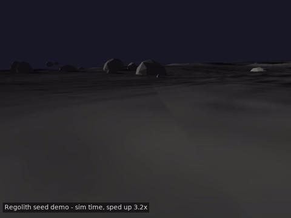

<p align="center">
  
</p>

<p align="center">
  <br>
  <sub>Onboard camera, procedural terrain (seed 42) — full clip: <a href="docs/media/m5_demo_tour.mp4">docs/media/m5_demo_tour.mp4</a></sub>
</p>

<p align="center">
  <strong>Open-source autonomous navigation for planetary rovers</strong><br>
  A fork of <a href="https://github.com/autowarefoundation/autoware">Autoware</a>, adapted for GPS-denied rough-terrain autonomy
</p>

<p align="center">
  <a href="LICENSE"></a>
  <a href="https://www.ros.org/"></a>
  <a href="https://github.com/Regolith-Project/regolith/issues"></a>
</p>

---

## The Problem

Every autonomous planetary rover runs proprietary navigation code. University rover teams rebuild autonomy from scratch every year. Startups face years of development before their rover can navigate a rock field. There is no open-source equivalent of what [Autoware](https://autoware.org/) did for self-driving cars — but for rovers on rough terrain.

## What Regolith Does

Regolith takes the proven Autoware ROS 2 architecture — perception, planning, control — and replaces road-driving assumptions with planetary rover requirements:

| Autoware (roads) | Regolith (rough terrain) |
|---|---|
| GPS + HD maps | Visual-inertial odometry, no GPS |
| Lane-following on pavement | Terrain-aware waypoint navigation |
| Traffic rules & signals | Hazard avoidance & traversability |
| Abundant compute (x86 server) | Resource-constrained embedded boards |

**The goal:** clone the repo, build it, launch the simulation, and watch a rover autonomously navigate between waypoints across a rocky, sloped planetary landscape — no hardware required.

## Architecture

```
┌─────────────────────────────────────────────────────────┐
│                    Mission Manager                       │
│              (waypoints, keep-out zones)                 │
└──────────────────────┬──────────────────────────────────┘
                       │
        ┌──────────────┼──────────────────┐
        ▼              ▼                  ▼
┌──────────────┐ ┌───────────────┐ ┌──────────────┐
│ Localisation │ │  Navigation   │ │  Perception  │
│              │ │  & Planning   │ │              │
│ Visual odom  │ │ Global plan   │ │ Terrain map  │
│ IMU fusion   │ │ Local planner │ │ Obstacle det │
│ Wheel odom   │ │ Traj follower │ │ Traversab.   │
│ Fault detect │ │ Hazard avoid  │ │ Costmap gen  │
└──────┬───────┘ └──────┬────────┘ └──────┬───────┘
       │                │                  │
       └────────────────┼──────────────────┘
                        ▼
          ┌──────────────────────────┐
          │  Hardware Abstraction    │
          │  Layer (HAL)             │
          │                          │
          │  Sensor interfaces       │
          │  Actuator interfaces     │
          │  Rover kinematics        │
          └──────────┬───────────────┘
                     ▼
          ┌──────────────────────────┐
          │  Your Rover / Simulator  │
          │  (Gazebo, ISAAC Sim,     │
          │   Leo Rover, Husky, ...) │
          └──────────────────────────┘
```

## Project Status

> **🌕 Working seed demo**

Regolith has a working end-to-end simulation pipeline: procedural lunar
terrain, a skid-steer rover, GPS-denied localisation, and autonomous
waypoint navigation, all runnable with one command. This is a seed demo
built to validate the architecture, not a finished product — see
[`PROGRESS.md`](PROGRESS.md) for the full, unvarnished record of what
works, what doesn't yet, and why.

1. **Procedural planetary terrain** — craters, rocks, and PBR textures generated from a seed, done
2. **Rover simulation** — skid-steer chassis, teleop, sensor bridging, done
3. **GPS-denied localisation** — EKF fusing wheel odometry + IMU, done, within target on measured test legs (see below)
4. **Autonomous navigation** — costmap + A* planner + path follower, works end-to-end and drives 100 m+ traverses among real boulders, escaping every wedge it hits (26/26) with zero flips; it does **not** meet the milestone's 1.5 m arrival accuracy, which a controlled experiment attributes entirely to localisation rather than to navigation (see below)

See the [Roadmap](#roadmap) below for target vs. actual, and [Known Limitations](#known-limitations) for the honest details.

## Quick Start

Targeting a fresh WSL2 or Ubuntu 22.04 machine to a driving rover in under an hour.

**Prerequisites:**
- Ubuntu 22.04 (or WSL2 with Ubuntu 22.04 — GPU rendering needs WSLg; on a
  hybrid AMD/NVIDIA laptop, add `export MESA_D3D12_DEFAULT_ADAPTER_NAME=NVIDIA`
  to your shell profile so WSLg picks the discrete GPU)
- [ROS 2 Humble](https://docs.ros.org/en/humble/Installation.html) (`ros-humble-desktop`)
- [Gazebo Harmonic](https://gazebosim.org/docs/harmonic/install_ubuntu/) + `ros-humble-ros-gzharmonic`
- `python3-colcon-common-extensions`, `python3-rosdep`, `python3-vcstool`

```bash
# One-time rosdep setup, if you haven't already
sudo rosdep init 2>/dev/null; rosdep update

# Clone the meta-repo
git clone https://github.com/Regolith-Project/regolith.git
cd regolith

# Pull in regolith.universe (packages), install deps, and build
# (only builds the regolith_* planetary packages, not the full Autoware tree)
./scripts/setup.sh

# Launch the full demo: terrain generation, rover spawn, localisation,
# navigation, and a scripted 5-waypoint tour
./scripts/demo.sh
```

`demo.sh` builds first if `install/` doesn't exist yet, then launches
Gazebo + RViz. To drive somewhere yourself instead of the scripted tour,
click "2D Goal Pose" in RViz after running:

```bash
source install/setup.bash
ros2 launch regolith_bringup hello_moon.launch.py seed:=42
```

See [`docs/architecture.md`](docs/architecture.md) for how this repo relates to `regolith.universe`, and [`regolith_bringup`'s README](https://github.com/Regolith-Project/regolith.universe/tree/main/planetary/regolith_bringup) for every individual launch file (terrain-only, teleop, localisation-only, etc.).

## Known Limitations

Documented in full in [`PROGRESS.md`](PROGRESS.md); the two that matter most for anyone trying the demo:

- **Localisation drift**: an earlier pass through this demo measured 20-45%
  position drift against a 5% target and attributed it to lunar-gravity
  wheel slip. That figure turned out to be measured before a terrain-
  collision smoothing fix and isn't reproducible on the current code —
  re-measured drift is 0-4% over straight and gently-turning test legs,
  within target. See [`PROGRESS.md`](PROGRESS.md)'s "M3 drift
  re-investigation" for the full correction.
- **Getting wedged on boulders is common, and recovery is now the thing that
  handles it**: on rocky terrain the rover wedges every few minutes. It has a
  detector (ground truth, plus an onboard wheel-slip detector that uses only
  wheel odometry and the IMU) and an escalating escape maneuver — reverse,
  turn away, mark the spot as a keep-out zone, replan. Across the three most
  recent acceptance runs this fired 25 times and freed the rover 25 times.
  The earlier, rarer "wheels lock in a tight turn" stall is covered by the
  same machinery. See `PROGRESS.md` for details.
- **Terrain-collision flip risk on long autonomous runs**: the physics
  engine (gz-physics/dartsim) doesn't implement heightmap or mesh collision
  construction, so terrain collision is approximated with a grid of boxes.
  A smoothing fix and a simulated flip-recovery backstop address this, and
  flips are no longer observed: zero across the three most recent 100 m+
  acceptance runs (see `PROGRESS.md`).
- **M4's arrival accuracy is not met, and it needs a sensor this PoC
  doesn't have.** An earlier 3/3 pass of the 60-100 m acceptance is
  retracted: it ran on a world where rock collision was a silent no-op, so
  the rover drove through all 190 boulders. With collisions working the
  rover ends 3.1-13.1 m from its goal instead of within 1.5 m — and on every
  seed that distance is exactly the localisation drift plus the stopping
  tolerance. The rover arrives precisely where it *believes* the goal is.
  Rerunning the identical build with a simulated 0.5 m / 1 Hz absolute
  position reference — standing in for the visual odometry the PoC lacks —
  passes **3/3 at 1.48 m** (an experiment, not a milestone result). So the
  planner, follower and wedge recovery all meet the bar; what is missing is
  any exteroceptive observation of position. About 10% of the rover's motion
  is lateral slip, which a differential-drive odometry model cannot represent
  and an IMU cannot observe, and it accumulates uncorrected. Full error
  budget and the controlled comparison are in `PROGRESS.md`.

## Roadmap

### Current Milestone (NLnet NGI Zero Commons Fund)

| Phase | Focus | Target | Status |
|---|---|---|---|
| **WP1** | Autoware fork, architecture, HAL interfaces | Architecture doc + interface packages | Done |
| **WP2** | GPS-denied localisation (IMU + wheel odom fusion) | <5% drift over 500 m traverse | Done — re-measured at 0-4% on test legs after a terrain fix (see above); full-course re-measurement still pending |
| **WP3** | Terrain-aware navigation + obstacle avoidance | Autonomous 5-waypoint route in simulation | Pipeline works end-to-end; a rare tight-turn stall has a detector + recovery, not yet observed catching a live occurrence (see above) |
| **WP4** | Gazebo planetary simulation environment + benchmarks | Turnkey sim with rocks, slopes, shadows | Done |
| **WP5** | Documentation + community bootstrap | Clone → build → run in under 1 hour | Done — this Quick Start |

### Future Vision

- 🔬 **Advanced perception** — HDR stereo vision, lidar processing for extreme lighting
- 🏔️ **Terrain classification** — ML-based surface detection (rock, sand, dust, bedrock)
- ⚡ **Adaptive speed governor** — look-ahead risk-aware speed control
- 🤖 **Hardware validation** — Leo Rover, Clearpath Husky, custom platforms
- 🏜️ **Field demos** — ESA Mars Yards, planetary analogue sites
- 🛰️ **Space-grade hardening** — ECSS alignment, FPGA offload, real-time determinism

## Built On

Regolith stands on the shoulders of excellent open-source projects:

- **[Autoware](https://autowarefoundation.github.io/autoware-documentation/)** — the autonomous driving stack we fork from
- **[ROS 2](https://docs.ros.org/)** — robotics middleware
- **[Gazebo](https://gazebosim.org/)** — simulation
- **[Nav2](https://navigation.ros.org/)** — ROS 2 navigation framework
- **[NVIDIA ISAAC Sim](https://developer.nvidia.com/isaac-sim)** — high-fidelity simulation (planned)

## Who Is This For?

- **🎓 University rover teams** — stop rewriting navigation every year. Start from a working stack.
- **🏢 Space industry** — a shared benchmark and reference implementation for ESA/Terrae Novae rover programmes.
- **🔧 ROS 2 developers** — standard packages that work with your existing tf2, sensor_msgs, Nav2 setup.
- **🔬 Researchers** — a reproducible simulation testbed for rough-terrain autonomy research.

## Contributing

We welcome contributions! See [CONTRIBUTING.md](CONTRIBUTING.md) for guidelines.

Whether you're fixing a typo, adding a sensor driver, improving the planner, or building a new simulation world — we'd love your help.

## About

Regolith is developed by [Astro42](https://astro42.com) a British-Hungarian space software consultancy with an ESA track record. Project funding is pending.

## License

Regolith is licensed under the [Apache License 2.0](LICENSE).

```
Copyright 2026 Wozify Engineering Group Kft / Wozify Technologies Ltd (t/a Astro42)

Licensed under the Apache License, Version 2.0
```
